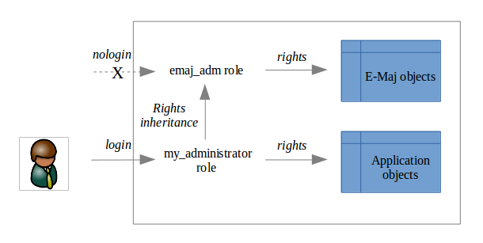

Setting Up the E-Maj Access Policy
==================================

A misuse of E-Maj can compromise database integrity. Therefore, it is advisable to restrict its use to specific, skilled users.

E-Maj Roles
-----------

To use E-Maj, it is possible to log in as a *SUPERUSER*. However, for safety reasons, it is preferable to use the two roles created by the installation script:

* ``emaj_adm``: Used as the **E-Maj administration** role.

   * It can execute all functions and access all E-Maj tables with read and write privileges.
   * It owns all log objects (schemas, tables, sequences, functions).
* ``emaj_viewer``: Used for **read-only** purposes. 

   * It can only execute informative or statistical functions and can only read E-Maj tables.

All privileges granted to *emaj_viewer* are also granted to *emaj_adm*.

When created, these roles have no login capability (no defined password and *NOLOGIN* option). It is recommended **not** to grant them any login capability. Instead, it is sufficient to grant the privileges they own to other roles using *GRANT* SQL commands.

Note that :ref:`both roles may not exist<roles_limits>` if the role that installed the extension did not have *SUPERUSER* privileges.

----

Granting E-Maj privileges
-------------------------

Once logged in as a *SUPERUSER*, execute one of the following commands to grant a role all privileges associated with either *emaj_adm* or *emaj_viewer*::

   GRANT emaj_adm TO <my_emaj_administrator_role>;
   GRANT emaj_viewer TO <my_emaj_viewer_role>;

Of course, *emaj_adm* or *emaj_viewer* privileges can be granted to multiple roles.

----

Granting privileges on Application Tables and Objects
-----------------------------------------------------

It is not necessary to grant any privileges on application tables and sequences to *emaj_adm* and *emaj_viewer*. The functions that need to access these objects are executed with the extension installation role, i.e., a *SUPERUSER* role.

----

Summary
-------

The following schema represents the **recommended privileges organization** for an E-Maj administrator.

Of course, the schema also applies to the *emaj_viewer* role.

Unless explicitly stated otherwise, the operations described later can be executed indifferently by a *SUPERUSER* or by a role belonging to the *emaj_adm* group.
