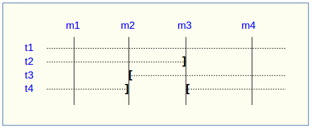
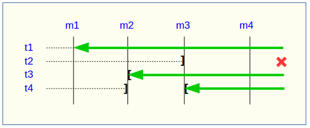
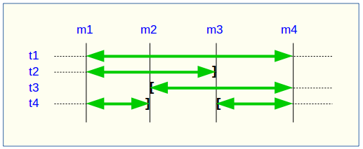
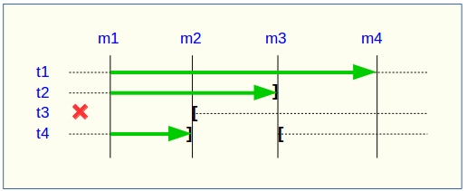

Modifying tables groups
=======================

.. _emaj_alter_group:

Several types of events may lead to alter a tables group:

* the tables group definition may change, some tables or sequences may have been added or suppressed,
* one of the parameters linked to a table (priority, schema, tablespaces,...) may have been modified,
* the structure of one or several application tables of the tables group may have changed, such as an added or dropped column or a change in a column type.

Modifying a tables group in *IDLE* state
----------------------------------------

In all cases, the following steps can be performed:

* stop the group, if it is in *LOGGING* state, using the :ref:`emaj_stop_group() <emaj_stop_group>` function,
* update the :ref:`emaj_group_def <emaj_group_def>` table and/or modify the application schema,
* drop and recreate the tables group, using the :ref:`emaj_drop_group() <emaj_drop_group>` and :ref:`emaj_create_group() <emaj_create_group>` functions.

But this last step can be also performed by the *emaj_alter_group()* function, with a statement like::

   SELECT emaj.emaj_alter_group('<group.name>');

The function returns the number of tables and sequences that now belong to the tables group.

The *emaj_alter_group()* function also recreates E-Maj objects that may be missing (log tables, functions, …).

The function creates and drops the secondary schemas when needed.

Once altered, a tables group remains in *IDLE* state, but its log tables become empty.

The “*ROLLBACKABLE*” or “*AUDIT_ONLY*” characteristic of the tables group cannot be changed using the *emaj_alter_group()* function. To change it, the tables group must be dropped and re-created using the :ref:`emaj_drop_group() <emaj_drop_group>` and :ref:`emaj_create_group() <emaj_create_group>` functions.

All actions that are chained by the *emaj_alter_group()* function are executed on behalf of a unique transaction. As a consequence, if an error occurs during the operation, the tables group remains in its previous state.

In most cases, executing the *emaj_alter_group()* function is much more efficient than chaining both :ref:`emaj_drop_group() <emaj_drop_group>` and :ref:`emaj_create_group() <emaj_create_group>` functions.

It is possible to update the *emaj_group_def* table, when the tables group is in *LOGGING* state. However it will not have an effect until the group is altered (or dropped and re-created).

Using the *emaj_alter_groups()* function, several groups can be modified at once::

   SELECT emaj.emaj_alter_groups('<group.names.array>');

This function allows to move a table or a sequence from one tables group to another in a single operation.

More information about :doc:`multi-groups functions <multiGroupsFunctions>`.

.. _alter_logging_group:

Modifying a tables group in *LOGGING* state
-------------------------------------------

But the previous method has several drawbacks:

* logs recorded before the operation are lost,
* it is not possible to rollback a tables group to a previous state anymore.

However, some actions are possible while the tables groups are in *LOGGING* state. The following table lists the allowed actions.

+-------------------------------------+---------------+-----------------------+
| Action                              | LOGGING Group | Method                |
+=====================================+===============+=======================+
| Change the groupe ownership         | No            |                       | 
+-------------------------------------+---------------+-----------------------+
| Change the log schema suffix        | Yes           | emaj_group_def update |
+-------------------------------------+---------------+-----------------------+
| Change the E-Maj names prefix       | Yes           | emaj_group_def update |
+-------------------------------------+---------------+-----------------------+
| Change the log data tablespace      | Yes           | emaj_group_def update |
+-------------------------------------+---------------+-----------------------+
| Change the log index tablespace     | Yes           | emaj_group_def update |
+-------------------------------------+---------------+-----------------------+
| Change the E-Maj priority           | Yes           | emaj_group_def update |
+-------------------------------------+---------------+-----------------------+
| Remove a table from a group         | Yes           | emaj_group_def update |
+-------------------------------------+---------------+-----------------------+
| Remove a sequence from a group      | Yes           | emaj_group_def update |
+-------------------------------------+---------------+-----------------------+
| Add a table to a group              | Yes           | emaj_group_def update |
+-------------------------------------+---------------+-----------------------+
| Add a sequence to a group           | No            |                       |
+-------------------------------------+---------------+-----------------------+
| Repair a table or a sequence        | No            |                       |
+-------------------------------------+---------------+-----------------------+
| Rename a table                      | No            |                       |
+-------------------------------------+---------------+-----------------------+
| Rename a sequence                   | No            |                       |
+-------------------------------------+---------------+-----------------------+
| Change the schema of a table        | No            |                       |
+-------------------------------------+---------------+-----------------------+
| Change the schema of a sequence     | No            |                       |
+-------------------------------------+---------------+-----------------------+
| Rename a table’s column             | No            |                       |
+-------------------------------------+---------------+-----------------------+
| Change a table’s structure          | No            |                       |
+-------------------------------------+---------------+-----------------------+
| Other forms of ALTER TABLE          | Yes           | No E-Maj impact       |
+-------------------------------------+---------------+-----------------------+
| Other forms of ALTER SEQUENCE       | Yes           | No E-Maj impact       |
+-------------------------------------+---------------+-----------------------+

The "emaj_group_def update" method
^^^^^^^^^^^^^^^^^^^^^^^^^^^^^^^^^^
Most attributes of the :ref:`emaj_group_def <emaj_group_def>` table describing the tables groups can be dynamicaly changed while groups have not been stopped.

To do this, the following steps can be performed:

* modify the :ref:`emaj_group_def <emaj_group_def>` table,
* call one of the *emaj_alter_group()* or *emaj_alter_groups()* functions.

For tables groups in *LOGGING* state, these functions set a *ROW EXCLUSIVE* lock on each application table of these groups.

On these same tables groups, they also set a mark whose name can be suppled as parameter. The syntax of these calls becomes::

   SELECT emaj.emaj_alter_group('<group.name>' [,’<mark>’]);

or ::

   SELECT emaj.emaj_alter_groups('<group.names.array>' [,’<mark>’]);

If the parameter representing the mark is not specified, or is empty or *NULL*, a name is automatically generated: “ALTER_%”, where the '%' character represents the current transaction start time with a “hh.mn.ss.mmm” pattern.

An E-Maj rollback operation targeting a mark set before such groups changes does **NOT** automaticaly cancel these changes.

However, the administrator can apply the same procedure to reset a tables group to a prior state.

Incidence of tables or sequences addition or removal in a group in *LOGGING* state
^^^^^^^^^^^^^^^^^^^^^^^^^^^^^^^^^^^^^^^^^^^^^^^^^^^^^^^^^^^^^^^^^^^^^^^^^^^^^^^^^^

.. caution::

	Once a table or a sequence is removed from a tables group, any rollback operation will leave this object unchanged. Once unlinked from its tables group, the application table or sequence can be altered or dropped. 

The historical data linked to the object (logs, marks traces,...) are kept as is so that they can be later examined. However, they remain linked to the tables group that owned the object. To avoid any confusion, log tables are renamed, adding a numeric  suffix to its name. These logs and marks traces will only be deleted by a :ref:`group’s reset <emaj_reset_group>` operation or by the :ref:`deletion of the oldest marks <emaj_delete_before_mark_group>` of the group.

.. caution::

	When a table or a sequence is added into a tables group in *LOGGING* state, it is then processed by any further rollback operation. But updates that occurred before the time when the table or sequence was added into the group cannot be cancelled. Such a table will not be processed by a SQL script generation function call if the requested start mark has been set before the addition of the table or sequence into the group

Some graphs help to more easily visualize the consequences of the addition or the removal of a table or a sequence into/from a tables group in *LOGGING* state.

Let’s use a tables group containing 4 tables (t1 to t4) and 4 marks set over time (m1 to m4). At m2, t3 has been added to the group while t4 has been removed. At m3, t2 has been removed from the group while t4 has been re-added.

A rollback to the mark m1:

* would process the table t1,
* would **NOT** process the table t2, for lack of log after m3,
* would process the table t3, but only up to m2,
* would process the table t4, but only up to m3, for lack of log between m2 and m3.

A log statistics report between the marks m1 and m4 would contain:

* 1 row for t1 (m1,m4),
* 1 row for t2 (m1,m3),
* 1 row for t3 (m2,m4),
* 2 rows for t4 (m1,m2) and (m3,m4).

The SQL script generation for the marks interval m1 to m4:

* would process the table t1,
* would process the table t2, but only up the mark m3,
* would **NOT** process the table t3, for lack of log before m2,
* would process the table t4, but only up to the mark m2, for lack of log between m2 and m3.

