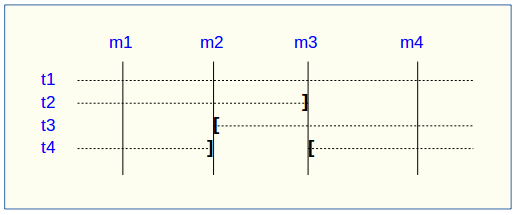
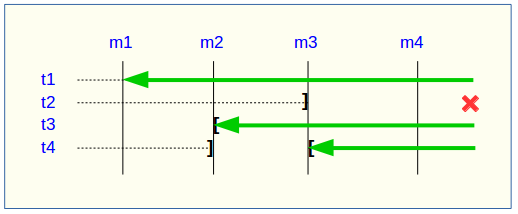
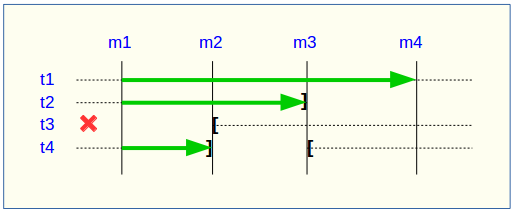

Modifying Table Groups
=======================

Several event types may lead to altering a table group:

* The table group definition may change: some **tables or sequences may have been added or removed**.
* One of the table **properties** (priority, tablespaces, etc.) may have been modified in the E-Maj configuration.
* The **structure** of one or more application tables in the table group may have changed, such as an added or dropped column or a column type change.
* A table or sequence may change its **name** or its **schema**.

When the modification concerns a table group in *LOGGING* state, it may be necessary to temporarily remove the table or sequence from its table group, with some impacts on potential future E-Maj rollback operations.

Below are the possible actions.

+------------------------------------------------------+----------------------------------------------+
| Action                                               | Method                                       |
+======================================================+==============================================+
| Add a table/sequence to a group                      | Tables/sequences assignment functions        |
+------------------------------------------------------+----------------------------------------------+
| Remove a table/sequence from a group                 | Tables/sequences removal functions           |
+------------------------------------------------------+----------------------------------------------+
| Move a table/sequence to another group               | Tables/sequences move functions              |
+------------------------------------------------------+----------------------------------------------+
| Change the log data or index tablespace for a table  | Tables properties modification functions     |
+------------------------------------------------------+----------------------------------------------+
| Change the E-Maj priority for a table                | Tables properties modification functions     |
+------------------------------------------------------+----------------------------------------------+
| Repair a table                                       | Remove from the group + add to the group     |
+------------------------------------------------------+----------------------------------------------+
| Rename a table                                       | Remove from the group + ALTER TABLE + Add    |
+------------------------------------------------------+----------------------------------------------+
| Rename a sequence                                    | Remove from the group + ALTER SEQUENCE + Add |
+------------------------------------------------------+----------------------------------------------+
| Change the schema of a table                         | Remove from the group + ALTER TABLE + Add    |
+------------------------------------------------------+----------------------------------------------+
| Change the schema of a sequence                      | Remove from the group + ALTER SEQUENCE + Add |
+------------------------------------------------------+----------------------------------------------+
| Rename a table’s column                              | Remove from the group + ALTER TABLE + Add    |
+------------------------------------------------------+----------------------------------------------+
| Change a table’s structure                           | Remove from the group + ALTER TABLE + Add    |
+------------------------------------------------------+----------------------------------------------+
| SPLIT or MERGE partitions of a partitioned table     | Remove from the group + ALTER TABLE + Add    |
+------------------------------------------------------+----------------------------------------------+
| Other forms of ALTER TABLE                           | No E-Maj impact                              |
+------------------------------------------------------+----------------------------------------------+
| Other forms of ALTER SEQUENCE                        | No E-Maj impact                              |
+------------------------------------------------------+----------------------------------------------+

Adjusting the structure of table groups in *LOGGING* state may have consequences on E-Maj rollback or SQL script generation (see below).

Even if the table group is in *LOGGING* state, an E-Maj **rollback** operation targeting a mark set before a group change **does not** automatically **revert** this **group change**. However, the E-Maj administrator can manually perform the changes that would reset the group to its previous state.

----

.. _dynamic_ajustment:

Adding Tables or Sequences to a Table Group
-------------------------------------------

The functions that :ref:`assign one or more tables or sequences<assign_table_sequence>` to a table group, which are used at group creation time, are also usable during the entire life of the group.

When executing these functions, the table group can be either in *IDLE* or in *LOGGING* state.

When the group is in *LOGGING* state:

- An *EXCLUSIVE* **lock** is set on all tables of the group.
- A mark is set. Its name is defined by the ``p_mark`` parameter of the function. If not supplied, the mark name is generated with an *ASSIGN_* prefix.

----

.. _remove_table_sequence:

Removing Tables from Their Table Group
--------------------------------------

The three following functions allow removing one or more tables from their table group::

   SELECT emaj.emaj_remove_table(p_schema, p_table, p_mark);

or::

   SELECT emaj.emaj_remove_tables(p_schema, p_tables, p_mark);

or::

   SELECT emaj.emaj_remove_tables(p_schema, p_tablesIncludeFilter, p_tablesExcludeFilter, p_mark);

Input parameters and returned data are similar to the :ref:`table assignment functions<assign_table_sequence>`.

**Notes**

When multiple tables are removed, they do not necessarily belong to the same group.

When the table group or groups are in *LOGGING* state and no mark is supplied in the parameters, the mark is generated with a ``REMOVE_`` prefix.

----

Removing Sequences from Their Table Group
-----------------------------------------

The three following functions allow removing one or more sequences from their table group::

   SELECT emaj.emaj_remove_sequence(p_schema, p_sequence, p_mark);

or::

   SELECT emaj.emaj_remove_sequences(p_schema, p_sequences, p_mark);

or::

   SELECT emaj.emaj_remove_sequences(p_schema, p_sequencesIncludeFilter, p_sequencesExcludeFilter, p_mark);

Input parameters and returned data are similar to the :ref:`sequence assignment functions<assign_table_sequence>`.

**Notes**

When multiple sequences are removed, they do not necessarily belong to the same group.

When the table group is in *LOGGING* state and no mark is supplied in the parameters, the mark is generated with a ``REMOVE_`` prefix.

----

.. _move_table_sequence:

Moving Tables to Another Table Group
------------------------------------

Three functions allow moving one or more tables to another table group::

   SELECT emaj.emaj_move_table(p_schema, p_table, p_newGroup, p_mark);

or::

   SELECT emaj.emaj_move_tables(p_schema, p_tables, p_newGroup, p_mark);

or::

   SELECT emaj.emaj_move_tables(p_schema, p_tablesIncludeFilter, p_tablesExcludeFilter, p_newGroup, p_mark);

Input parameters and returned data are similar to the :ref:`table assignment functions<assign_table_sequence>`.

**Notes**

When several tables are moved to another table group, they do not necessarily belong to the same source group.

When the table group is in *LOGGING* state and no mark is supplied in the parameters, the mark is generated with a ``MOVE_`` prefix.

----

Moving Sequences to Another Table Group
---------------------------------------

Three functions allow moving one or more sequences to another table group::

   SELECT emaj.emaj_move_sequence(p_schema, p_sequence, p_newGroup, p_mark);

or::

   SELECT emaj.emaj_move_sequences(p_schema, p_sequences, p_newGroup, p_mark);

or::

   SELECT emaj.emaj_move_sequences(p_schema, p_sequencesIncludeFilter, p_sequencesExcludeFilter, p_newGroup, p_mark);

Input parameters and returned data are similar to the :ref:`sequence assignment functions<assign_table_sequence>`.

**Notes**

When several sequences are moved to another table group, they do not necessarily belong to the same source group.

When the table group is in *LOGGING* state and no mark is supplied in the parameters, the mark is generated with a ``MOVE_`` prefix.

----

.. _modify_table:

Modifying Table Properties
--------------------------

Three functions allow modifying the properties of one or more tables from a single schema::

   SELECT emaj.emaj_modify_table(p_schema, p_table, p_changedProperties, p_mark);

or::

   SELECT emaj.emaj_modify_tables(p_schema, p_tables, p_changedProperties, p_mark);

or::

   SELECT emaj.emaj_modify_tables(p_schema, p_tablesIncludeFilter, p_tablesExcludeFilter, p_changedProperties, p_mark);

Input parameters and returned data are similar to the :ref:`table assignment functions<assign_table>`.

**Notes**

The ``p_changedProperties`` parameter is of type *JSONB*. Its elementary fields are the same as the ``p_properties`` parameter of the :ref:`table assignment functions<assign_table_sequence>`. However, this ``p_changedProperties`` parameter only contains the properties to modify. The properties not listed remain unchanged. It is possible to reset a property to its default value by setting it to *null* (the *JSON null*).

The functions return the number of tables that have effectively changed at least one property.

When the table group is in *LOGGING* state and no mark is supplied in the parameters, the mark is generated with a ``MODIFY_`` prefix.

----

.. _get_assigned_group:

Determining the Table Group a Table or Sequence Is Assigned To
--------------------------------------------------------------

Two functions return the table group name a table or a sequence is assigned to::

   SELECT emaj.emaj_get_assigned_group_table(p_schema, p_table);

   SELECT emaj.emaj_get_assigned_group_sequence(p_schema, p_sequence);

If the table or sequence is not currently assigned to a group, both functions return a *NULL* value.

Thanks to these functions, it is easy to assign, move, or leave a table or a sequence as is, depending on its state.

These functions are callable by *emaj_viewer* roles.

----

Impact of Adding or Removing Tables or Sequences in a *LOGGING* Group
---------------------------------------------------------------------

.. caution::

   Once a table or a sequence is **removed** from a table group, any rollback operation will leave this object unchanged. Once unlinked from its table group, the application table or sequence can be altered or dropped.

The historical data linked to the object (logs, mark traces, etc.) are kept as is so that they can be examined later. However, they remain linked to the table group that owned the object. To avoid any confusion, log tables are renamed by adding a numeric suffix to their names. These logs and mark traces will only be deleted by a :ref:`group reset <emaj_reset_group>` operation or by the :ref:`deletion of the oldest marks <emaj_delete_before_mark_group>` of the group.

.. caution::

   When a table or a sequence is **added** to a table group in *LOGGING* state, it is then processed by any further rollback operation. However, if the rollback operation targets a mark set before the addition to the group, the table or sequence is left in its state at the time of the addition to the group, and a warning message is issued. Such a table or sequence will not be processed by a SQL script generation function call if the requested start mark was set before the addition of the table or sequence to the group.

Some graphs help to more easily visualize the consequences of adding or removing a table or a sequence to/from a table group in *LOGGING* state.

Let’s consider a table group containing 4 tables (t1 to t4) and 4 marks set over time (m1 to m4). At m2, t3 was added to the group while t4 was removed. At m3, t2 was removed from the group while t4 was re-added.

A rollback to the mark m1 would:

* Process the table t1.
* **Not** process the table t2, due to lack of logs after m3.
* Process the table t3, but only up to m2.
* Process the table t4, but only up to m3, due to lack of logs between m2 and m3.

A log statistics report between the marks m1 and m4 would contain:

* 1 row for t1 (m1, m4).
* 1 row for t2 (m1, m3).
* 1 row for t3 (m2, m4).
* 2 rows for t4 (m1, m2) and (m3, m4).

.. image:: images/logging_group_stat.png
   :align: center

The SQL script generation for the marks interval m1 to m4 would:

* Process the table t1.
* Process the table t2, but only up to the mark m3.
* **Not** process the table t3, due to lack of logs before m2.
* Process the table t4, but only up to the mark m2, due to lack of logs between m2 and m3.

If the structure of an application table has been inadvertently changed while it belonged to a table group in *LOGGING* state, the mark set and rollback operations will be blocked by E-Maj internal checks. To avoid stopping, altering, and then restarting the entire table group, it is possible to simply remove the concerned table from its group and then re-add it.

When a table changes its assigned group, the impact on the ability to generate a SQL script or to roll back the source and destination table groups is similar to removing the table from its source group and then adding the table to the destination group.

----

Repairing a Table Group
-----------------------

Although the event triggers created by E-Maj limit the risk, some E-Maj components that support an application table (log table, function, or trigger) may have been dropped. In such a case, the associated table group can no longer work correctly.

To solve the issue **without stopping the table group** if it is in *LOGGING* state (and thus losing the benefits of the recorded logs), it is possible to **remove** the table from its group and **then re-add** it by chaining both statements::

   SELECT emaj.emaj_remove_table(p_schema, p_table, p_mark);

   SELECT emaj.emaj_assign_table(p_schema, p_table, p_group, p_properties, p_mark);

Of course, once the table is removed from its group, the content of the associated logs can no longer be used for a potential E-Maj rollback or script generation.

However, if the log sequence is missing (which should never be the case) and the table group is in *LOGGING* state, it is necessary to :ref:`force the group’s stop<emaj_force_stop_group>` before removing and re-assigning the table.

It may also happen that an application table or sequence has been accidentally dropped. In this case, the table or sequence can be simply removed a posteriori from its group by executing the appropriate *emaj_remove_table()* or *emaj_remove_sequence()* function.
