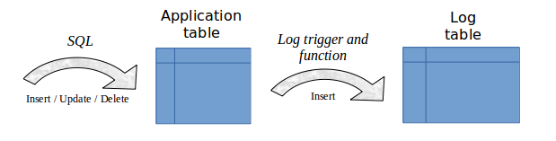

Architecture
============

In order to be able to perform a rollback operation without having previously kept a physical image of the PostgreSQL instance's files, all updates applied on application tables must be recorded, so that they can be cancelled. 

With E-Maj, this updates recording takes the following form.

Logged SQL statements
*********************
The recorded update operations concerns the following SQL verbs:

* rows insertions:

  * INSERT, either elementary (INSERT … VALUES) or set oriented (INSERT … SELECT)
  * COPY … FROM

* rows updates:

  * UPDATE

* rows deletions:

  * DELETE

* tables truncations

  * TRUNCATE 

For statements that process several rows, each creation, update or deletion is individually recorded. For instance, if a *DELETE FROM <table>* is performed against a table having 1 million rows, 1 million row deletion events are recorded.

The case of *TRUNCATE* SQL verbs is specific. As no *FOR EACH ROW* trigger can be fired for this verb, the consequences of a *TRUNCATE* cannot be cancelled by E-Maj. Therefore, its execution is forbidden for *ROLLBACKABLE* tables groups in *LOGGING* state. In contrast, *TRUNCATE* is always permitted for *AUDIT_ONLY* tables groups. In such a case, only its execution is recorded.

Created objects
***************

For each application table, the following objects are created:

* a dedicated **log table**, containing data corresponding to the updates applied on the application table,
* a **trigger** and a specific **function**, that, for each row creation (*INSERT*, *COPY*), change (*UPDATE*) or suppression (*DELETE*), record into the log table all data needed to potentially cancel later this elementary action,
* another **trigger**, that either blocks any execution of a *TRUNCATE* SQL verb for *ROLLBACKABLE* tables groups or records the execution of a *TRUNCATE* SQL verb for *AUDIT_ONLY* tables groups,
* a **sequence** used to quickly count the number of updates recorded in log tables between 2 marks.

A **log table** has the same structure as its corresponding application table. However, it contains some :ref:`additional technical columns<logTableStructure>`.

To let E-Maj work, some **other technical objects** are also created at extension installation time:

* 17 tables,
* 8 composite and 3 enum types,
* 1 view,
* 2 triggers,
* more than 120 functions, about 50 of them being directly callable by users,
* 1 sequence named *emaj_global_seq* used to assign to every update recorded in any log table of the database a unique identifier with an increasing value over time,
* 1 specific schema, named emaj, that contains all these relational objects,
* 2 roles acting as groups (NOLOGIN): *emaj_adm* to manage E-Maj components, and *emaj_viewer* to only look at E-Maj components
* 3 event triggers.

Some technical tables, whose structure is interesting to know, are described in details: :ref:`emaj_group_def <emaj_group_def>`, :ref:`emaj_param <emaj_param>` and :ref:`emaj_hist <emaj_hist>`.

Schemas
*******

Almost all technical objects created at E-Maj installation are located into the schema named **emaj**. The only exception is the event trigger *emaj_protection_trg* that belongs to the *public* schema.

All objects linked to application tables are stored into schemas named *emaj_<schema>*, where <schema> is the schema name of the application tables.

The creation and the suppression of log schemas are only managed by E-Maj functions. They should NOT contain any other objects than those created by the extension.

Norm for E-Maj objects naming
*****************************

For an application table, the log objects name is prefixed with the table name. More precisely, for an application table:

* the name of the **log table** is: 
	<table.name>_log

* the name of the **log function** is: 
	<table.name>_log_fnct

* the name of the **sequence** associated to the log table is:
	<table.name>_log_seq

For application tables whose name is very long (over 50 characters), the prefix used to build the log objects name is generated so it respects the PostgreSQL naming rules and avoids name conflict.

A log table name may contain a suffix like “_1”, “_2”, etc. In such a case, it deals with an old log table that has been renamed by an emaj_alter_group operation.

Other E-Maj **function** names are also normalised:

* function names that begin with `emaj_` are functions that are callable by users,
* function names that begin with `_` are internal functions that should not be called directly.

**Triggers** created on application tables have the same name:

* *emaj_log_trg* for the log triggers,
* *emaj_trunc_trg* for the triggers that manage *TRUNCATE* verbs.

The name of **event triggers** starts with `emaj_` and ends with `_trg`.

Tablespaces
***********

When the extension is installed, the E-Maj technical tables are stored into the default tablespace set at instance or database level or explicitely set for the current session.

The same rule applies for log tables and index. But using :ref:`tables group parameters <emaj_group_def>`, it is also possible to store log tables and/or their index into specific tablespaces.
