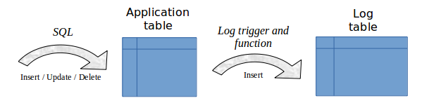

Architecture
============

To enable rollback operations without requiring a physical backup of the PostgreSQL instance files, E-Maj records all changes applied to application tables so they can be reversed later.

Logged SQL Statements
*********************

E-Maj records the following SQL operations:

* **Row insertions**:

  - ``INSERT`` (elementary: ``INSERT ... VALUES`` or set-oriented: ``INSERT ... SELECT``)
  - ``COPY ... FROM``

* **Row updates**:

  - ``UPDATE``

* **Row deletions**:

  - ``DELETE``

* **Table truncations**:

  - ``TRUNCATE``

For statements affecting multiple rows (e.g., ``DELETE FROM <table>``), **each individual row change is recorded separately**. For example, deleting 1 million rows results in 1 million deletion events being logged.

For ``TRUNCATE`` operations, the **entire table content is recorded** before the table is truncated.

----

Created Objects
***************

For each application table, E-Maj creates the following objects:

* A **dedicated log table** containing data corresponding to updates applied to the application table.
* A **trigger** and a **specific function** that, for each row change (*INSERT*, *COPY*, *UPDATE*, or *DELETE*), record all data needed to potentially reverse the action later.
* An **additional trigger** to handle **TRUNCATE** statements.
* A **sequence** used to quickly count the number of changes recorded in log tables between two marks.

A **log table** has the **same structure** as its corresponding application table but includes :ref:`additional technical columns<logTableStructure>`.

To support E-Maj functionality, the following **technical objects** are also created during extension installation:

* 19 tables,
* 1 sequence named *emaj_global_seq*, which assigns a unique, time-increasing identifier to every change recorded in any log table of the database,
* 8 composite types and 3 enum types,
* 1 view,
* Over 180 functions, with more than 80 directly :doc:`callable by users<functionsList>`),
* 1 trigger,
* 1 dedicated schema named *emaj*, containing all these relational objects,
* 2 roles (NOLOGIN):

  - ``emaj_adm`` to manages E-Maj components.
  - ``emaj_viewer`` for read-only access to E-Maj components.
* 3 event triggers.

The *emaj_adm* role owns all log schemas, tables, sequences, and functions.

----

Schemas
*******

Almost all technical objects created during E-Maj installation are stored in the ``emaj`` schema. The only exception is the *emaj_protection_trg* event trigger, which resides in the *public* schema.

All objects linked to application tables are stored in schemas named ``emaj_<schema>``, where *<schema>* is the schema name of the application tables.

.. note::
   Log schemas are **exclusively managed** by E-Maj functions. They **must not** contain any objects other than those created by the extension.

----

Naming Conventions for E-Maj Objects
************************************

For an application table, log objects are named using the table name as a prefix:

* **Log table**: ``<table_name>_log``
* **Log function**: ``<table_name>_log_fnct``
* **Log sequence**: ``<table_name>_log_seq``

For application tables with **long names** (over 50 characters), the prefix is generated to comply with PostgreSQL naming rules and avoid conflicts.

A log table name may include a suffix like *_1*, *_2*, etc. In such cases, it refers to an **old log table** renamed by an table group alter operation.

E-Maj **function names** follow a naming convention:

* Functions prefixed with ``emaj_`` are **user-callable**.
* Functions prefixed with ``_`` are **internal** and should not be called directly.

**Triggers** created on application tables share the same names:

* ``emaj_log_trg``: Logs row-level operations (*INSERT*, *UPDATE*, *DELETE*).
* ``emaj_trunc_trg``: Handles *TRUNCATE operations.

**Event trigger** names start with ``emaj_`` and end with ``_trg``.

----

Tablespaces
***********

By default, E-Maj technical tables are stored in the **default tablespace** set at the instance, database, or session level.

The same rule applies to **log tables and their indexes**. However, using :ref:`table group parameters<table_emaj_properties>`, you can specify **custom tablespaces** for log tables and/or their indexes.
