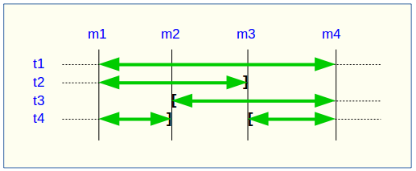

Examining Data Content Changes
==============================

.. _examining_changes:

Introduction
------------

Log tables and the internal sequences states table are a valuable resource for analyzing changes recorded between two marks. In addition to the already described rollback and statistics functions, it is possible to view changes in various formats.

Any user with *emaj_adm* or *emaj_viewer* privileges can directly query the log tables. Their structure is described :ref:`here <logTableStructure>`.

However, two functions, :ref:`emaj_dump_changes_group() <emaj_dump_changes_group>` and :ref:`emaj_gen_sql_dump_changes_group() <emaj_gen_sql_dump_changes_group>`, can simplify this process. They allow users to visualize data content changes for each table and sequence belonging to a table group, within a time period defined by two marks.

----

Output Types
------------

To cover a wide range of use cases, data change visualization can take different forms:

* A **set of flat files** created using *COPY TO* statements (stored in the PostgreSQL instance's disk space);
* A **psql script** generating flat files using *\\copy to* meta-commands (stored in the client's disk space);
* A **temporary table** containing **SQL statements**, enabling direct visualization and analysis of data changes by any client.

----

Consolidation Levels
--------------------

Different levels of change visualization are available through the **consolidation** concept.

Without consolidation, every elementary change recorded in the log tables is returned. This provides simple log table extracts for the specified time period.

The consolidation process aims to return only the initial state (at the start mark time) and/or the final state (at the end mark time) of each primary key for which changes have been recorded. For each primary key, a row of type **OLD** (representing the initial state, if it exists) and/or a row of type **NEW** (representing the final state, if it still exists) is returned. Thus, the consolidation process requires that all examined tables have a **PRIMARY KEY**.

Two consolidation levels exist:

* **Partial consolidation** ignores data content.
* **Full consolidation** excludes changes that produce strictly identical data between both marks.

Below are examples using a table defined as *(col1 INT PRIMARY KEY, col2 TEXT)*.

+-----------------------------+---------------------------------------+-------------------------+-----------------------+
| SQL between both marks      | Log table (*)                         | Partial consolidation   | Full consolidation    |
+=============================+=======================================+=========================+=======================+
| INSERT (1,'A')              | 1,'A',NEW,1                           | 1,'A',NEW               | 1,'A',NEW             |
+-----------------------------+---------------------------------------+-------------------------+-----------------------+
| UPDATE (1,'A') => (1,'B')   | 1,'A',OLD,1                           | 1,'A',OLD               | 1,'A',OLD             |
|                             | 1,'B',NEW,1                           | 1,'B',NEW               | 1,'B',NEW             |
+-----------------------------+---------------------------------------+-------------------------+-----------------------+
| DELETE (1,'A')              | 1,'A',OLD,1                           | 1,'A',OLD               | 1,'A',OLD             |
+-----------------------------+---------------------------------------+-------------------------+-----------------------+
| INSERT (1,'A')              | 1,'A',NEW,1                           | 1,'B',NEW               | 1,'B',NEW             |
| UPDATE (1,'A') => (1,'B')   | 1,'A',OLD,2                           |                         |                       |
|                             | 1,'B',NEW,2                           |                         |                       |
+-----------------------------+---------------------------------------+-------------------------+-----------------------+
| UPDATE (1,'A') => (1,'B')   | 1,'A',OLD,1                           | 1,'A',OLD               | 1,'A',OLD             |
| DELETE (1,'B')              | 1,'B',OLD,1                           |                         |                       |
+-----------------------------+---------------------------------------+-------------------------+-----------------------+
| UPDATE (1,'A') => (1,'B')   | 1,'A',OLD,1                           | 1,'A',OLD               | 1,'A',OLD             |
| UPDATE (1,'B') => (1,'C')   | 1,'B',OLD,2                           | 1,'D',NEW               | 1,'D',NEW             |
| UPDATE (1,'C') => (1,'D')   | 1,'C',OLD,3                           |                         |                       |
|                             | 1,'D',NEW,3                           |                         |                       |
+-----------------------------+---------------------------------------+-------------------------+-----------------------+
| INSERT (1,'A')              | 1,'A',NEW,1                           |                         |                       |
| DELETE (1,'A')              | 1,'A',OLD,2                           |                         |                       |
+-----------------------------+---------------------------------------+-------------------------+-----------------------+
| DELETE (1,'A')              | 1,'A',OLD,1                           | 1,'A',OLD               | 1,'A',OLD             |
| INSERT (1,'B')              | 1,'B',NEW,2                           | 1,'B',NEW               | 1,'B',NEW             |
+-----------------------------+---------------------------------------+-------------------------+-----------------------+
| UPDATE (1,'A') => (1,'B')   | 1,'A',OLD,1                           | 1,'A',OLD               |                       |
| UPDATE (1,'B') => (1,'A')   | 1,'B',OLD,2                           | 1,'A',NEW               |                       |
|                             | 1,'A',NEW,2                           |                         |                       |
+-----------------------------+---------------------------------------+-------------------------+-----------------------+
| DELETE (1,'A')              | 1,'A',OLD,1                           | 1,'A',OLD               |                       |
| INSERT (1,'A')              | 1,'A',NEW,2                           | 1,'A',NEW               |                       |
+-----------------------------+---------------------------------------+-------------------------+-----------------------+
| UPDATE (1,'A') => (2,'A')   | 1,'A',OLD,1                           | 1,'A',OLD,1             | 1,'A',OLD             |
| UPDATE (2,'A') => (2,'B')   | 2,'A',NEW,1                           | 3,'B',NEW               | 3,'B',NEW             |
| UPDATE (2,'B') => (3,'B')   | 2,'A',OLD,2                           |                         |                       |
|                             | 2,'B',NEW,2                           |                         |                       |
|                             | 2,'B',OLD,3                           |                         |                       |
|                             | 3,'B',NEW,3                           |                         |                       |
+-----------------------------+---------------------------------------+-------------------------+-----------------------+

(*) The log table extract corresponds to columns *(col1, col2, emaj_tuple, emaj_gid)*. Other E-Maj technical columns are not mentioned.

.. caution::

   Some rare data types, such as *JSON* or *XML*, do not have an equality operator. In such cases, full consolidation casts these columns to *TEXT* to compare initial and final values.

For each sequence, two rows are returned, corresponding to its initial and final states. In a full consolidation context, no row is returned if both states are strictly identical.

----

.. _emaj_dump_changes_group:

Dumping Changes on Files
------------------------

The ``emaj_dump_changes_group()`` function extracts changes from log tables and the sequences states table for a given table group, then creates files in the PostgreSQL instance's disk space using *COPY TO* statements. ::

   SELECT emaj.emaj_dump_changes_group(p_groupName, p_firstMark, p_lastMark,
                                       p_optionsList, p_tblseqs, p_dir);

**Input Parameters**

- ``p_groupName`` (*TEXT*): **Table group name**.
- ``p_firstMark`` (*TEXT*): **First mark name**.
- ``p_lastMark`` (*TEXT*): **Last mark name**. The keyword **EMAJ_LAST_MARK** represents the last set mark.
- ``p_optionsList`` (*TEXT*): Comma-separated **options list**.
- ``p_tblseqs`` (*TEXT[]*): Array of **tables or sequences** to filter. *NULL* means all tables and sequences are processed.
- ``p_dir`` (*TEXT*): **Output directory**.

**Returned data**

The function returns a message indicating the number of generated files and their location.

**Notes**

During extraction, the table group can be in any **IDLE** or **LOGGING** state.

If the marks range is not contained within a single *log session* (i.e., if the group was stopped or restarted between these marks), a warning message is raised, indicating that some data changes may not have been recorded.

The ``p_optionsList`` parameter is a comma-separated list of options. Available options (in alphabetical order) include:

* **COLS_ORDER = LOG_TABLE | PK**: Defines the column order in output files (*LOG_TABLE* = same order as in log tables, *PK* = primary key columns first);
* **CONSOLIDATION = NONE | PARTIAL | FULL**: Defines the consolidation level (default: *NONE*);
* **COPY_OPTIONS = (options)**: Defines the options for *COPY TO* statements. The list must be enclosed in parentheses. Refer to the `PostgreSQL documentation <https://www.postgresql.org/docs/current/sql-copy.html>`_ for details;
* **EMAJ_COLUMNS = ALL | MIN | (columns_list)**: Restricts the returned E-Maj technical columns (*ALL* = all columns, *MIN* = minimal columns, or an explicit list enclosed in parentheses);
* **NO_EMPTY_FILES**: Removes files that do not contain any data;
* **ORDER_BY = PK | TIME**: Defines the row sort order in files (*PK* = primary key order, *TIME* = log entry order);
* **SEQUENCES_ONLY**: Processes only sequences in the table group (default: tables are processed);
* **TABLES_ONLY**: Processes only tables in the table group (default: sequences are processed).

Default values for **COLS_ORDER**, **EMAJ_COLUMNS**, and **ORDER_BY** depend on the consolidation level:

* If **CONSOLIDATION = NONE**: *COLS_ORDER = LOG_TABLE*, *EMAJ_COLUMNS = ALL*, *ORDER_BY = TIME*;
* If **CONSOLIDATION = PARTIAL** or **FULL**: *COLS_ORDER = PK*, *EMAJ_COLUMNS = MIN*, *ORDER_BY = PK*.

The ``p_tblseqs`` parameter **filters the tables and sequences** to process for the requested table group. If set to *NULL*, all tables and sequences in the group are processed. If specified, it must be a non-empty array of text elements, each representing a schema-qualified table or sequence name. Both syntaxes are supported: ::

   ARRAY['sch1.tbl1','sch1.tbl2']

or ::

   '{ "sch1.tbl1", "sch1.tbl2" }'

The effects of this selection and the **TABLES_ONLY**/**SEQUENCES_ONLY** options are cumulative. For example, a sequence listed in the array will not be processed if the **TABLES_ONLY** option is set.

The ``p_dir`` parameter specifies the output directory. It must be an **absolute pathname**, pre-created with appropriate write permissions for the PostgreSQL instance.

If the table group structure is stable between the two marks, the function generates **one file per application table and sequence**. The naming convention is: ::

   <schema_name>_<table_or_sequence_name>.changes

Unsuitable characters in file names (spaces, "/", "\\", "$", ">", "<", "|", quotes, "*") are replaced with underscores ("_"). Note that these adjustments may lead to duplicate filenames, with the last file overwriting previous ones.

All files are stored in the directory specified as the ``p_dir`` parameter. Existing files are overwritten.

At the end of the operation, an **_INFO** file is created in the same directory. It contains:

* Operation details (table group, selected marks, options, date, and time);
* One line per generated file, indicating the table or sequence name and the associated marks range.

As this function may generate large files, users must ensure sufficient disk space is available.

----

.. _emaj_gen_sql_dump_changes_group:

Generating SQL to Dump Changes
------------------------------

The ``emaj_gen_sql_dump_changes_group()`` function generates SQL statements to extract changes from log tables and the sequences states table for a given table group. It produces either a temporary table or a flat file::

   SELECT emaj.emaj_gen_sql_dump_changes_group(p_groupName, p_firstMark, p_lastMark,
                                               p_optionsList, p_tblseqs, p_scriptLocation);

**Input Parameters**

- ``p_groupName`` (*TEXT*): **Table group name**.
- ``p_firstMark`` (*TEXT*): **First mark name**.
- ``p_lastMark`` (*TEXT*): **Last mark name**. The keyword **EMAJ_LAST_MARK** represents the last set mark.
- ``p_optionsList`` (*TEXT*): Comma-separated **options list**.
- ``p_tblseqs`` (*TEXT[]*): Array of **tables or sequences** to filter. *NULL* means all tables and sequences are processed.
- ``p_scriptLocation`` (*TEXT*, optional): Output **script location**. If *NULL*, SQL statements are generated into a temporary table.

**Returned data**

The function returns a message indicating the number of generated statements and their location.

**Notes**

During SQL generation, the table group can be in any **IDLE** or **LOGGING** state.

If the marks range is not contained within a single *log session*, a warning message is raised, indicating that some data changes may not have been recorded.

The ``p_optionsList`` is a comma-separated list of options. Available options (in alphabetical order) include:

* **COLS_ORDER = LOG_TABLE | PK**: Defines the column order in output results (*LOG_TABLE* = same order as in log tables, *PK* = primary key columns first);
* **CONSOLIDATION = NONE | PARTIAL | FULL**: Defines the consolidation level (default: *NONE*);
* **EMAJ_COLUMNS = ALL | MIN | (columns_list)**: Restricts the returned E-Maj technical columns (*ALL* = all columns, *MIN* = minimal columns, or an explicit list enclosed in parentheses);
* **ORDER_BY = PK | TIME**: Defines the row sort order in output results (*PK* = primary key order, *TIME* = log entry order);
* **PSQL_COPY_DIR = (directory)**: Generates a *psql* *\\copy* meta-command for each statement, using the directory provided by this option. The directory name must be enclosed in parentheses;
* **PSQL_COPY_OPTIONS = (options)**: If **PSQL_COPY_DIR** is set, defines the options for the generated *\\copy to* statements. The list must be enclosed in parentheses. Refer to the `PostgreSQL documentation <https://www.postgresql.org/docs/current/sql-copy.html>`_ for details;
* **SEQUENCES_ONLY**: Processes only sequences in the table group (default: tables are processed);
* **SQL_FORMAT = RAW | PRETTY**: Defines the formatting of generated statements (*RAW* = single line, *PRETTY* = multiple lines with indentation for readability);
* **TABLES_ONLY**: Processes only tables in the table group (default: sequences are processed).

Default values for **COLS_ORDER**, **EMAJ_COLUMNS**, and **ORDER_BY** depend on the consolidation level:

* If **CONSOLIDATION = NONE**: *COLS_ORDER = LOG_TABLE*, *EMAJ_COLUMNS = ALL*, *ORDER_BY = TIME*;
* If **CONSOLIDATION = PARTIAL** or **FULL**: *COLS_ORDER = PK*, *EMAJ_COLUMNS = MIN*, *ORDER_BY = PK*.

The ``p_tblseqs`` **filters the tables and sequences** to process for the requested table group. If set to *NULL*, all tables and sequences in the group are processed. If specified, it must be a non-empty array of text elements, each representing a schema-qualified table or sequence name. Both syntaxes are supported: ::

   ARRAY['sch1.tbl1','sch1.tbl2']

or ::

   '{ "sch1.tbl1", "sch1.tbl2" }'

The effects of this selection and the **TABLES_ONLY**/**SEQUENCES_ONLY** options are cumulative.

The ``p_scriptLocation`` is optional. If omitted or set to *NULL*, generated statements are stored in the *emaj_temp_sql* temporary table for the caller's use. If provided, they are written to the specified file, which must be an **absolute pathname**. The directory must be pre-created with appropriate write permissions for the PostgreSQL instance.

If any schema, table, or column name contains a backslash ("\\"), the *COPY* command used to generate the output script duplicates this character. If a *sed* command is available on the server, *emaj_gen_sql_dump_changes_group()* automatically removes duplicated backslashes. Otherwise, manual adjustments are required.

The ``emaj_temp_sql`` temporary table has the following **structure**:

* **sql_stmt_number** (INT): Statement number;
* **sql_line_number** (INT): Line number for the statement (0 for comments, 1 for a full statement if *SQL_FORMAT = RAW*, 1 to *n* if *SQL_FORMAT = PRETTY*);
* **sql_rel_kind** (TEXT): Type of relation ("table" or "sequence");
* **sql_schema** (TEXT): Schema containing the application table or sequence;
* **sql_tblseq** (TEXT): Table or sequence name;
* **sql_first_mark** (TEXT): First mark for this table or sequence;
* **sql_last_mark** (TEXT): Last mark for this table or sequence;
* **sql_group** (TEXT): Table group owning the table or sequence;
* **sql_nb_changes** (BIGINT): Estimated number of changes to process (*NULL* for sequences);
* **sql_file_name_suffix** (TEXT): File name suffix if the *PSQL_COPY_DIR* option is set;
* **sql_text** (TEXT): A line of text from the generated statement;
* **sql_result** (BIGINT): Column reserved for the caller's use when using the temporary table.

The table contains:

* A first statement: a general comment reporting the main SQL generation details (table group, marks, options, etc.) (*sql_stmt_number* = 0);
* If full consolidation is used, a statement to change the *enable_nestloop* configuration variable (optimizes log table analysis) (*sql_stmt_number* = 1);
* For each table and sequence:
   * A comment related to the table or sequence (*sql_line_number* = 0);
   * The analysis statement, on one or multiple lines depending on the *SQL_FORMAT* option;
* If full consolidation is used, a final statement to reset *enable_nestloop* to its previous value.

An index is created on both *sql_stmt_number* and *sql_line_number* columns.

Once *emaj_gen_sql_dump_changes_group()* has executed, the caller can use the temporary table as needed. Using *ALTER TABLE*, he/she can add columns, rename the table, or convert it to a permanent table. Additional indexes can also be added if required. The estimated number of changes can help parallelize statement execution efficiently.

For example, the caller can generate a SQL script and store it locally with: ::

   \copy (SELECT sql_text FROM emaj_temp_sql) to <file>

Or retrieve the SQL statement for a specific table with::

   SELECT sql_text FROM emaj_temp_sql
     WHERE sql_line_number >= 1
       AND sql_schema = '<schema>' AND sql_tblseq = '<table>';

The *emaj_gen_sql_dump_changes_group()* function can be called by any role with *emaj_viewer* privileges, if no output file is directly written.

----

Impact of Table Group Structure Changes
---------------------------------------

The table group structure may change during the examined marks range.

A table or sequence may be removed from or added to the group between the start and end marks. In such cases (e.g., tables *t2* and *t3* in the example above), the extraction covers only the actual period during which the table or sequence belonged to the group. For this reason, the **_INFO** file and the *emaj_temp_sql* table include details about the actual marks range used for each table or sequence.

A table or sequence may even be removed and later reassigned to the group. In such cases (e.g., table *t4* above), multiple extractions occur. The *emaj_dump_changes_group()* function generates multiple statements in the *emaj_temp_sql* table, and the *emaj_gen_sql_dump_changes_group()* function writes multiple files for the same table or sequence. The output file name suffixes become *_1.changes*, *_2.changes*, etc.
