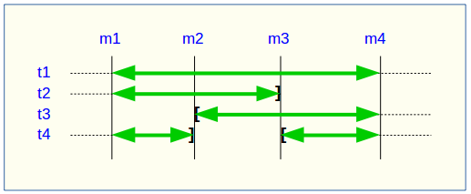

Examine data content changes
============================

.. _examining_changes:

Introduction
------------

Log tables and the internal sequences states table are a real gold mine for the analysis of changes recorded between two marks. Aside already described cancellation (rollback) and statistics functions, it is possible to view the changes in different forms.

First of all, any user having *emaj_adm* or *emaj_viewer* privileges can directly query log tables. Their structure is described :ref:`here<logTableStructure>`.

But two functions, :ref:`emaj_dump_changes_group()<emaj_dump_changes_group>` and :ref:`emaj_gen_sql_dump_changes_group()<emaj_gen_sql_dump_changes_group>`, may help this examination. They allow to visualize data content changes for each table and sequence belonging to a tables group, for a period of time framed by two marks.

Output types
------------

In order to cover many use cases, the data changes visualization may take different forms:

* a set of flat files created by *COPY TO* statements (thus stored into the PostgreSQL instance disk space);
* a *psql* script producing flat files using *\\copy to* meta-commands (thus in the client disk space);
* a temporary table containing SQL statements allowing any client to directly visualize and analyze data changes.

Consolidation levels
--------------------

Different levels of changes visualization are available through the concept of **consolidation**.

Without consolidation, each elementary change recorded into the log tables is returned. So one gets simple log table extracts for the targeted time period.

The consolidation process aims to only return the initial state (at the begin mark time) and/or the end state (at the end mark time) of each primary key, for which changes have been recorded. For each primary key, one gets a row of type ‘OLD’, representing the initial state if it already exists, and/or a row of type ‘NEW’ representing the final state, if it still exists. So the consolidation process needs that all examined tables own a PRIMARY KEY.

Two consolidation levels exists. The **partial consolidation** doesn’t take into account the data content. On the contrary, the **full consolidation** considers that changes producing strictly identical data between both marks are not to be returned.

Let’s take some examples, using a table described as *(col1 INT PRIMARY KEY, col2 TEXT)*.

+-----------------------------+---------------------------------------+-------------------------+----------------------+
| SQL between both marks      | Log table (*)                         | Partial consolidation   | Full consolidation   |
+=============================+=======================================+=========================+======================+
| | INSERT (1,’A’)            | | 1,’A’,NEW,1                         | | 1,’A’,NEW             | | 1,’A’,NEW          |
+-----------------------------+---------------------------------------+-------------------------+----------------------+
| | UPDATE (1,’A’) => (1,’B’) | | 1,’A’,OLD,1                         | | 1,’A’,OLD             | | 1,’A’,OLD          |
| |                           | | 1,’B’,NEW,1                         | | 1,’B’,NEW             | | 1,’B’,NEW          |
+-----------------------------+---------------------------------------+-------------------------+----------------------+
| | DELETE (1,’A’)            | | 1,’A’,OLD,1                         | | 1,’A’,OLD             | | 1,’A’,OLD          |
+-----------------------------+---------------------------------------+-------------------------+----------------------+
| | INSERT (1,’A’)            | | 1,’A’,NEW,1                         | | 1,’B’,NEW             | | 1,’B’,NEW          |
| | UPDATE (1,’A’) => (1,’B’) | | 1,’A’,OLD,2                         | |                       | |                    |
| |                           | | 1,’B’,NEW,2                         | |                       | |                    |
+-----------------------------+---------------------------------------+-------------------------+----------------------+
| | UPDATE (1,’A’) => (1,’B’) | | 1,’A’,OLD,1                         | | 1,’A’,OLD             | | 1,’A’,OLD          |
| |                           | | 1,’B’,NEW,1                         | |                       | |                    |
| | DELETE (1,’B’)            | | 1,’B’,OLD,1                         | |                       | |                    |
+-----------------------------+---------------------------------------+-------------------------+----------------------+
| | UPDATE (1,’A’) => (1,’B’) | | 1,’A’,OLD,1                         | | 1,’A’,OLD             | | 1,’A’,OLD          |
| |                           | | 1,’B’,NEW,1                         | | 1,’D’,NEW             | | 1,’D’,NEW          |
| | UPDATE (1,’B’) => (1,’C’) | | 1,’B’,OLD,2                         | |                       | |                    |
| |                           | | 1,’C’,NEW,2                         | |                       | |                    |
| | UPDATE (1,’C’) => (1,’D’) | | 1,’C’,OLD,3                         | |                       | |                    |
| |                           | | 1,’D’,NEW,3                         | |                       | |                    |
+-----------------------------+---------------------------------------+-------------------------+----------------------+
| | INSERT (1,’A’)            | | 1,’A’,NEW,1                         | | -                     | | -                  |
| | DELETE (1,’A’)            | | 1,’A’,OLD,2                         | |                       | |                    |
+-----------------------------+---------------------------------------+-------------------------+----------------------+
| | DELETE (1,’A’)            | | 1,’A’,OLD,1                         | | 1,’A’,OLD             | | 1,’A’,OLD          |
| | INSERT (1,’B’)            | | 1,’B’,NEW,2                         | | 1,’B’,NEW             | | 1,’B’,NEW          |
+-----------------------------+---------------------------------------+-------------------------+----------------------+
| | UPDATE (1,’A’) => (1,’B’) | | 1,’A’,OLD,1                         | | 1,’A’,OLD             | | -                  |
| |                           | | 1,’B’,NEW,1                         | | 1,’A’,NEW             | |                    |
| | UPDATE (1,’B’) => (1,’A’) | | 1,’B’,OLD,2                         | |                       | |                    |
| |                           | | 1,’A’,NEW,2                         | |                       | |                    |
+-----------------------------+---------------------------------------+-------------------------+----------------------+
| | DELETE (1,’A’)            | | 1,’A’,OLD,1                         | | 1,’A’,OLD             | | -                  |
| | INSERT (1,’A’)            | | 1,’A’,NEW,2                         | | 1,’A’,NEW             | |                    |
+-----------------------------+---------------------------------------+-------------------------+----------------------+
| | UPDATE (1,’A’) => (2,’A’) | | 1,’A’,OLD,1                         | | 1,’A’,OLD,1           | | 1,’A’,OLD          |
| |                           | | 2,’A’,NEW,1                         | | 3,’B’,NEW             | | 3,’B’,NEW          |
| | UPDATE (2,’A’) => (2,’B’) | | 2,’A’,OLD,2                         | |                       | |                    |
| |                           | | 2,’B’,NEW,2                         | |                       | |                    |
| | UPDATE (2,’B’) => (3,’B’) | | 2,’B’,OLD,3                         | |                       | |                    |
| |                           | | 3,’B’,NEW,3                         | |                       | |                    |
+-----------------------------+---------------------------------------+-------------------------+----------------------+

(*) the log table extract corresponds to columns *(col1, col2, emaj_tuple, emaj_gid)*, other E-Maj technical columns not being mentionned.

.. caution::

   Some rare data types like *JSON* or *XML* have no equality operator. In this case, the full consolidation casts these columns into *TEXT* to compare initial and final values.

For each sequence, two rows are returned, corresponding to its initial and final state. In a full consolidation vision, no row is returned when both states are strictly identical.

.. _emaj_dump_changes_group:

The emaj_dump_changes_group() function
--------------------------------------

The *emaj_dump_changes_group()* function extracts changes from log tables and from the sequences states table and create files into the PostgreSQL instance disk space, using *COPY TO* statements. ::

   SELECT emaj.emaj_dump_changes_group('<group.name>', '<start.mark>', '<end.mark>',
               '<options.list>', <tables/sequences.array>, '<output.directory>');

The keyword 'EMAJ_LAST_MARK' can be used as end mark name, representing the last set mark.

If the marks range is not contained by a single *log session*, i.e. if group stops/restarts occured between these marks, a warning message is raised, indicating that data changes may have been not recorded.

The **4th parameter** is a list of options, separated by commas. Options can be any of the following keywords (in alphabetic order):

* COLS_ORDER = LOG_TABLE | PK: defines the columns order in output files (LOG_TABLE = the same order than in log tables, PK = the primary key columns first);
* CONSOLIDATION = NONE | PARTIAL | FULL: defines the consolidation level; the default value is NONE;
* COPY_OPTIONS = (options): defines the options to be used by the *COPY TO* statements; the list must be set between parenthesis; refer to the PostgreSQL documentation for the available options details (https://www.postgresql.org/docs/current/sql-copy.html);
* EMAJ_COLUMNS = ALL | MIN | (columns list): restricts the returned E-Maj technical columns: ALL = all existing columns, MIN = a minimum number of columns, or an explicit columns list, set between parenthesis;
* NO_EMPTY_FILES: removes files that do not contain any data;
* ORDER_BY = PK | TIME: defines the rows sort order in files; PK = the primary key order, TIME = the entry into the table log order;
* SEQUENCES_ONLY: only process sequences of the tables group; by default, tables are processed;
* TABLES_ONLY: only process tables of the tables groups; by default, sequences are processed.

The default value of the three COLS_ORDER, EMAJ_COLUMNS and ORDER_BY options depends on the consolidation level:

* when CONSOLIDATION = NONE, COLS_ORDER = LOG_TABLE, EMAJ_COLUMNS = ALL and ORDER_BY = TIME;
* when CONSOLIDATION = PARTIAL or FULL, COLS_ORDER = PK, EMAJ_COLUMNS = MIN and ORDER_BY = PK.

The **5th parameter** allows to filter the tables and sequences to process. If the parameter is set to NULL, all tables and sequences of the tables group are processed. If specified, the parameter must be expressed as a non empty array of text elements, each of them representing a schema qualified table or sequence name. Both syntaxes can be used::

   ARRAY['sch1.tbl1','sch1.tbl2']

or::

   '{ "sch1.tbl1" , "sch1.tbl2" }'

The effects of this tables/sequences selection and the TABLES_ONLY and SEQUENCES_ONLY options are cumulative. For instance, a sequence listed in the array will not be processed if the TABLES_ONLY option is set.

The output directory/folder set as **6th parameter** must be an absolute pathname. It must have been created prior the function call and it must have the appropriate permission so that the PostgreSQL instance can write into it.

The function returns a textual message containing the number of generated files and their location.

When the tables group structure is stable between both targeted marks, the *emaj_dump_changes_group()* function generates one file per application table and sequence. Its name profile looks like::

   <schema.name>_<table/sequence.name>.changes

The impact of tables group structure changes is presented below.

In order to manipulate generated files more easily, any unconvenient in file name characters, namely spaces, “/”, “\”, “$”, “>”, “<”, “|”, single or double quotes and “*” are replaced by “_”. Beware, these file names adjusment may lead to duplicates, the last generated file overwriting then the previous ones.

All files are stored into the directory/folder set as 6th parameter. Already existing files are overwritten.

At the end of the operation, a file named *_INFO* is created in this same directory/folder. It contains:

* the operation characteristics, including the tables group, both selected marks, the options and the operation date and time;
* one line per created file, indicating the table or sequence name and the associated marks range.

During the extraction, the tables group may be in any idle or logging state.

As this function may generate large or very large files, it is user's responsibility to provide a sufficient disk space.

The log tables structure is described :ref:`here <logTableStructure>`.

.. _emaj_gen_sql_dump_changes_group:

The emaj_gen_sql_dump_changes_group() function
----------------------------------------------

The *emaj_gen_sql_dump_changes_group()* function generates SQL statements that extract changes from log tables and from the sequences states table. Two versions exist, depending whether the 6th parameter is present. ::

   SELECT emaj.emaj_gen_sql_dump_changes_group('<group.name>', '<start.mark>', '<end.mark>',
               '<options.list>', <tables/sequences.array>);

or ::

   SELECT emaj.emaj_gen_sql_dump_changes_group('<group.name>', '<start.mark>', '<end.mark>',
               '<options.list>', <tables/sequences.array>, '<script.location>');

The keyword 'EMAJ_LAST_MARK' can be used as end mark name, representing the last set mark.

If the marks range is not contained by a single *log session*, i.e. if group stops/restarts occured between these marks, a warning message is raised, indicating that data changes may have been not recorded.

The **4th parameter** is a list of options, separated by commas. Options can be any of the following keywords (in alphabetic order):

* COLS_ORDER = LOG_TABLE | PK: defines the columns order in output results (LOG_TABLE = the same order than in log tables, PK = the primary key columns first);
* CONSOLIDATION = NONE | PARTIAL | FULL: defines the consolidation level; the default value is NONE;
* EMAJ_COLUMNS = ALL | MIN | (columns list): restricts the returned E-Maj technical columns: ALL = all existing columns, MIN = a minimum number of columns, or an explicit columns list, set between parenthesis;
* ORDER_BY = PK | TIME: defines the rows sort order in output results; PK = the primary key order, TIME = the entry into the table log order;
* PSQL_COPY_DIR = (directory): generates a *psql* *\\copy* meta-command for each statement, using the directory name provided by the option; the diretory name must be surrounded by parenthesis;
* PSQL_COPY_OPTIONS = (options): when PSQL_COPY_DIR is set, defines the options to be used by the generated *\\copy to* statements; the list must be set between parenthesis; refer to the PostgreSQL documentation for the available options details (https://www.postgresql.org/docs/current/sql-copy.html);
* SEQUENCES_ONLY: only process sequences of the tables group; by default, tables are processed;
* SQL_FORMAT = RAW | PRETTY: defines how generated statements will be formatted: RAW = on a single line, PRETTY = on several lines and indended, for a better readability;
* TABLES_ONLY: only process tables of the tables groups; by default, sequences are processed.

The default value of the three COLS_ORDER, EMAJ_COLUMNS and ORDER_BY options depends on the consolidation level:

* when CONSOLIDATION = NONE, COLS_ORDER = LOG_TABLE, EMAJ_COLUMNS = ALL and ORDER_BY = TIME;
* when CONSOLIDATION = PARTIAL or FULL, COLS_ORDER = PK, EMAJ_COLUMNS = MIN and ORDER_BY = PK.

The **5th parameter** allows to filter the tables and sequences to process. If the parameter is set to NULL, all tables and sequences of the tables group are processed. If specified, the parameter must be expressed as a non empty array of text elements, each of them representing a schema qualified table or sequence name. Both syntaxes can be used::

   ARRAY['sch1.tbl1','sch1.tbl2']

or::

   '{ "sch1.tbl1" , "sch1.tbl2" }'

The effects of this tables/sequences selection and the TABLES_ONLY and SEQUENCES_ONLY options are cumulative. For instance, a sequence listed in the array will not be processed if the TABLES_ONLY option is set.

The script file name parameter supplied as **6th parameter** is optional. If it is not present, generated statements are left at the caller’s disposal into an *emaj_temp_sql* temporary table. Otherwise, they are written into the file defined by this parameter. It must be an absolute pathname. The directory must have been created prior the function call and it must have the appropriate permission so that the PostgreSQL instance can write into it.

If any schema, table or column name contains a "\\" (antislah) character, the *COPY* command executed to build the output script file duplicates this character. If a *sed* command is available on the server hosting the PostgreSQL instance, the *emaj_gen_sql_dump_changes_group()* function automatically removes such duplicated characters. Otherwise, manual script changes are required.

The function returns a textual message containing the number of generated statements and their location.

The *emaj_temp_sql* temporary table left at the caller’s disposal when the 6th parameter is not present has the following structure:

* sql_stmt_number (INT): statement number
* sql_line_number (INT): line number for the statement (0 for comments, 1 for a full statement when SQL_FORMAT = RAW, 1 to n when SQL_FORMAT = PRETTY)
* sql_rel_kind (TEXT): kind of relation ("table" ou "sequence")
* sql_schema (TEXT): schema containing the application table or sequence
* sql_tblseq (TEXT): table or sequence name
* sql_first_mark (TEXT): the first mark for this table or sequence
* sql_last_mark (TEXT): the last mark for this table or sequence
* sql_group (TEXT): tables group owning the table or sequence
* sql_nb_changes (BIGINT): estimated number of changes to process (NULL for sequences)
* sql_file_name_suffix (TEXT): file name suffix when the PSQL_COPY_DIR option has been set
* sql_text (TEXT): a line of text of the generated statement
* sql_result (BIGINT): column dedicated to the caller for its own purpose when using the temporary table.

The table contents:

* a first statement which is a general comment, reporting the main SQL generation characteristics: tables group, marks, options, etc (*sql_stmt_number* = 0);
* in case of full consolidation, a statement that changes the *enable_nestloop* configuration variable ; this statement is needed to optimize the log tables analysis (*sql_stmt_number* = 1);
* then, for each table and sequence:

   * a comment related to this table or sequence (*sql_line_number* = 0);
   * the analysis statement, on one or several lines, depending on the SQL_FORMAT option;
* in case of full consolidation, a last statement reseting the *enable_nestloop* variable to its previous value.

An index is created on columns *sql_stmt_number* and *sql_line_number*.

Once the *emaj_gen_sql_dump_changes_group()* function has been executed the caller can use the temporary table as he wants. With *ALTER TABLE* statements, he can even add columns, rename the table, transform it into a permanent table; He can also add an additional index, if needed. The estimated number of changes can be used to efficiently parallelize the statements execution.

For instance, the caller can generate a SQL script and store it locally with::

   \copy (SELECT sql_text FROM emaj_temp_sql) to <fichier>

He can get the SQL statement for a given table with::

   SELECT sql_text FROM emaj_temp_sql
     WHERE sql_line_number >= 1
       AND sql_schema = '<schema>' AND sql_tblseq = '<table>';

During the SQL generation, the tables group may be in any idle or logging state.

The *emaj_gen_sql_dump_changes_group()* function can be called by any role who has been granted *emaj_viewer* but not *emaj_adm* if no file is directly written by the function (i.e. if the 6th parameter is not present).

Impact of tables group structure changes
----------------------------------------

It may happen that the tables group structure changes during the examined marks frame.

A table or a sequence may have been removed from the group or assigned to the group between the selected start mark and end mark. In this case, as for table t2 and t3 in the example above, the extraction frames the real period of time the table or sequence belonged to the tables group. For this reason, the *_INFO* file and the *emaj_temp_sql* table contain information about the real marks frame used for each table or sequence.

A table or a sequence may even be removed from its group and reassigned to it later. In this case, as for table t4 above, there are several distinct extractions; the *emaj_dump_changes_group()* function generates several statements into the *emaj_temp_sql* table and the *emaj_gen_sql_dump_changes_group()* function writes several files for the same table or sequence. Then, the output file name suffix becomes *_1.changes*, *_2.changes*, etc.
