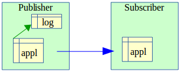
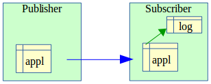
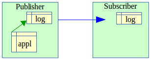
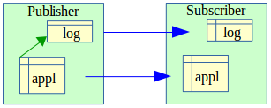

Impacts on Instance and Database Administration
===============================================

Stopping and Restarting the Instance
------------------------------------

Using E-Maj does not impose any particular constraints regarding stopping and restarting a PostgreSQL instance.

General Rule
^^^^^^^^^^^^

At instance restart, all E-Maj objects are in the same state as at instance stop: log triggers of table groups in *LOGGING* state remain enabled, and log tables contain cancelable changes already recorded.

If a transaction with table changes was not committed at instance stop, it would be rolled back during the recovery phase of the instance start, with both the application table changes and the log table changes being canceled at the same time.

This rule also applies, of course, to transactions that execute E-Maj functions, such as starting or stopping a table group, performing a rollback, or deleting a mark.

Sequences Rollback
^^^^^^^^^^^^^^^^^^

Due to a PostgreSQL constraint, the rollback of application sequences assigned to a table group is the only operation that is not protected by transactions. This is why application sequences are processed at the very end of the :ref:`rollback operations <emaj_rollback_group>`. (For the same reason, at mark set time, application sequences are processed at the beginning of the operation.)

In case of an instance stop during an E-Maj rollback execution, it is recommended to rerun this rollback just after the instance restart to ensure that application sequences and tables remain properly synchronized.

----

Saving and Restoring the Database
---------------------------------

.. caution::
   Using E-Maj allows a reduction in the frequency of database saves. However, E-Maj cannot be considered a substitute for regular database saves, which remain indispensable for maintaining a full image of databases on an external medium.

File-Level Saves and Restores
^^^^^^^^^^^^^^^^^^^^^^^^^^^^^

When saving or restoring instances at the file level, it is essential to save or restore **ALL** instance files, including those stored on dedicated tablespaces.

After a file-level restore, table groups are in the exact same state as at the save time, and database activity can be restarted without any particular E-Maj operation.

Logical Saves and Restores of Entire Database
^^^^^^^^^^^^^^^^^^^^^^^^^^^^^^^^^^^^^^^^^^^^^

To properly save and restore a database with E-Maj using *pg_dump* and *psql* or *pg_restore*, it is essential that both the source and restored databases use the **same E-Maj version**. If this is not the case, the content of some technical tables may not be synchronized with their structure. The :ref:`emaj_get_version()<emaj_get_version>` function allows checking the current version of the *emaj* extension.

Regarding stopped table groups (in *IDLE* state), as log triggers are disabled and the content of related log tables is meaningless, no action is required to restore them to the same state as at save time.

For table groups in *LOGGING* state at save time, it is important to ensure that log triggers are only activated after the application tables are rebuilt. Otherwise, during the table rebuild, table changes would also be recorded in log tables.

When using the *pg_dump* command for saves and *psql* or *pg_restore* commands for restores while processing full databases (schema + data), these tools recreate triggers, including E-Maj log triggers, after tables have been rebuilt. Therefore, no specific precautions are necessary.

On the other hand, in the case of data-only saves or restores (i.e., without schema, using `-a` or `--data-only` options), the `--disable-triggers` option must be used:

* With *pg_dump* (or *pg_dumpall*) when saving in *plain* format (and *psql* is used to restore).
* With the *pg_restore* command when saving in *tar* or *custom* format.

Restoring the database structure generates two error messages indicating that the *_emaj_protection_event_trigger_fnct()* function and the *emaj_protection_trg* event trigger already exist::

    ...
    ERROR:  function "_emaj_protection_event_trigger_fnct" already exists with same argument types
    ...
    ERROR:  event trigger "emaj_protection_trg" already exists
    ...

These messages are normal and do not indicate a faulty restore. Indeed, both objects are created with the extension and are then detached from it so that the trigger can block any attempt to drop the extension. As a result, the *pg_dump* tool saves them as independent objects. When restoring, these objects are created twice: first with the E-Maj extension creation, and then as independent objects, with the second attempt generating both error messages.

Logical Save and Restore of Partial Database
^^^^^^^^^^^^^^^^^^^^^^^^^^^^^^^^^^^^^^^^^^^^

Using *pg_dump* and *pg_restore* tools, database administrators can perform operations on a subset of database schemas or tables.

Restoring a subset of application tables and/or log tables creates a high risk of data corruption in the event of a later E-Maj rollback of the concerned tables. Indeed, it is impossible to guarantee in this case that application tables, log tables, and internal E-Maj tables containing essential data for rollbacks remain coherent.

If it is necessary to perform partial restores of application tables, all table groups concerned by the operation must be dropped and recreated immediately afterward.

Similarly, it is strongly recommended **not** to restore partial *emaj* schema content.

The only safe case for partial restore involves a full restore of the *emaj* schema content, as well as all tables belonging to all groups created in the database.

----

Data Load
---------

Besides using *pg_restore* or *psql* with files produced by *pg_dump*, it is possible to efficiently load large amounts of data using the *COPY* SQL command or the *\copy* *psql* meta-command. In both cases, this data loading fires *INSERT* triggers, including the E-Maj log trigger. Therefore, there are no constraints on using *COPY* or *\copy* in an E-Maj environment.

With other loading tools, it is important to verify that triggers are effectively fired for each row insertion.

----

Table Reorganization
--------------------

Reorganization of Application Tables
^^^^^^^^^^^^^^^^^^^^^^^^^^^^^^^^^^^^

Application tables protected by E-Maj can be reorganized using the *CLUSTER* or *REPACK* SQL commands. Whether or not log triggers are enabled, the reorganization process has no impact on log table content.

Reorganization of E-Maj Tables
^^^^^^^^^^^^^^^^^^^^^^^^^^^^^^

The index corresponding to the primary key of each table from E-Maj schemas (neither log tables nor technical tables) is declared as *cluster*.

.. caution::
   Therefore, using E-Maj may have an operational impact on the execution of *CLUSTER* or *REPACK* SQL commands at the database level.

When E-Maj is used in continuous mode (with deletion of the oldest marks instead of regular table group stops and restarts), it is recommended to regularly reorganize E-Maj log tables to reclaim unused disk space following mark deletions.

----

Using E-Maj with Replication
----------------------------

Integrated Physical Replication
^^^^^^^^^^^^^^^^^^^^^^^^^^^^^^^

E-Maj is fully compatible with the use of the different PostgreSQL integrated physical replication modes (*WAL* archiving and *PITR*, asynchronous and synchronous *Streaming Replication*). Indeed, all E-Maj objects hosted in the instance are replicated like all other objects in the instance.

However, due to the way PostgreSQL manages sequences, the current values of sequences may be slightly ahead on secondary instances compared to the primary instance. For E-Maj, this may slightly overestimate the number of log rows in general statistics. However, there is no impact on data integrity.

Integrated Logical Replication
^^^^^^^^^^^^^^^^^^^^^^^^^^^^^^

PostgreSQL includes logical replication mechanisms. The replication granularity is at the table level. The *publication* object used with logical replication is quite close to the E-Maj table group concept, except that a *publication* cannot contain sequences.

**Replication of Application Tables Managed by E-Maj**

An application table that belongs to a table group can be replicated. The effect of any rollback operation that may occur would simply be replicated on the *subscriber* side, as long as no filter has been applied to the replicated SQL command types.

**Replication of Application Tables with E-Maj Activated on Subscriber Side**

As of E-Maj 4.0, it is possible to include an application table in a table group with updates coming from a logical replication stream. However, all E-Maj operations (starting/stopping the group, setting marks, etc.) must, of course, be executed on the *subscriber* side. An E-Maj rollback operation can be launched once the replication stream has been stopped (to avoid update conflicts). However, tables on both the *publisher* and *subscriber* sides are then no longer coherent.

**Replication of E-Maj Log Tables**

As of E-Maj 4.0, it is technically possible to replicate an E-Maj log table (once a way to obtain the DDL that creates the log table has been found, using *pg_dump*, for instance). This allows duplicating or centralizing log content on another server. However, the replicated log table can only be used for log **auditing**. As log sequences are not replicated, these logs cannot be used for other purposes.

**Replication of Application Tables and E-Maj Log Tables**

Application tables and log tables can be simultaneously replicated. However, as previously mentioned, these replicated logs can only be used for **auditing** purposes. E-Maj rollback operations can only be executed on the *publisher* side.

Other Replication Solutions
^^^^^^^^^^^^^^^^^^^^^^^^^^^

Using E-Maj with external replication solutions based on triggers, such as *Slony* or *Londiste*, requires some attention. It is probably advisable to avoid replicating log tables and E-Maj technical tables.
