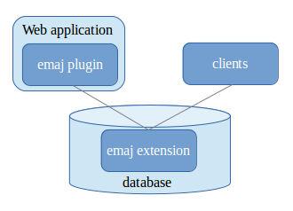

Introduction
============

License
*******

This extension and its documentation are distributed under GPL license (GNU - General Public License).

E-Maj's objectives
******************

E-Maj is the French acronym for "*Enregistrement des Mises A Jour*", which means "*updates recording*".

It meets two main goals:

* E-Maj can be used to **trace updates** performed by application programs on the table's content. Viewing these recorded updates offers an answer to the need for “updates-auditing”,
* By using these recorded updates, E-Maj is able to **logically restore sets of tables into predefined states**, without being obliged to either restore all files of the PostgreSQL instance (cluster) or reload the entire content of the concerned tables.

In other words, E-Maj is a PostgreSQL extension which enables fine-grained write logging and time travel on subsets of the database.

It provides a good solution to :

* define save points at precise time on a set of tables,
* restore, if needed, this table set into a stable state, without stopping the instance,
* manage several save points, each of them being usable at any time as a restore point.

So, in a **production environment**, E-Maj may simplify the technical architecture, by offering a smooth and efficient alternative to time and/or disk consuming intermediate saves (pg_dump, mirror disks,...). E-Maj may also bring a help to the debugging by giving a way to precisely analyse how suspicious programs update application tables.

In a **test environment**, E-Maj also brings smoothness into operations. It is possible to very easily restore database subsets into predefined stable states, so that tests can be replayed as many times as needed.

Main components
***************

E-Maj actually groups several components:

* a PostgreSQL **extension** object created into each database, named *emaj* and holding some tables, functions, sequences, ...
* a set of **external clients** working in command line interface,
* a **web GUI** as a plugin for the *phpPgAdmin* tool, or an independent web application, **Emaj_web**.

The external clients and the GUI call the functions of the emaj extension.

All these components are discribed in the documentation.

