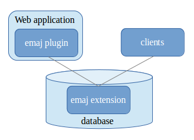

Introduction
============

License
*******

This extension and its documentation are released under the **GNU General Public License (GPL)**.

----

E-Maj's objectives
******************

E-Maj is the French acronym for "*Enregistrement des Mises À Jour*", which translates to "*Updates Recording*".

It serves two primary purposes:

* **Audit Trail**: E-Maj can trace updates performed by application programs on table content. Viewing these recorded updates addresses the need for auditing database changes.

* **Logical Restoration**: Using these recorded updates, E-Maj can logically restore sets of tables to predefined states, without requiring a full restore of the PostgreSQL instance (cluster) or reloading the entire content of the affected tables.

In other words, E-Maj is a PostgreSQL extension that enables fine-grained **write logging and time travel on subsets of the database**.

It provides an efficient solution to:

* define savepoints at precise times for a set of tables,
* restore, if needed, this table set to a stable state without stopping the instance,
* manage multiple savepoints, each usable at any time as a restore point.

In a **production environment**, E-Maj simplifies the technical architecture by offering a smooth and efficient alternative to time-consuming and disk-intensive intermediate saves (e.g., pg_dump, mirror disks, etc.). It also aids debugging by enabling precise analysis of how suspicious programs update application tables.

In a **test environment**, E-Maj streamlines operations by allowing easy restoration of database subsets to predefined stable states, so that tests can be replayed as many times as needed.

----

Main components
***************

The **E-Maj solution** consists of several components:

* a PostgreSQL **extension** object created in each database, named *emaj* and containing tables, functions, sequences, etc.,
* a set of **command-line external clients**,
* a web GUI, **Emaj_web**.

The external clients and the GUI call the functions of the *emaj* extension.

All these components are described in the documentation.