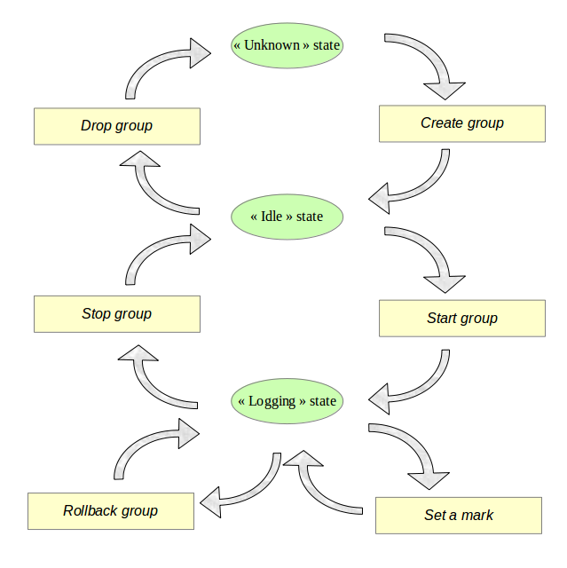

Main functions
==============

Before describing each main E-Maj function, it is interesting to have a global view on the typical operations chain. 

Operations chain
----------------

The possible chaining of operations for a tables group can be materialised by this schema. 

.. _emaj_start_group:

Start a tables group
--------------------

Starting a tables group consists in activating the recording of updates for all tables of the group. To achieve this, the following command must be executed::

   SELECT emaj.emaj_start_group('<group.name>'[, '<mark.name>'[, <delete.old.logs?>]]);

The group must be first in *IDLE* state.

When a tables group is started, a first mark is created.
 
If specified, the initial mark name may contain a generic '%' character. Then this character is replaced by the current time, with the pattern *hh.mn.ss.mmmm*,

If the parameter representing the mark is not specified, or is empty or NULL, a name is automatically generated: "*START_%*", where the '%' character represents the current time with a *hh.mn.ss.mmmm* pattern.

The *<are.old.logs.to.be.deleted?>* parameter is an optional boolean. By default, its value is true, meaning that all log tables of the tables group are purged before the trigger activation. If the value is explicitly set to false, all rows from log tables are kept as is. The old marks are also preserved, even-though they are not usable for a rollback any more, (unlogged updates may have occurred while the tables group was stopped).

The function returns the number of tables and sequences contained by the group.

To be sure that no transaction implying any table of the group is currently running, the *emaj_start_group()* function explicitly sets a *SHARE ROW EXCLUSIVE* lock on each table of the group. If transactions accessing these tables are running, this can lead to deadlock. If the deadlock processing impacts the execution of the E-Maj function, the error is trapped and the lock operation is repeated, with a maximum of 5 attempts.

The function also performs a purge of the oldest events in the :ref:`emaj_hist <emaj_hist>` technical table.

When a group is started, its state becomes "*LOGGING*".

Using the *emaj_start_groups()* function, several groups can be started at once::

   SELECT emaj.emaj_start_groups('<group.names.array>'[, '<mark.name>'[,<delete.old.logs?>]]);

More information about :doc:`multi-groups functions <multiGroupsFunctions>`.

.. _emaj_set_mark_group:

Set an intermediate mark
------------------------

When all tables and sequences of a group are considered as being in a stable state that can be used for a potential rollback, a mark can be set. This is done with the following SQL statement::

   SELECT emaj.emaj_set_mark_group('<group.name>', '<mark.name>');

The tables group must be in *LOGGING* state.

A mark having the same name can not already exist for this tables group.

The mark name may contain a generic '%' character. Then this character is replaced by the current time, with the pattern *hh.mn.ss.mmmm*.

If the parameter representing the mark is not specified or is empty or *NULL*, a name is automatically generated: "*MARK_%*", where the '%' character represents the current time with a *hh.mn.ss.mmmm* pattern.

The function returns the number of tables and sequences contained in the group.

The *emaj_set_mark_group()* function records the identity of the new mark, with the state of the application sequences belonging to the group, as well as the state of the log sequences associated to each table of the group. The application sequences are processed first, to record their state as earlier as possible after the beginning of the transaction, these sequences not being protected against updates from concurrent transactions by any locking mechanism.

It is possible to set two consecutive marks without any update on any table between these marks.

The *emaj_set_mark_group()* function sets *ROW EXCLUSIVE* locks on each table of the group in order to be sure that no transaction having already performed updates on any table of the group is running. However, this does not guarantee that a transaction having already read one or several tables before the mark set, updates tables after the mark set. In such a case, these updates would be candidate for a potential rollback to this mark.

Using the *emaj_set_mark_groups()* function, a mark can be set on several groups at once::

   SELECT emaj.emaj_set_mark_groups('<group.names.array>', '<mark.name>');

More information about :doc:`multi-groups functions <multiGroupsFunctions>`.

.. _emaj_rollback_group:

Rollback a tables group
-----------------------

If it is necessary to reset tables and sequences of a group in the state they were when a mark was set, a rollback must be performed. To perform a simple (“*unlogged*”) rollback, the following SQL statement can be executed::

   SELECT * FROM emaj.emaj_rollback_group('<group.name>', '<mark.name>' [, <is_alter_group_allowed> [, <comment>]]);

The tables group must be in *LOGGING* state and :ref:`not protected<emaj_protect_group>`. The target mark cannot be prior a :ref:`protected mark<emaj_protect_mark_group>`.

The '*EMAJ_LAST_MARK*' keyword can be used as mark name, meaning the last set mark.

The third parameter is a boolean that indicates whether the rollback operation may target a mark set before an :doc:`alter group <alterGroups>` operation. Depending on their nature, changes performed on tables groups in *LOGGING* state can be automatically cancelled or not. In some cases, this cancellation can be partial. By default, this parameter is set to *FALSE*.

A comment associated to the rollback can be supplied as 4th parameter. It allows the administrator to annotate the operation, indicating for instance the reason for it has been launched or the reverted processing. The comment can also be added by the :ref:`emaj_comment_rollback() <emaj_comment_rollback>` function, this function allowing also its update or deletion.

The function returns a set of rows with a severity level set to either “*Notice*” or “*Warning*” values, and a textual message. The function returns 3 “*Notice*” rows reporting the generated rollback identifier, the number of tables and the number of sequences that have been effectively modified by the rollback operation. Other messages of type “*Warning*” may also be reported when the rollback operation has processed tables group changes.

To be sure that no concurrent transaction updates any table of the group during the rollback operation, the *emaj_rollback_group()* function explicitly sets an *EXCLUSIVE* lock on each table of the group. If transactions updating these tables are running, this can lead to deadlock. If the deadlock processing impacts the execution of the E-Maj function, the error is trapped and the lock operation is repeated, with a maximum of 5 attempts. But tables of the group remain accessible for read only transactions during the operation.

The E-Maj rollback takes into account the existing triggers and foreign keys on the concerned tables. More details :doc:`here<rollbackDetails>`.

When the volume of updates to cancel is high and the rollback operation is therefore long, it is possible to monitor the operation using the :ref:`emaj_rollback_activity() <emaj_rollback_activity>` function or the :doc:`emajRollbackMonitor <rollbackMonitorClient>` client.

When the rollback operation is completed, the following are deleted:

* all log tables rows corresponding to the rolled back updates,
* all marks later than the mark referenced in the rollback operation.

Then, it is possible to continue updating processes, to set other marks, and if needed, to perform another rollback at any mark.

Using the *emaj_rollback_groups()* function, several groups can be rolled back at once::

   SELECT * FROM emaj.emaj_rollback_groups('<group.names.array>', '<mark.name>' [, <is_alter_group_allowed> [, <comment>]]);

The supplied mark must correspond to the same point in time for all groups. In other words, this mark must have been set by the same :ref:`emaj_set_mark_group() <emaj_set_mark_group>` function call.

More information about :doc:`multi-groups functions <multiGroupsFunctions>`.

.. _emaj_logged_rollback_group:

Perform a logged rollback of a tables group
-------------------------------------------

Another function executes a “*logged*” rollback. In this case, log triggers on application tables are not disabled during the rollback operation. As a consequence, the updates on application tables are also recorded into log tables, so that it is possible to cancel a rollback. In other words, it is possible to rollback … a rollback.

To execute a “*logged*” rollback, the following SQL statement can be executed::

   SELECT * FROM emaj.emaj_logged_rollback_group('<group.name>', '<mark.name>' [, <is_alter_group_allowed> [, <comment>]]);

The usage rules are the same as with *emaj_rollback_group()* function.

The tables group must be in *LOGGING* state and :ref:`not protected<emaj_protect_group>`. The target mark cannot be prior a :ref:`protected mark<emaj_protect_mark_group>`.

The '*EMAJ_LAST_MARK*' keyword can be used as mark name, meaning the last set mark.

The third parameter is a boolean that indicates whether the rollback operation may target a mark set before an :doc:`alter group <alterGroups>` operation. Depending on their nature, changes performed on tables groups in *LOGGING* state can be automatically cancelled or not. In some cases, this cancellation can be partial. By default, this parameter is set to *FALSE*.

A comment associated to the rollback can be supplied as 4th parameter. It allows the administrator to annotate the operation, indicating for instance the reason for it has been launched or the reverted processing. The comment can also be added by the :ref:`emaj_comment_rollback() <emaj_comment_rollback>` function, this function allowing also its update or deletion.

The function returns a set of rows with a severity level set to either “*Notice*” or “*Warning*” values, and a textual message. The function returns 3 “*Notice*” rows reporting the generated rollback identifier, the number of tables and the number of sequences that have been effectively modified by the rollback operation. Other messages of type “*Warning*” may also be reported when the rollback operation has processed tables group changes.

To be sure that no concurrent transaction updates any table of the group during the rollback operation, the *emaj_rollback_group()* function explicitly sets an *EXCLUSIVE* lock on each table of the group. If transactions updating these tables are running, this can lead to deadlock. If the deadlock processing impacts the execution of the E-Maj function, the error is trapped and the lock operation is repeated, with a maximum of 5 attempts. But tables of the group remain accessible for read only transactions during the operation.

The E-Maj rollback takes into account the existing triggers and foreign keys on the concerned tables. More details :doc:`here<rollbackDetails>`.

Unlike with :ref:`emaj_rollback_group() <emaj_rollback_group>` function, at the end of the operation, the log tables content as well as the marks following the rollback mark remain.
At the beginning and at the end of the operation, the function automatically sets on the group two marks named:

* '*RLBK_<rollback.mark>_<rollback.time>_START*'
* '*RLBK_<rollback.mark>_<rollback.time>_DONE*'

where rollback.time represents the start time of the transaction performing the rollback, expressed as “hours.minutes.seconds.milliseconds”.

When the volume of updates to cancel is high and the rollback operation is therefore long, it is possible to monitor the operation using the :ref:`emaj_rollback_activity() <emaj_rollback_activity>` function or the :doc:`emajRollbackMonitor <rollbackMonitorClient>` client.

Following the rollback operation, it is possible to resume updating the database, to set other marks, and if needed to perform another rollback at any mark, including the mark set at the beginning of the rollback, to cancel it, or even delete an old mark that was set after the mark used for the rollback.

Rollback from different types (logged/unlogged) may be executed in sequence. For instance, it is possible to chain the following steps:

* Set Mark M1
* …
* Set Mark M2
* …
* Logged Rollback to M1 (generating RLBK_M1_<time>_STRT, and RLBK_M1_<time>_DONE)
* …
* Rollback to RLBK_M1_<time>_DONE (to cancel the updates performed after the first rollback)
* …
* Rollback to  RLBK_M1_<time>_STRT (to finally cancel the first rollback)

A :ref:`"consolidation" function <emaj_consolidate_rollback_group>` for “logged rollback“ allows to transform a logged rollback into a simple unlogged rollback.

Using the *emaj_rollback_groups()* function, several groups can be rolled back at once::

   SELECT * FROM emaj.emaj_logged_rollback_groups('<group.names.array>', '<mark.name>' [, <is_alter_group_allowed> [, <comment>]]);

The supplied mark must correspond to the same point in time for all groups. In other words, this mark must have been set by the same :ref:`emaj_set_mark_group() <emaj_set_mark_group>` function call.

More information about :doc:`multi-groups functions <multiGroupsFunctions>`.

.. _emaj_stop_group:

Stop a tables group
-------------------

When one wishes to stop the updates recording for tables of a group, it is possible to deactivate the logging mechanism, using the command::

   SELECT emaj.emaj_stop_group('<group.name>'[, '<mark.name>')];

The function returns the number of tables and sequences contained in the group.

If the mark parameter is not specified or is empty or *NULL*, a mark name is generated: "*STOP_%*" where '%' represents the current time expressed as *hh.mn.ss.mmmm*.

Stopping a tables group simply deactivates log triggers of application tables of the group. The setting of *SHARE ROW EXCLUSIVE* locks may lead to deadlock. If the deadlock processing impacts the execution of the E-Maj function, the error is trapped and the lock operation is repeated, with a maximum of 5 attempts.

The *emaj_stop_group()* function closes the current log session. Then, it is not possible to execute an E-Maj rollback targeting an existing mark anymore, even though no changes have been applied since the tables group stop.

However the content of log tables and E-Maj technical tables can be examined. 

When a group is stopped, its state becomes "*IDLE*" again.

Executing the *emaj_stop_group()* function for a tables group already stopped does not generate an error. Only a warning message is returned.

Using the *emaj_stop_groups()* function, several groups can be stopped at once::

   SELECT emaj.emaj_stop_groups('<group.names.array>'[, '<mark.name>')];

More information about :doc:`multi-groups functions <multiGroupsFunctions>`.
