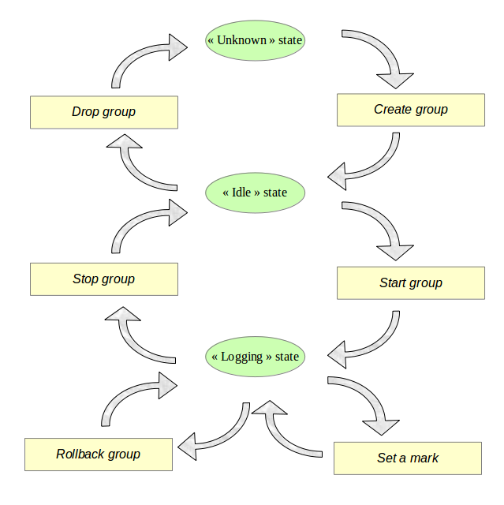

Main Functions
==============

Before describing each main E-Maj function, it is useful to have a global view of the typical operations chain.

Operations Chain
----------------

The possible chaining of operations for a table group can be represented by the following schema.

----

.. _emaj_start_group:

Starting a Table Group
----------------------

Starting a table group consists of activating change recording for all tables in the group. To achieve this, execute the following command::

   SELECT emaj.emaj_start_group(p_groupName, p_mark, p_resetLogs, p_loggingGroupAllowed);

**Input Parameters**

- ``p_groupName`` (*TEXT*): **Table group name**.
- ``p_mark`` (*TEXT*, optional): Initial **mark name**. It may contain a generic ``%`` character, which is replaced by the current time with the pattern ``hh.mm.ss.mmmm``. If the parameter is not specified, or is empty or *NULL*, a name is automatically generated: ``*START_%*``.
- ``p_resetLogs`` (*BOOLEAN*, optional):

   - *TRUE* (default): All log tables of the table group are purged before trigger activation. All marks previously set for the group are deleted.
   - *FALSE*: All rows from log tables are kept as is. The old marks are also preserved, even though they are not usable for a rollback anymore (unlogged updates may have occurred while the table group was stopped).
- ``p_loggingGroupAllowed`` (*BOOLEAN*, optional):

   - *FALSE* (default): If the table group is already in *LOGGING* state, the function raises an error.
   - *TRUE*: If the table group is already in *LOGGING* state, the function only raises a warning.

**Returned data**

The function returns the number of tables and sequences contained in the group or 0 if the group was already in *LOGGING* state.

**Notes**

The group must previously be in *IDLE* state, unless ``p_loggingGroupAllowed`` is explicitely set to *TRUE*.

The function:

- **Purges log tables**, unless ``p_resetLogs`` is *FALSE*.
- **Delete all marks** previously set for the group, unless ``p_resetLogs`` is *FALSE*.
- **Purges** the oldest events in the :ref:`emaj_hist <emaj_hist>` technical table and in some other internal tables.
- Sets an initial **mark**.
- Activates E-Maj **triggers** for all tables.

Once started:

- The group **state** becomes *LOGGING*.
- A **new log session** is started.

The ``p_loggingGroupAllowed`` parameter allows writing idempotent administration scripts.

To ensure that no transaction involving any table of the group is currently running, the *emaj_start_group()* function explicitly sets a *SHARE ROW EXCLUSIVE* **lock** on each table of the group. If transactions accessing these tables are running, this can lead to deadlocks. If the deadlock processing impacts the execution of the E-Maj function, the error is trapped, and the lock operation is retried with a maximum of 5 attempts.

**Multi-groups operation**

Using the **emaj_start_groups()** function, **several groups** can be started at once::

   SELECT emaj.emaj_start_groups(p_groupNames, p_mark, p_resetLogs, p_loggingGroupsAllowed);

The differences with the *emaj_start_group()* function are:

- The first parameter is a *TEXT array* representing all table groups to process. For more information, see :doc:`multi-groups functions <multiGroupsFunctions>`.
- If at least one table group is already in *LOGGING* state, the ``p_loggingGroupsAllowed`` parameter must be set to *TRUE*.
- The function returns the number of tables and sequences of groups effectively set from *IDLE* to *LOGGING* state.

----

.. _emaj_set_mark_group:

Setting an Intermediate Mark
----------------------------

When all tables and sequences of a group are considered to be in a stable state that can be used for a potential rollback, a mark can be set. This is done with the following SQL statement::

   SELECT emaj.emaj_set_mark_group(p_groupName, p_mark, p_comment);

**Input Parameters**

- ``p_groupName`` (*TEXT*): **Table group name**.
- ``p_mark`` (*TEXT*, optional): **Mark name**. It may contain a generic ``%`` character, which is replaced by the current time with the pattern ``hh.mm.ss.mmmm``. If the parameter is not specified, or is empty or *NULL*, a name is automatically generated: ``*MARK_%*``.
- ``p_comment`` (*TEXT*, optional): **Comment** describing the mark. If it is not provided or if it is set to *NULL*, no comment is registered for the mark.

**Returned data**

The function returns the number of tables and sequences contained in the group.

**Notes**

The table group must be in *LOGGING* state.

A mark with the same name cannot already exist for the table group.

The **comment** describing the mark can be modified or deleted later using the :ref:`emaj_comment_mark_group()<emaj_comment_mark_group>` function.

The *emaj_set_mark_group()* function records the identity of the new mark, with the state of the application sequences belonging to the group, as well as the state of the log sequences associated with each table of the group. The application sequences are processed first to record their state as early as possible after the beginning of the transaction, as these sequences are not protected against updates from concurrent transactions by any locking mechanism.

It is possible to set two consecutive marks without any table changes between these marks.

The *emaj_set_mark_group()* function sets *ROW EXCLUSIVE* locks on each table of the group to ensure that no transaction having already performed updates on any table of the group is running. However, this does not guarantee that a transaction having already read one or more tables before the mark is set will not update tables after the mark is set. In such a case, these updates would be candidates for a potential rollback to this mark.

To set a mark in an idempotent script, it is possible to condition the operation on the mark's non-existence by using the :ref:`emaj_does_exist_mark_group()<emaj_exist_state_mark_group>` function in a *WHERE* clause.

**Multi-groups operation**

Using the ``emaj_set_mark_groups()`` function, a mark can be set on several groups at once::

   SELECT emaj.emaj_set_mark_groups(p_groupNames, p_mark, p_comment);

The differences with the *emaj_set_mark_group()* function are:

- The first parameter is a *TEXT array* representing all table groups to process. For more information, see :doc:`multi-groups functions <multiGroupsFunctions>`.

----

.. _emaj_rollback_group:

Rolling Back a Table Group
--------------------------

If it is necessary to reset tables and sequences of a group to the state they were in when a mark was set, a rollback must be performed. To perform a simple ("unlogged") rollback, execute the following SQL statement::

   SELECT * FROM emaj.emaj_rollback_group(p_groupName, p_mark, p_isAlterGroupAllowed, p_comment);

**Input Parameters**

- ``p_groupName`` (*TEXT*): **Table group name**.
- ``p_mark`` (*TEXT*): Target **mark name**. The ``'EMAJ_LAST_MARK'`` keyword can be used to represent the last set mark.
- ``p_isAlterGroupAllowed`` (*BOOLEAN*, optional):

   - *FALSE* (default): The rollback attempt raises an exception if the table group has been altered since the target mark.
   - *TRUE*: The rollback operation is allowed to target a mark set before an :doc:`alter group <alterGroups>`.
   
- ``p_comment`` (*TEXT*, optional): **Comment** describing the rollback. If it is not provided or if it is set to *NULL*, no comment is registered for the rollback.

**Returned data**

The function returns a set of rows with the following columns:

- ``rlbk_severity`` (*TEXT*): **Severity level** set to either *Notice* or *Warning*.
- ``rlbk_message`` (*TEXT*): **Message**. 

The function returns 3 *Notice* rows reporting the generated rollback identifier, the number of tables, and the number of sequences that have been effectively modified by the rollback operation. Other messages, of type *Warning*, may also be reported when the rollback operation has crossed table group changes.

**Notes**

The table group must be in *LOGGING* state and :ref:`not protected<emaj_protect_group>`.

The target mark cannot be prior to a :ref:`protected mark<emaj_protect_mark_group>`.

If the table group has been altered after the target mark and the ``p_isAlterGroupAllowed`` parameter is set to *TRUE*, the rollback operation:

- May not revert table content changes or may only revert some of them (:doc:`more details here<alterGroups>`).
- **Does not revert** the group structure changes, but reports them and lets the administrator execute the needed action.

The comment allows the administrator to annotate the operation, indicating, for instance, the reason it was launched or the reverted processing. The :ref:`emaj_comment_rollback() <emaj_comment_rollback>` function can also be called to add, modify or delete a comment on an E-Maj rollback.

When the rollback operation is completed, the following are deleted:

* All log table rows corresponding to the rolled-back updates.
* All marks later than the mark referenced in the rollback operation.

It is then possible to continue updating processes, set other marks, and, if needed, perform another rollback at any mark.

To ensure that no concurrent transaction updates any table of the group during the rollback operation, the *emaj_rollback_group()* function explicitly sets an *EXCLUSIVE* **lock** on each table of the group. If transactions updating these tables are running, this can lead to deadlocks. If the deadlock processing impacts the execution of the E-Maj function, the error is trapped, and the lock operation is retried with a maximum of 5 attempts. However, tables of the group remain accessible for read-only transactions during the operation.

The E-Maj rollback takes into account existing triggers and foreign keys on the concerned tables. For more details, see :doc:`rollback details<rollbackDetails>`.

When the volume of updates to cancel is high and the rollback operation is therefore long, it is possible to monitor the operation using the :ref:`emaj_rollback_activity() <emaj_rollback_activity>` function or the :doc:`emajRollbackMonitor <rollbackMonitorClient>` client.

**Multi-groups operation**

Using the ``emaj_rollback_groups()`` function, several groups can be rolled back at once::

   SELECT * FROM emaj.emaj_rollback_groups(p_groupNames, p_mark, p_isAlterGroupAllowed, p_comment);

The differences with the *emaj_rollback_group()* function are:

- The first parameter is a *TEXT array* representing all table groups to process. For more information, see :doc:`multi-groups functions <multiGroupsFunctions>`.
- The target mark must correspond to the same point in time for all groups. In other words, this mark must have been set by the same :ref:`emaj_set_mark_groups() <emaj_set_mark_group>` function call.

----

.. _emaj_logged_rollback_group:

Performing a Logged Rollback of a Table Group
---------------------------------------------

Another function executes a **"logged" rollback**. In this case, log triggers on application tables are not disabled during the rollback operation. As a consequence, the changes on application tables are also recorded in log tables, making it possible to cancel a rollback. In other words, it is possible to roll back a rollback.

To execute a "logged" rollback, use the following SQL statement::

   SELECT * FROM emaj.emaj_logged_rollback_group(p_groupName, p_mark, p_isAlterGroupAllowed, p_comment);

Both :ref:`emaj_rollback_group()<emaj_rollback_group>` and *emaj_logged_rollback_group()* functions **share**:

- The same parameters.
- The same returned data.
- The same usage rules.

Unlike :ref:`emaj_rollback_group() <emaj_rollback_group>`, the *emaj_logged_rollback_group()* function:

- Does not delete any log table content and keep all marks following the rollback target mark.
- Automatically sets two marks on the group to frame the operation:

   - ``*RLBK_<rollback_id>_START*``
   - ``*RLBK_<rollback_id>_DONE*``

Each mark includes a comment with the target mark name.

Rollbacks of different types (logged/unlogged) may be executed in sequence. For example, the following steps can be chained:

* Set mark M1.
* ...
* Set mark M2.
* ...
* Logged rollback to M1 (generating ``RLBK_<rollback_1_id>_START`` and ``RLBK_<rollback_1_id>_DONE``).
* ...
* Rollback to ``RLBK_<rollback_1_id>_DONE`` (to cancel the changes performed after the first rollback).
* ...
* Rollback to ``RLBK_<rollback_1_id>_START`` (to finally cancel the first rollback).

A :ref:`logged rollback consolidation <emaj_consolidate_rollback_group>` function allows transforming a logged rollback into a simple unlogged rollback.

**Multi-groups operation**

Using the ``emaj_logged_rollback_groups()`` function, several groups can be rolled back at once::

   SELECT * FROM emaj.emaj_logged_rollback_groups(p_groupNames, p_mark, p_isAlterGroupAllowed, p_comment);

The differences with the *emaj_logged_rollback_group()* function are:

- The first parameter is a *TEXT array* representing all table groups to process. For more information, see :doc:`multi-groups functions <multiGroupsFunctions>`.
- The target mark must correspond to the same point in time for all groups. In other words, this mark must have been set by the same :ref:`emaj_set_mark_groups() <emaj_set_mark_group>` function call.

----

.. _emaj_stop_group:

Stopping a Table Group
----------------------

When you wish to stop recording changes for tables in a group, it is possible to deactivate the logging mechanism using the following command::

   SELECT emaj.emaj_stop_group(p_groupName, p_mark, p_resetLogs, p_idleGroupAllowed);

**Input Parameters**

- ``p_groupName`` (*TEXT*): **Table group name**.
- ``p_mark`` (*TEXT*, optional):  Name of the **stop mark**. It may contain a generic ``%`` character, which is replaced by the current time with the pattern ``hh.mm.ss.mmmm``. If the parameter is not specified, or is empty or *NULL*, a name is automatically generated: ``*STOP_%*``.
- ``p_resetLogs`` (*BOOLEAN*, optional):

   - *FALSE* (default): All rows from log tables are kept as is. Marks are also preserved.
   - *TRUE*: All log tables of the table group are purged after trigger deactivation. All marks previously set for the group are deleted.
- ``p_idleGroupAllowed`` (*BOOLEAN*, optional):

   - *FALSE* (default): If the table group is already in *IDLE* state, the function raises an error.
   - *TRUE*: If the table group is already in *IDLE* state, the function only raises a warning and the stop mark is not set.

**Returned data**

The function returns the number of tables and sequences contained in the group or 0 if the group was already in *IDLE* state.

**Notes**

The group must previously be in *LOGGING* state, unless ``p_idleGroupAllowed`` is explicitely set to *TRUE*.

The function:

- Deactivates E-Maj **triggers** for all tables of the group.
- Sets the **stop mark**.
- **Purges log tables** if ``p_resetLogs`` is *TRUE*.
- **Delete all marks** previously set for the group if ``p_resetLogs`` is *TRUE*.

Once the group is stopped:

- Its state becomes *IDLE* again.
- The current **log session** is closed, meaning that it is no longer possible to execute an E-Maj rollback targeting an existing mark, even if no changes have been applied since the table group stop. However, other uses of log tables and marks remain possible (visualization, statistics, change dumps, SQL generation).

To ensure that no transaction involving any table of the group is currently running, the *emaj_stop_group()* function explicitly sets *SHARE ROW EXCLUSIVE* **locks** on all application tables assigned to the group, which may lead to deadlocks. If the deadlock processing impacts the execution of the E-Maj function, the error is trapped, and the lock operation is retried with a maximum of 5 attempts.

The ``<idle_group_allowed?>`` parameter allows writing idempotent administration scripts.

**Multi-groups operation**

Using the ``emaj_stop_groups()`` function, several groups can be stopped at once::

   SELECT emaj.emaj_stop_groups(p_groupNames, p_mark, p_resetLogs, p_idleGroupsAllowed);

The differences with the *emaj_stop_group()* function are:

- The first parameter is a *TEXT array* representing all table groups to process. For more information, see :doc:`multi-groups functions <multiGroupsFunctions>`.
- If at least one table group is already in *IDLE* state, the ``p_idleGroupsAllowed`` parameter must be set to *TRUE*. In this case, the stop mark is set on all listed table groups, this mark being a common point in time for further statistics or SQL script generation.
- The function returns the number of tables and sequences of groups effectively set from *LOGGING* to *IDLE* state.
