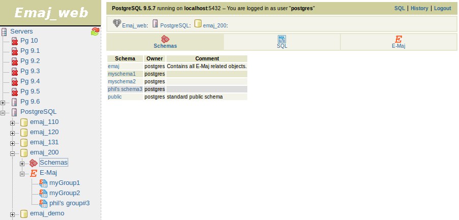
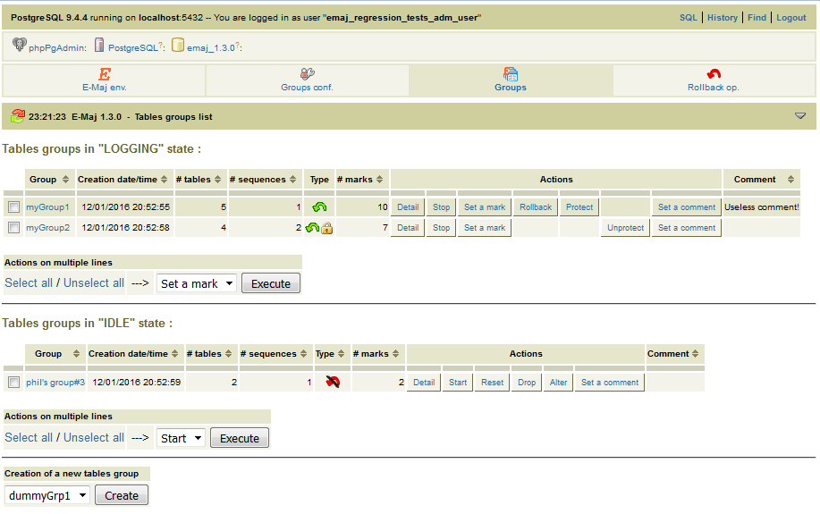
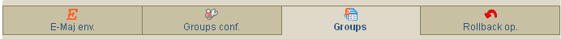
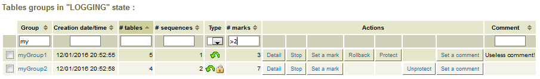
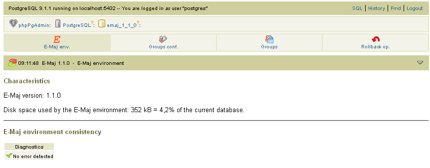
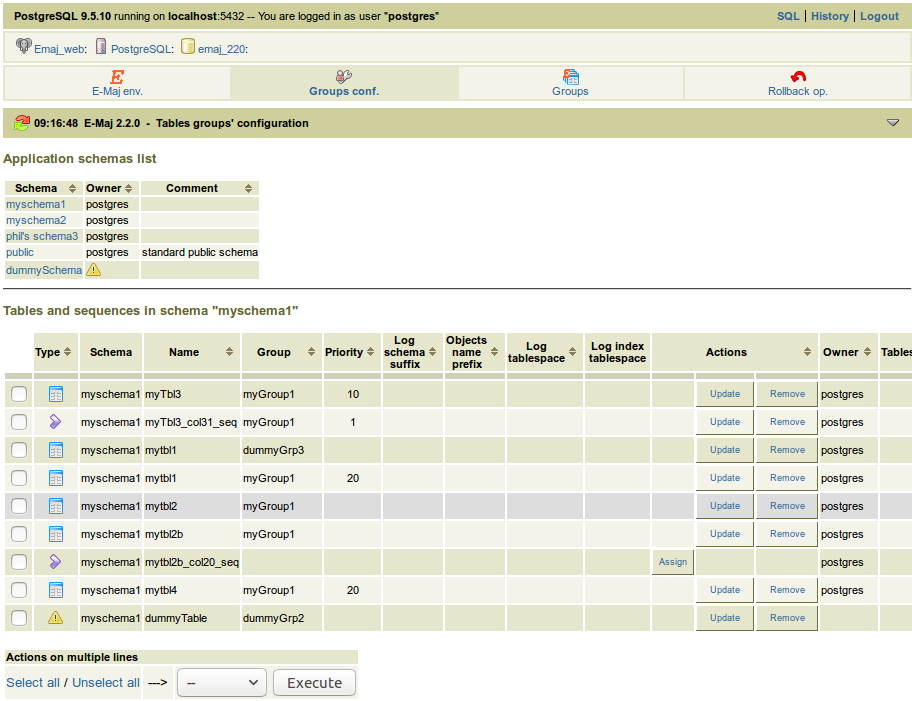
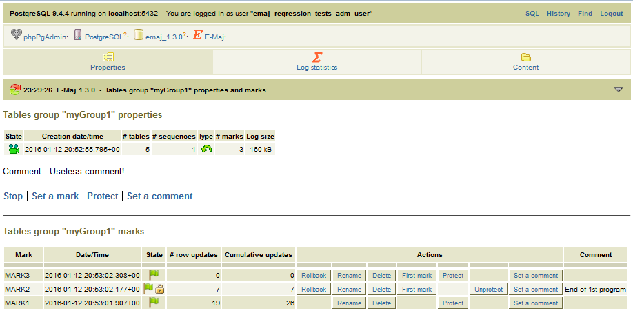
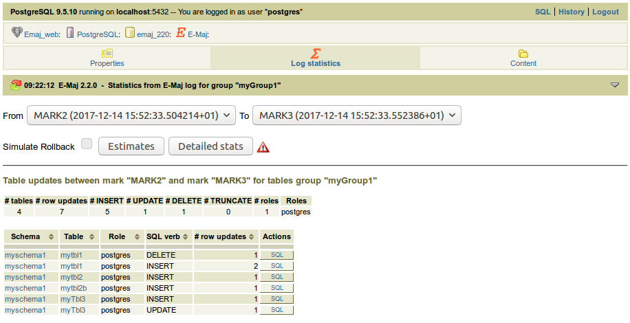
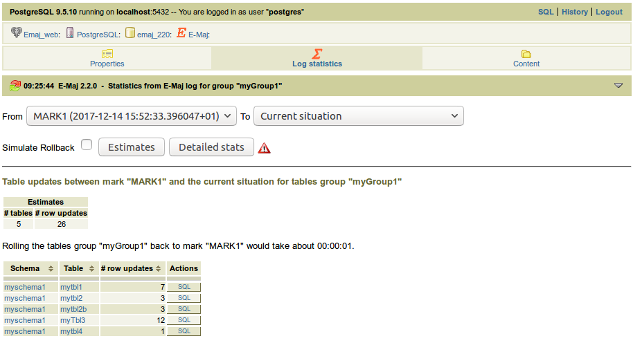
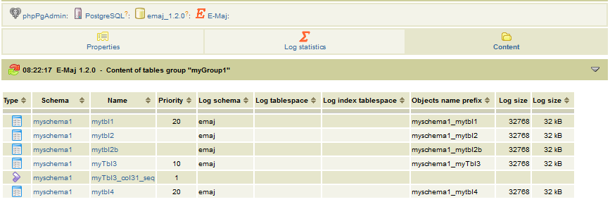

Using Emaj_web
==============

Access to Emaj_web
------------------

To log on to a database, select the target instance in the left browser and fill the connection identifier and password. Several connections can remain opened simultaneously.

Once connected to a database where the E-Maj extension has been installed, and using a role having sufficient privileges (*super-user*, *emaj_adm* or *emaj_viewer*), a red icon appears on the right in the horizontal database icons tab.

In the browser tree on the left, the E-Maj object also appears. By opening it, the list of created tables groups becomes directly accessible.

	Figure 1 – Connection to a database where E-Maj is installed.

Tables groups list
------------------

By clicking on one of the E-Maj icons, the user reaches a page that lists all tables groups created in this database.

   Figure 2 – List of the tables groups created in the database.

In fact, this page displays two lists: one for groups in *LOGGING* state and the other for groups in *IDLE* state.

For each tables group, the following attributes are displayed:

* its creation date and time,
* the number of application tables and sequences it contains,
* its type (*ROLLBACKABLE* or *AUDIT_ONLY*, protected against rollback or not),
* the number of marks it owns,
* its associated comment, if any.

Several buttons are available so that the user can perform any possible action, depending on the group state.

Under both lists, a combo box and a button are dedicated to multi-group actions.

At the bottom of the page, a list box presents the table groups that may be created (those known in the :ref:`emaj_group_def <emaj_group_def>` table but not yet created).

Some details about the user interface
-------------------------------------

The user can navigate in E-Maj functions using two icon bars: one for the general purpose functions and the other for the functions concerning a single tables group.

   Figure 3 – Main icons bar.

   Figure 4 – Tables groups icons bar.

For *emaj_viewer* roles, some icons are not visible.

All pages displayed by the E-Maj plug-in have a header that contains:

* a button to refresh the current page,
* the time of current page display,
* the E-Maj version installed on the database,
* the page title,
* a bottom link, located at the extreme right of the header, to reach the bottom of the page.

On some tables, it is possible to dynamically sort displayed rows, using small vertical arrows on the right of column titles. On some tables too, hovering the mouse over the grey bar located just below the header row displays input fields that can be used to filter rows to display.

   Figure 5 – Filtering the tables groups in *LOGGING* state. Here, only tables groups whose name contains “my” and having more than 2 marks are displayed, sorted in descending order by number of tables.

E-Maj environment state
-----------------------

By clicking on the “*E-Maj env.*” icon of the main bar, the user reaches an overview of the E-Maj environment state.

Items displayed first:

* the installed E-Maj version,
* the disk space used by E-Maj (log tables, technical tables and their indexes), and the part of the global database space it represents.

Then, the environment integrity is checked; the result of the :ref:`emaj_verify_all() <emaj_verify_all>` function execution is displayed.

   Figure 6 – E-Maj environment state.

Tables groups content
---------------------

With a click on the “*Groups conf.*” icon of the main bar, the user reaches the function that manages the tables groups content.

The upper part of the page lists the existing schemas (except schemas dedicated to E-Maj). By selecting a schema, the list of its tables and sequences appears.

   Figure 7 – Tables groups content.

The user can then view or modify the content of the :ref:`emaj_group_def <emaj_group_def>` table used for the tables groups creation.

The following are listed for each table or sequence:

* its type
* the tables group it belongs to, if any,
* the following attributes of the table or sequence in the :ref:`emaj_group_def <emaj_group_def>` table, if assigned:

   * the priority level in the group,
   * the suffix that defines log schema,
   * the prefix used to build the E-Maj object names for this table,
   * the optional tablespace name for the log table,
   * the optional tablespace name for the log table's index,

* its owner,
* the tablespace it belongs to, if any,
* the associated comment in the database.

The schemas list and the tables and sequences list also display the objects that are known in the :ref:`emaj_group_def <emaj_group_def>` table but don't exist in the database. These objects are identified with a “!” icon in the first column of each list.

With buttons, it is possible to:

* assign a table or a sequence to a new or an already known tables group,
* modify the properties of a table or a sequence inside its tables group,
* remove a table or a sequence from its tables group.

Note that any change applied in the :ref:`emaj_group_def <emaj_group_def>` table's content will only be effective when the concerned tables groups are altered or dropped and re-created.

Tables group details
--------------------

From the tables groups list page, it is possible to get more information about a particular tables group by clicking on its name or on its "*Detail*" button. This page is also accessible with the “*Properties*” icon of the groups bar and through the left browsing tree.

   Figure 8 – Details of a tables group

A first line repeats information already displayed on the groups list (number of tables and sequences, type, state and number of marks). It also shows the disk space used by its log tables.

This line is followed by the group's comment, if any has been recorded for this group.

Next is a list of links enabling execution of actions applicable to the group's state.

Then, the user can see the list of all marks that have been set on the group. For each of them, the following is displayed:

* its name,
* the date and time it has been set,
* its state (active or not, protected against rollback or not),
* the number of recorded log rows between this mark and the next one (or the current situation if this is the last set mark),
* the total number of recorded log rows from when the mark was set,
* the comment associated to the mark, if it exists.

Several buttons are available to perform the actions permitted by the mark's state.

Statistics
----------

Using the “*Log statistics*” icon of the groups bar, one gets statistics about updates recorded into the log tables for the selected tables group.

Two types of statistics can be produced:

* some estimates about the number of updates per table, recorded between two marks or between one mark and the current situation,
* a precise numbering of updates per tables, per statement type (*INSERT/UPDATE/DELETE/TRUNCATE*) and role.

If the end of the range corresponds to the current situation, a check box allows one to request a rollback simulation to the selected mark in order to quickly get an approximate duration of this operation.

The figure below shows an example of detailed statistics.

   Figure 9 – Detailed statistics about updates recorded between two marks

The displayed page contains a first line returning global counters.

On each line of the statistics table, the user can click on a “*SQL*” button to easily look at the log tables content. A click on this button opens the SQL editor window and proposes the statement displaying the content of the log table that corresponds to the selection (table, time frame, role, statement type). The user can modify this suggested statement before executing it to better fit his needs.

   Figure 10 – Result of the rollback simulation, with the estimated number of updates for each table. 

The displayed page contains a first part indicating the number of tables and sequences concerned by the rollback operation to this mark, and an estimate of the operation duration.

Tables group content
--------------------

Using the “*Content*” icon of the groups icon bar, it is possible to get a summary of a tables group content.

For each table and sequence belonging to the group, the displayed table shows the characteristics configured into the :ref:`emaj_group_def <emaj_group_def>` table, as well as the disk space used by the log table and its index.

   Figure 11 – Content of a tables group.

Monitoring rollback operations
------------------------------

Using the “*Rollback op.*” icon of the main bar, users can monitor the rollback operations. Three different lists are displayed:

* in progress rollback operations, with the characteristics of the rollback operations and estimates of the percentage of the operation already done and of the remaining duration,
* the latest completed operations,
* logged rollback operations that are consolidable.

For completed operations, the user can filter on a more or less deep history.

For each consolidable rollback, a button allows to effectively consolidate the operation.

.. figure:: images/ppa12.png
   :align: center

   Figure 12 – Rollback operation monitoring.

