Using Emaj_web
==============

.. raw:: html

    

----

Accessing Emaj_web and Databases
--------------------------------

Accessing **Emaj_web** in a browser displays the welcome page.

To sign in to a database, select the target instance in the left browser or in the *Servers* tab, then enter the connection identifier and password. Multiple connections can remain open simultaneously.

Once connected to a database where the *emaj extension* is installed, the user can interact with the extension depending on the role they have (*superuser*, *emaj_adm*, or *emaj_viewer*).

On the left, the browser tree displays all configured instances, which may be split into instance groups, and all the databases they contain. By expanding a database object, the user can access the E-Maj table groups and the existing schemas.

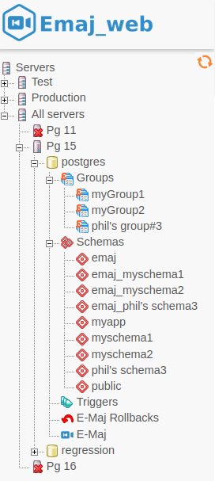

   Figure 1 – The browser tree.

Both icons located at the bottom-right (not visible here) allow adjusting the browser width.

----

Table Groups Lists
------------------

By selecting a database, the user reaches a page that lists all table groups created in that database.

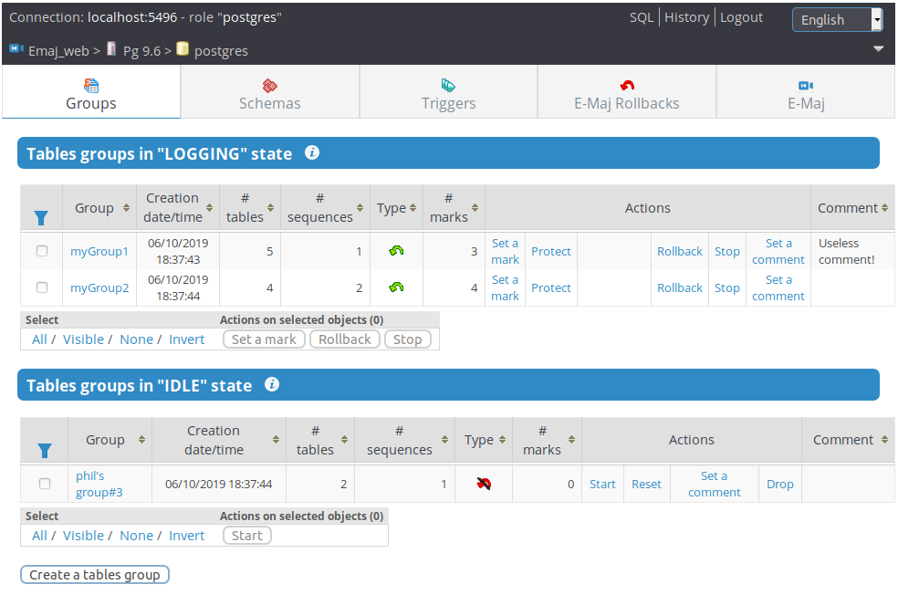

   Figure 2 – Table groups list.

This page displays two lists:

* Table groups in **LOGGING** state.
* Table groups in **IDLE** state.

For each table group, the following attributes are displayed:

* Its creation date and time.
* The number of application tables and sequences it contains.
* Its type (*ROLLBACKABLE* or *AUDIT_ONLY*, protected against rollback or not).
* The number of marks it has.
* Its associated comment, if any.

For each table group, several buttons are available so the user can perform any possible action depending on the group's state.

Below, three buttons allow creating a new table group, exporting, or importing a table group configuration to or from a local file.

Lastly, a list of dropped table groups is displayed.

----

Some Details About the User Interface
-------------------------------------

The page headers contain:

* Information about the current connection.
* Three links to access the SQL statements editor, the history of submitted statements, and to log out of the current connection.
* A combo box to select the language used by the user interface.
* A breadcrumb trail.
* A button to directly go to the bottom of the page.

The user can navigate *Emaj_web* functions using four **icon bars**:

- One for general-purpose functions.
- Two similar bars for functions concerning a single table group or a single table.
- The last for functions concerning a single sequence.

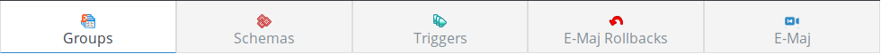

   Figure 3 – Main icons bar.

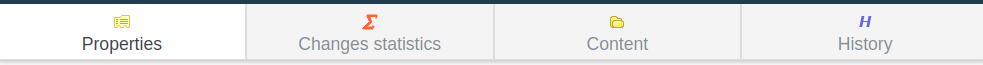

   Figure 4 – Table groups and tables icons bar.

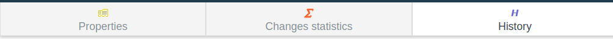

   Figure 5 – Sequences icons bar.

For *emaj_viewer* roles, some icons are not visible.

On most tables, it is possible to dynamically sort displayed rows using small vertical arrows on the right side of column titles.

On most tables, an icon located to the left of the header row allows showing or hiding input fields that can be used to dynamically filter displayed rows.

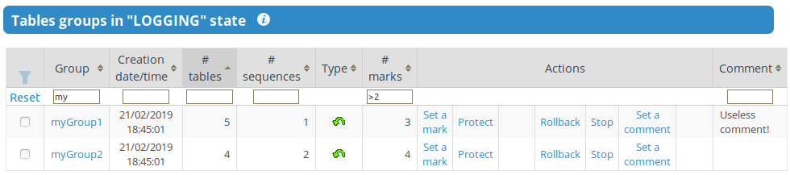

   Figure 6 – Filtering the table groups in **LOGGING** state. Here, only table groups whose name contains "my" and having more than 2 marks are displayed, sorted in descending order by number of tables.

Some tables allow performing actions on multiple objects at once. In this case, the user selects the objects using the checkboxes in the first column of the table and chooses the action to perform from the available buttons below the table.

Columns containing comments have a limited size. However, the full comment content is visible in a tooltip when hovering over the cell.

Cells containing event timestamps or durations display the full data content in a tooltip.

----

Table Group Details
--------------------

From the table groups list page, it is possible to get more information about a specific table group by clicking on its name. This page is also accessible via the **Properties** icon in the groups bar and through the left browsing tree.

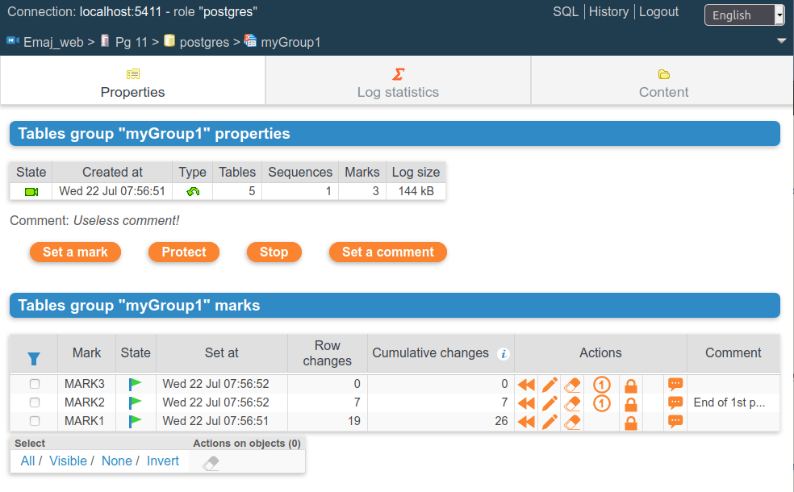

   Figure 7 – Details of a table group.

A first line repeats information already displayed on the groups list (number of tables and sequences, type, state, and number of marks). It also shows the disk space used by its log tables.

This line is followed by the group's comment, if one has been recorded for this group.

Next is a set of buttons to execute actions depending on the group's state.

Then, the user can see the list of all marks that have been set on the group, with the most recent first. For each mark, the following is displayed:

* Its name.
* The date and time it was set.
* Its protected-against-rollback state.
* The number of recorded log rows between this mark and the next one (or the current state if this is the last set mark).
* The total number of recorded log rows since the mark was set.
* The comment associated with the mark, if it exists.

For each mark, several buttons are available to perform the actions permitted by the mark's state.

----

Statistics
----------

Using the **Changes Statistics** tab in the group’s bar, users can obtain statistics about recorded changes for tables or sequences for the selected table group and a given time interval. This time interval is defined as either between two marks or between a mark and the current state.

Three types of statistics can be produced:

* An estimate of the number of changes for each table.
* An estimate of the number of increments and property changes per sequence.
* A precise count of changes per table, statement type (*INSERT/UPDATE/DELETE/TRUNCATE*), and role.

The figure below shows an example of detailed statistics for tables.

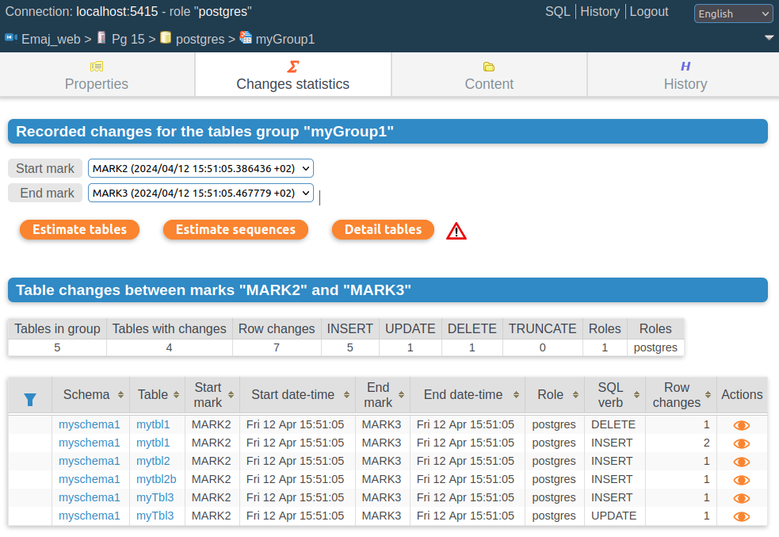

   Figure 8 – Detailed statistics about updates recorded between two marks.

The displayed page contains a first line with global counters.

On each line of the statistics table, the user can click on a button to easily view the log table contents. Clicking this button opens a window to set the SQL generation parameters. The generated SQL statement is then displayed in the SQL editor window so the user can adjust it before execution to better fit their needs.

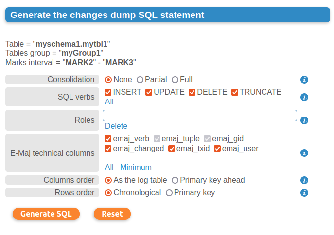

   Figure 9 – Form to generate the SQL statement displaying table changes.

----

Table Group Content
--------------------

Using the **Content** tab in the group’s bar, it is possible to get a summary of a table group's content.

For each table in the group, the displayed sheet shows its E-Maj characteristics, as well as the disk space used by its log table and index.

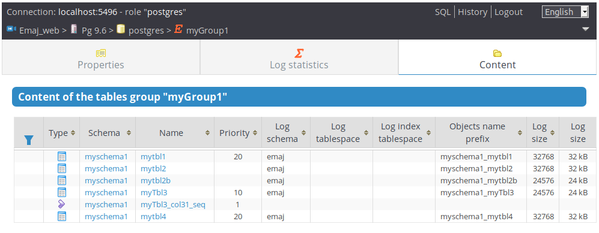

   Figure 10 – A table group’s content.

----

Table Group History
--------------------

The **History** tab displays the periods when the table group existed and the periods when the group was in *LOGGING* state (*log sessions*). The historical depth depends on the *history_retention* parameter.

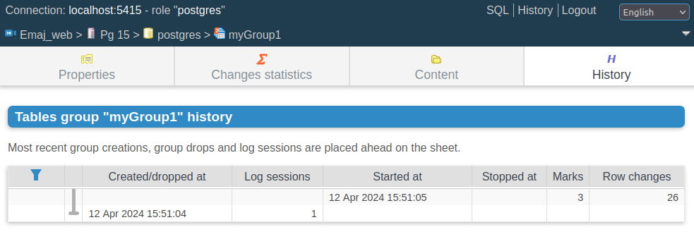

   Figure 11 – A table group’s history.

----

Schemas and Table Groups Configuration
---------------------------------------

The **Schemas** tab displays the list of schemas contained in the database.

By selecting one, two additional lists are displayed: the tables and the sequences contained in that schema.

For both lists, the E-Maj properties and some general properties of each object are visible. Some action buttons allow accessing their structure or content and managing their assignment to table groups.

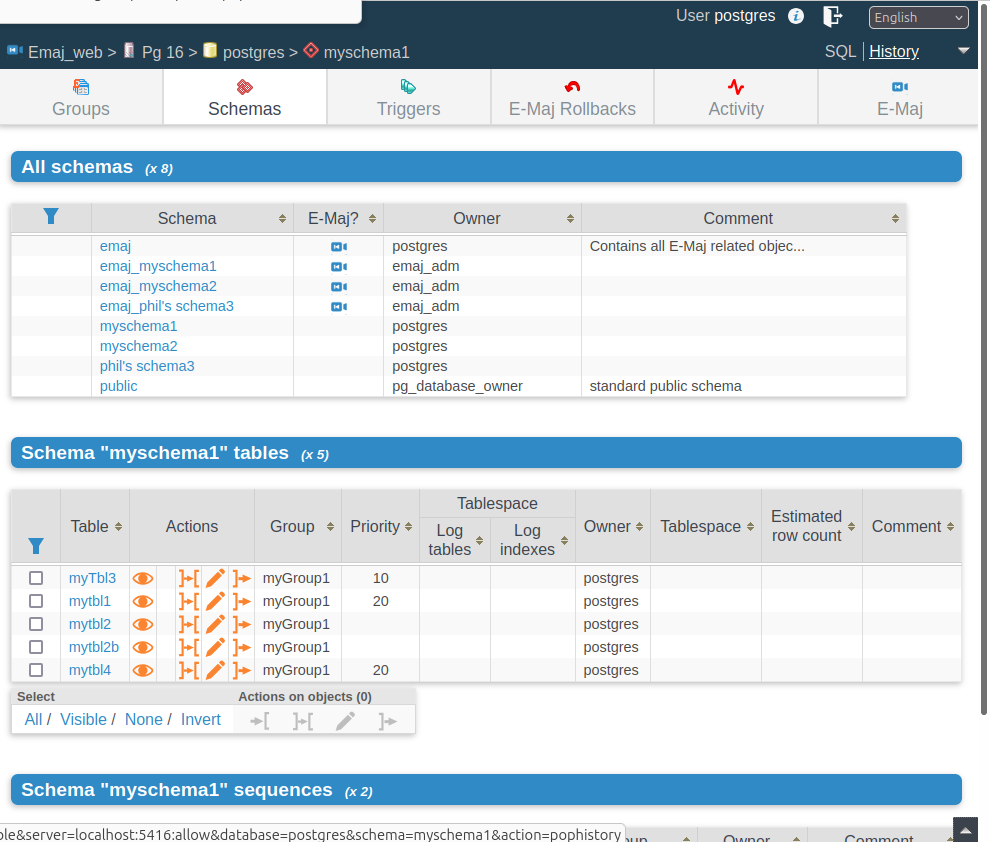

   Figure 12 – Schema content and table groups configuration.

By clicking on a table or sequence name or on an eye icon, users can view details about the table or sequence characteristics and content.

----

Table Details
-------------

By selecting a table from a schema’s table list, the user reaches a **Properties** tab that shows the current E-Maj properties, the table structure, and its triggers.

E-Maj properties such as table group assignment, movement, or removal are available through appropriate buttons.

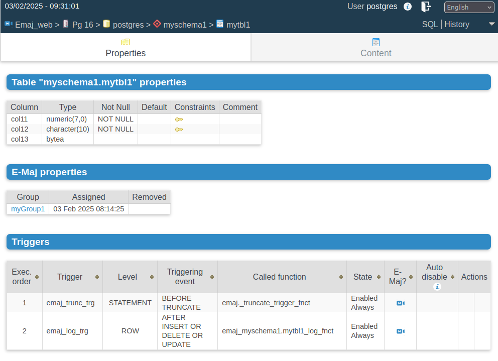

   Figure 13 – Table properties.

Thanks to the specific table tabs bar, three other functions are available.

The **Change Statistics** tab provides statistics about changes recorded for the table over a specified time frame, similar to table group statistics. However, they differ in several ways:

* Only a single table is processed.
* One statistic row is provided per elementary mark interval.
* The number of executed E-Maj rollbacks is also reported for each mark interval.

As with table groups, an eye icon allows viewing changes in detail.

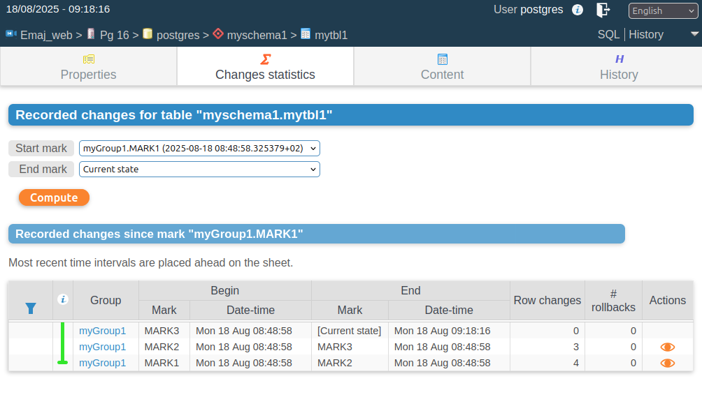

   Figure 14 – Table changes statistics.

The **Content** tab allows visualizing the current table rows.

Lastly, the **History** tab shows the E-Maj property changes for the table, particularly its table group assignments.

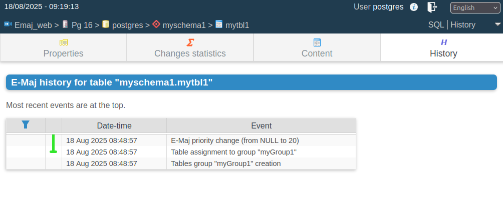

   Figure 15 – E-Maj history for a table.

----

Sequence Details
----------------

For sequences, the **Properties** tab shows the E-Maj properties and the characteristics of a single sequence. Some buttons allow modifying the sequence’s E-Maj properties (table group assignment, movement, or removal).

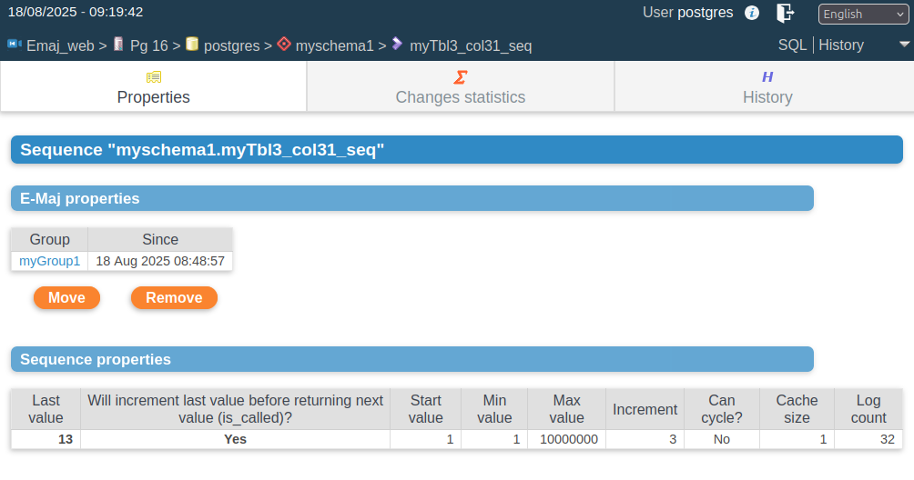

   Figure 16 – Sequence properties.

Thanks to the sequence-specific tabs bar, two other functions are available.

The **Changes Statistics** tab returns statistics about the sequence state evolution over a specified time frame. For each elementary mark interval, it displays:

* The number of sequence increments.
* A flag indicating whether another sequence property has changed (minimum value, maximum value, increment, etc.).
* The number of executed E-Maj rollbacks.

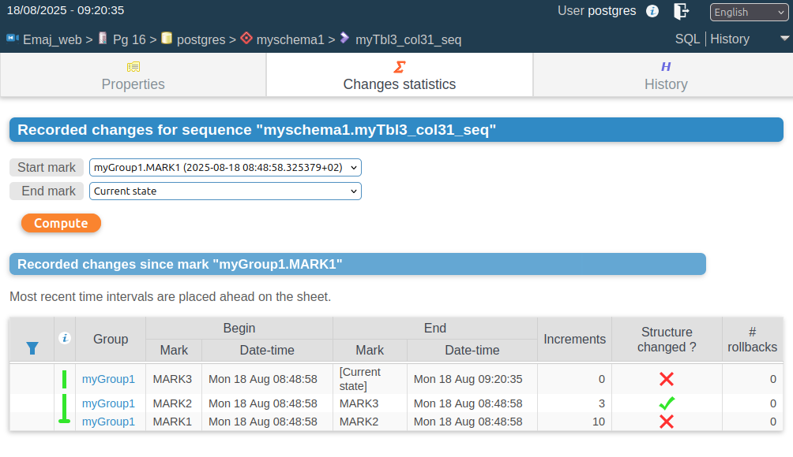

   Figure 17 – Sequence statistics.

Lastly, the **History** tab shows the E-Maj property changes for the sequence, particularly its assignment to table groups.

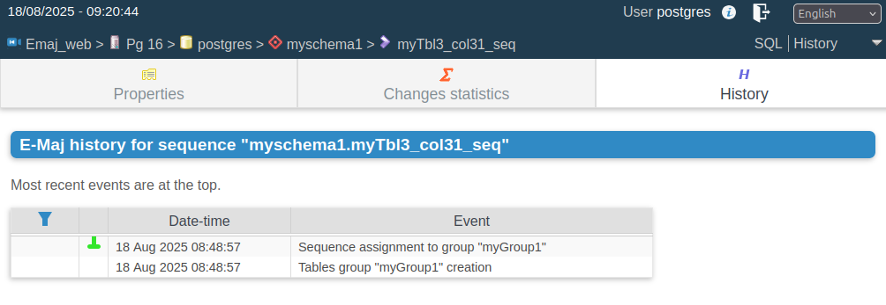

   Figure 18 – E-Maj history for a sequence.

----

Triggers
--------

The **Triggers** tab lists the application triggers (those not linked to E-Maj), with their main characteristics.

A button allows toggling their deactivation mode during E-Maj rollback operations.

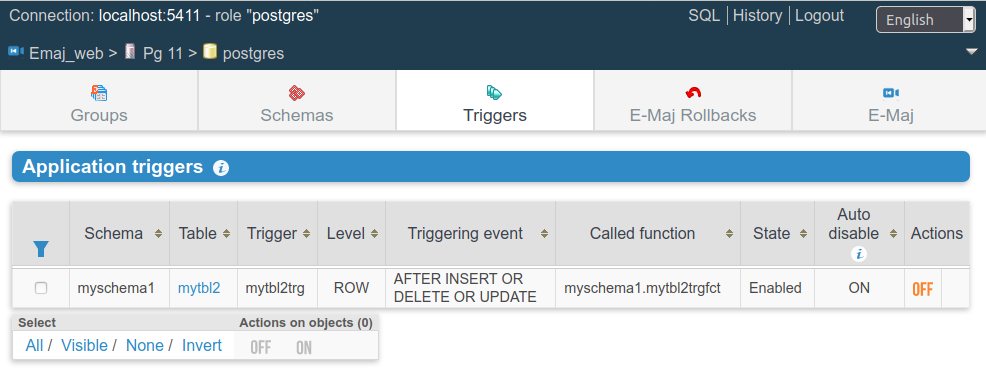

   Figure 19 – Application triggers list.

----

Monitoring Rollback Operations
------------------------------

Using the **E-Maj Rollback** tab in the main bar, users can monitor rollback operations. Three different lists are displayed:

* In-progress rollback operations, including their characteristics, estimates of the percentage completed, and the remaining duration.
* Completed operations.
* Logged rollback operations that are consolidable.

For each consolidable rollback, a button allows effectively consolidating the operation.

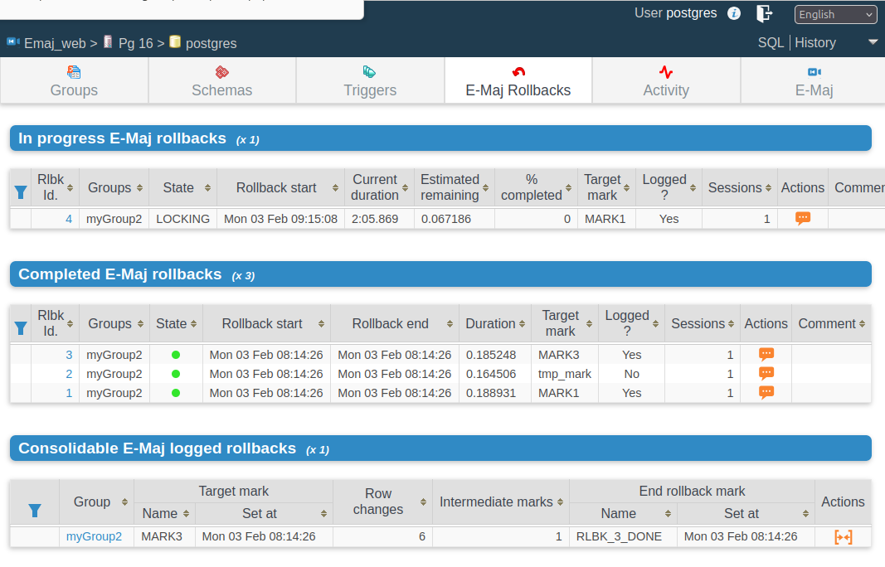

   Figure 20 – Rollback operations monitoring.

Clicking on a rollback identifier in one of these tables displays a page with detailed information about the selected in-progress or completed operation. Specifically, the following are displayed:

* The rollback properties.
* Its progress.
* The final report returned to the user when the operation is completed.
* The detail of the operation plan, showing each elementary step with its duration and, optionally, estimates computed by E-Maj at the operation initialization.
* Information about rollback sessions.

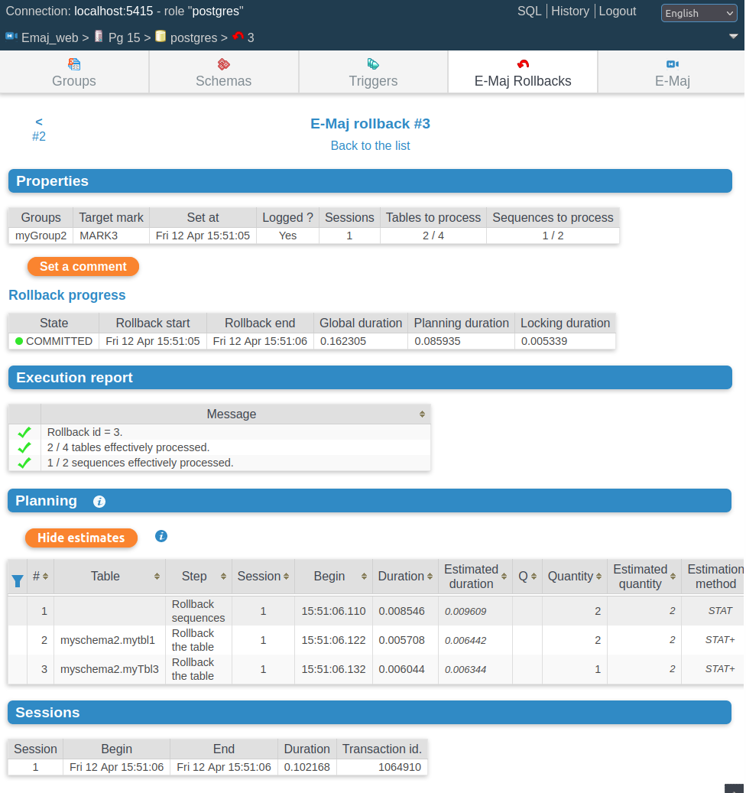

   Figure 21 – Details of a rollback operation.

----

E-Maj Activity
--------------

The **Activity** tab allows monitoring E-Maj log trigger activity in real time.

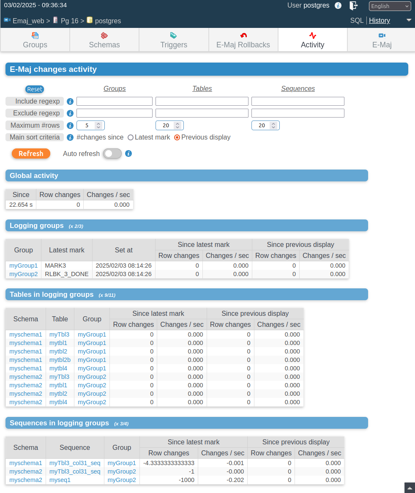

   Figure 22 – E-Maj activity.

At the top of the page, the form allows defining monitoring preferences. By default, it shows the 5 most active table groups, the 20 most active tables, and the 20 most active sequences. Regular expressions can be set to filter (include or exclude) table groups, tables, and sequences.

The activity indicators are displayed below the form:

* At a global level (all groups, tables, and sequences).
* For the selected table groups.
* For the selected tables of selected table groups.
* For the selected sequences of selected table groups.

Four activity indicators are computed:

* The number of changes since the latest mark set for the table group.
* The throughput since the latest mark, in number of changes per second.
* The number of changes since the last display.
* The throughput since the last display.

Groups, tables, and sequences are displayed and filtered in descending order by the number of changes since either the last display (by default) or the latest mark.

The page can be refreshed either manually or automatically. The automatic refresh delay is set in the **Emaj_web** configuration (10 seconds by default).

----

E-Maj Environment State
-----------------------

By selecting the **E-Maj** tab in the main bar, the user reaches an overview of the E-Maj environment state.

First, the installed PostgreSQL and*E-Maj **versions** are displayed.

If the user is connected with a *SUPERUSER* role, some buttons allow creating, updating, or dropping the *emaj* extension, depending on the context.

Next, the **disk space** used by E-Maj (log tables, technical tables, and their indexes) and the portion of the global database space it represents are displayed.

The environment **integrity** is then checked, and the result of the :ref:`emaj_verify_all() <emaj_verify_all>` function execution is displayed.

The page ends with the list of all **extension parameters**.

Two buttons allow exporting and importing parameter configurations to or from a local file.

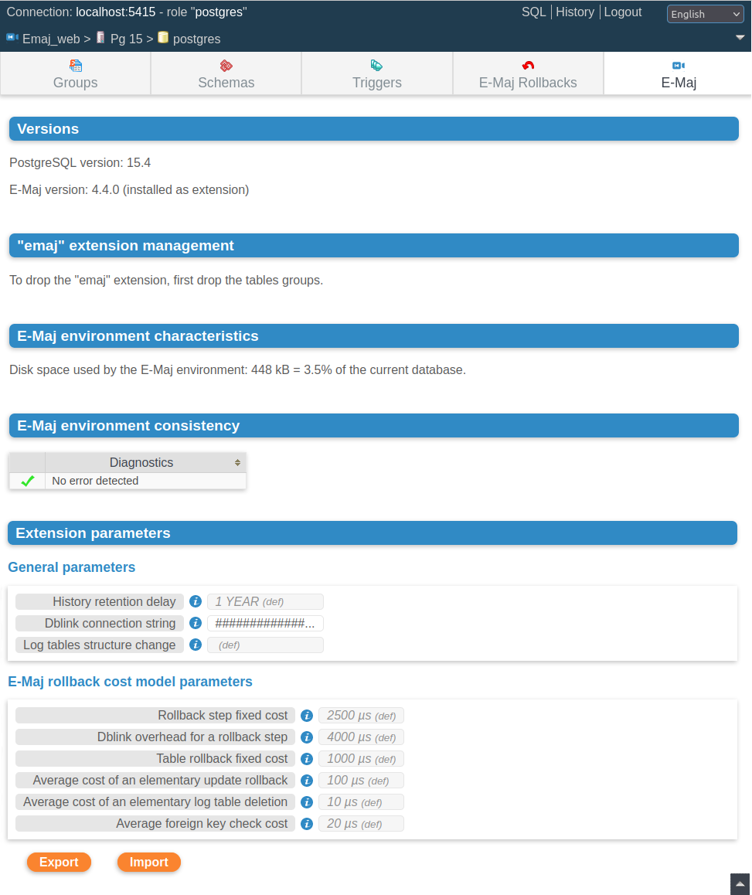

   Figure 23 – The E-Maj environment state.
