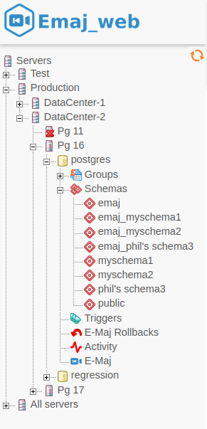
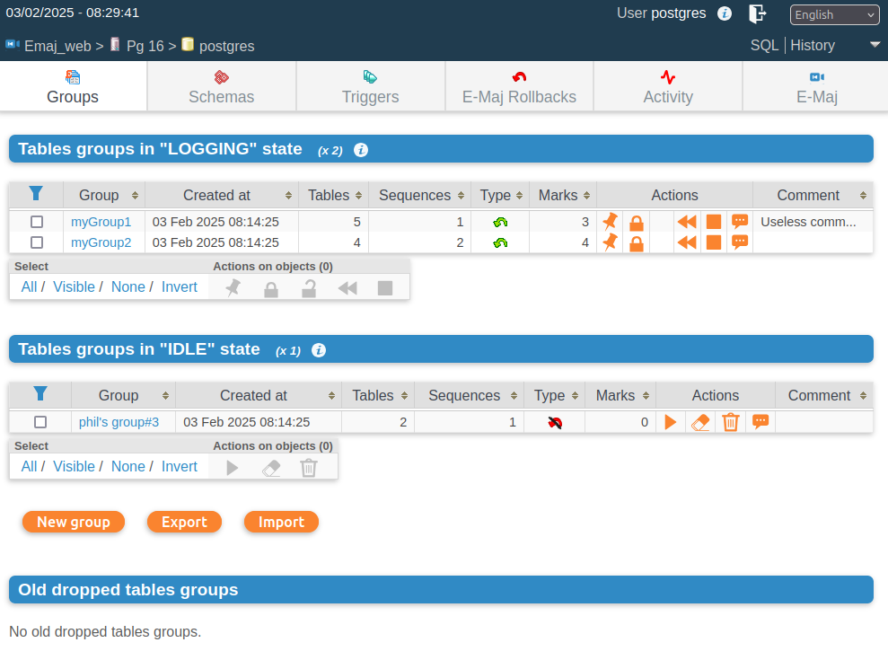
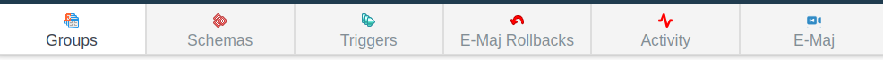
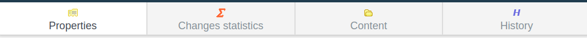
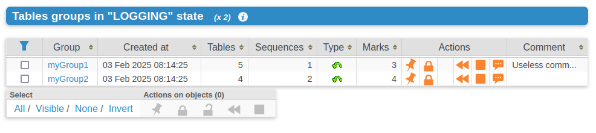
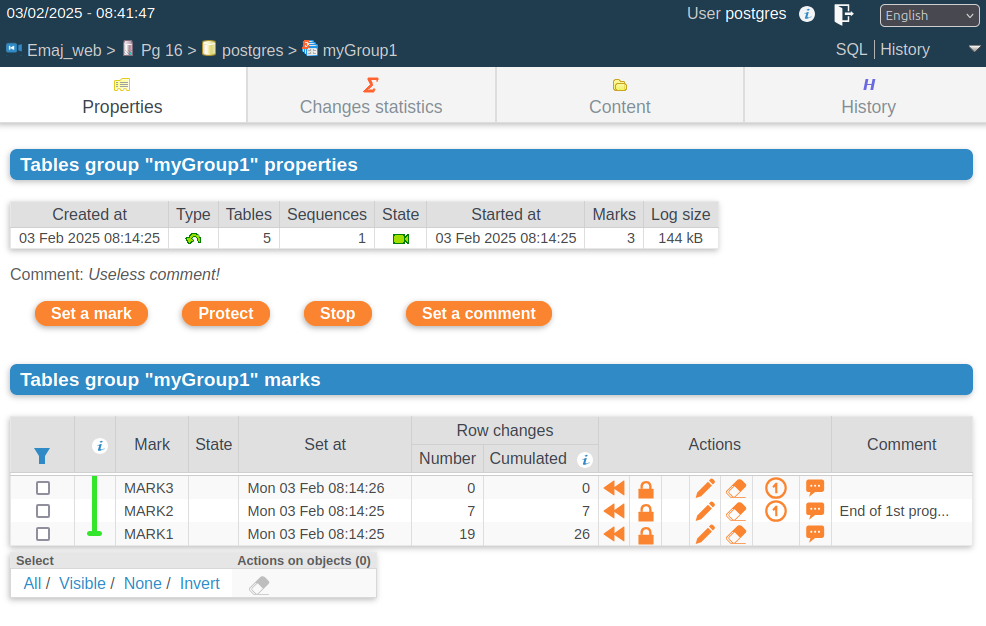
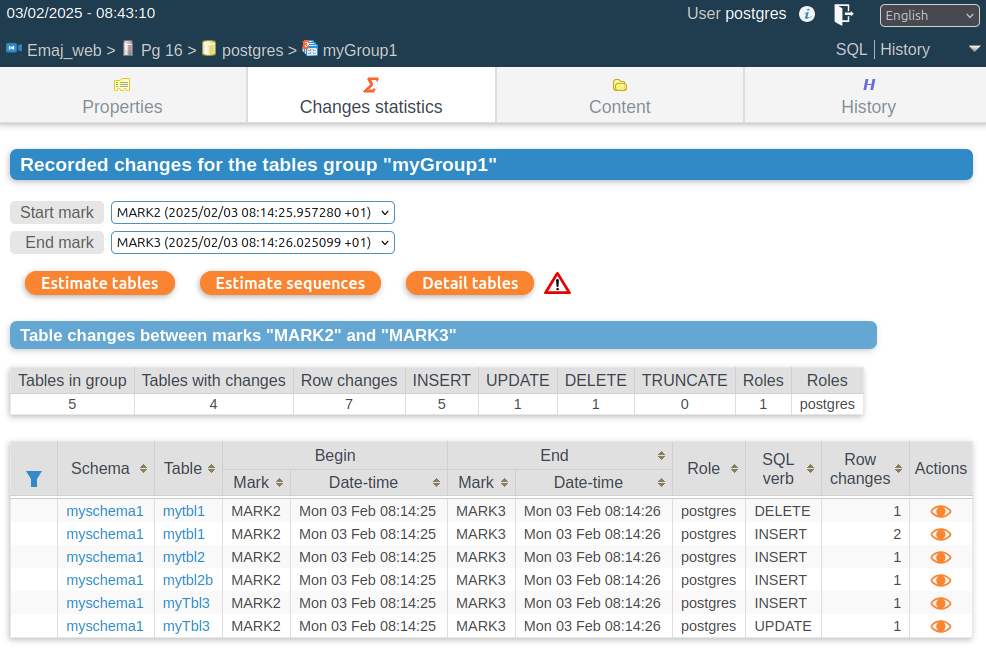
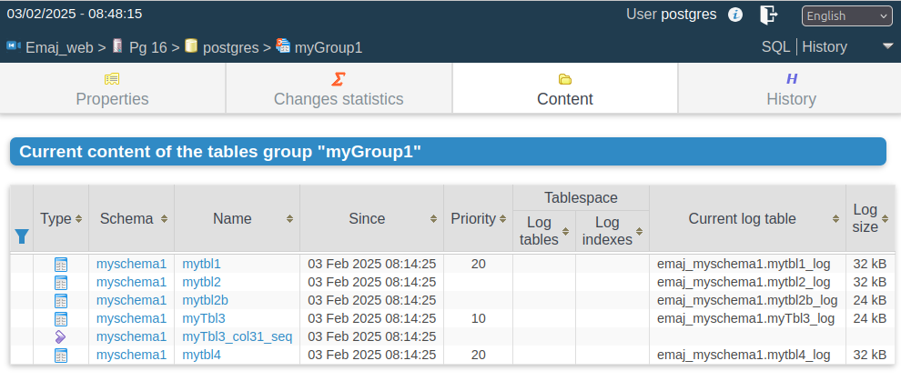
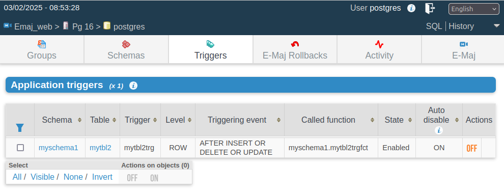
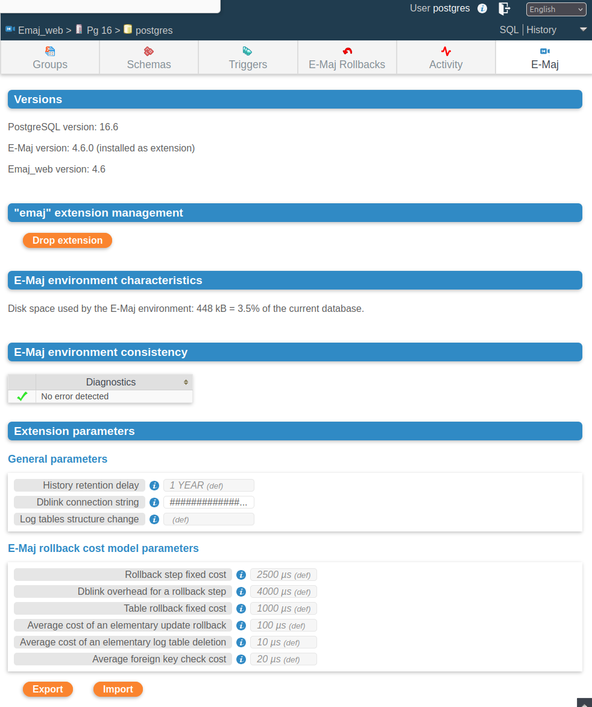

Using Emaj_web
==============

Access to Emaj_web and databases
--------------------------------

Accessing Emaj_web in a browser displays the welcome page.

To sign in to a database, select the target instance in the left browser or in the *servers* tab, and fill the connection identifier and password. Several connections can remain opened simultaneously.

Once connected to a database where the emaj extension has been installed, the user interacts with the extension, depending on the role it owns (*super-user*, *emaj_adm* or *emaj_viewer*).

On the left, the browser tree shows all the configured instances, that may be split into instances groups, and all the databases they contain. By unfolding a database object, the user reaches the E-Maj tables groups and the existing schemas.

	Figure 1 – The browser tree.

Tables groups list
------------------

By selecting a database, the user reaches a page that lists all tables groups created in this database.

   Figure 2 – Tables groups list.

This page displays two lists: 

* the tables groups in *LOGGING* state,
* the tables groups in *IDLE* state.

For each created tables group, the following attributes are displayed:

* its creation date and time,
* the number of application tables and sequences it contains,
* its type (*ROLLBACKABLE* or *AUDIT_ONLY*, protected against rollback or not),
* the number of marks it owns,
* its associated comment, if any.

For each tables group, several buttons are available so that the user can perform any possible action, depending on the group state.

At the bottom of the page, three buttons allow to create a new tables group, to export or import a tables groups configuration to or from a local file.

Some details about the user interface
-------------------------------------

The page headers contain:

* some information regarding the current connection,
* 3 links to reach the SQL statements editor, the history of submitted statements and to logout the current connection,
* a combo box to select the language used by the user interface,
* a breadcrumb trail,
* and a button allowing to directly go to the page bottom.

The user can navigate in Emaj_web functions using two icon bars: one for the general purpose functions and the other for the functions concerning a single tables group.

   Figure 3 – Main icons bar.

   Figure 4 – Tables groups icons bar.

For *emaj_viewer* roles, some icons are not visible.

On some tables, it is possible to dynamically sort displayed rows, using small vertical arrows on the right of column titles.

On some tables too, an icon located at the left of the header row, let show or hide input fields that can be used to dynamically filter displayed rows.

   Figure 5 – Filtering the tables groups in *LOGGING* state. Here, only tables groups whose name contains “my” and having more than 2 marks are displayed, sorted in descending order by number of tables.

Some tables allow to perform actions on several objects at once. In this case, the user selects the objects with the checkboxes on the first column of the table and choose the action to perform among the available buttons under the table.

Tables group details
--------------------

From the tables groups list page, it is possible to get more information about a particular tables group by clicking on its name. This page is also accessible with the “*Properties*” icon of the groups bar and through the left browsing tree.

   Figure 6 – Details of a tables group

A first line repeats information already displayed on the groups list (number of tables and sequences, type, state and number of marks). It also shows the disk space used by its log tables.

This line is followed by the group's comment, if any has been recorded for this group.

Next is a set of buttons to execute actions depending on the group's state.

Then, the user can see the list of all marks that have been set on the group. For each of them, the following is displayed:

* its name,
* the date and time it has been set,
* its state (active or not, protected against rollback or not),
* the number of recorded log rows between this mark and the next one (or the current situation if this is the last set mark),
* the total number of recorded log rows from when the mark was set,
* the comment associated to the mark, if it exists.

For each mark, several buttons are available to perform the actions permitted by the mark's state.

Statistics
----------

Using the “*Log statistics*” tab of the group's bar, one gets statistics about updates recorded into the log tables for the selected tables group.

Two types of statistics can be produced:

* some estimates about the number of updates per table, recorded between two marks or between one mark and the current situation,
* a precise numbering of updates per tables, per statement type (*INSERT/UPDATE/DELETE/TRUNCATE*) and role.

If the end of the range corresponds to the current situation, a check box allows one to request a rollback simulation to the selected mark in order to quickly get an approximate duration of this operation.

The figure below shows an example of detailed statistics.

   Figure 7 – Detailed statistics about updates recorded between two marks

The displayed page contains a first line returning global counters.

On each line of the statistics table, the user can click on a “*SQL*” button to easily look at the log tables content. A click on this button opens the SQL editor window and proposes the statement displaying the content of the log table that corresponds to the selection (table, time frame, role, statement type). The user can modify this suggested statement before executing it to better fit his needs.

.. figure:: images/emajweb_rollbacksim.png
   :align: center

   Figure 8 – Result of the rollback simulation, with the estimated number of updates for each table. 

The displayed page contains a first part indicating the number of tables and sequences concerned by the rollback operation to this mark, and an estimate of the operation duration.

Tables group content
--------------------

Using the “*Content*” tab of the group's bar, it is possible to get a summary of a tables group content.

For each table and sequence belonging to the group, the displayed table shows the characteristics configured into the :ref:`emaj_group_def <emaj_group_def>` table, as well as the disk space used by the log table and its index.

   Figure 9 – A tables group's content.

Schemas and tables groups configuration
---------------------------------------

The "*Schemas*" tab displays the list of schemas contained in the database.

By selecting one of them, two additional lists are displayed: the tables and the sequences contained by this schema.

For both lists, the E-Maj properties and some general properties of each object become visible. Some action buttons allow to reach their structure or content and manage their assignment to tables groups.

   Figure 10 – Schema content and tables groups configuration.

Triggers
--------

The "*Triggers*"tab lists the application triggers (those not linked to E-Maj), with their main characteristics. 

A button allows to switch their de-activation mode at E-Maj rollback time.

   Figure 11 – Application triggers list.

Monitoring rollback operations
------------------------------

Using the “*Rollback operations*” tab of the main bar, users can monitor the rollback operations. Three different lists are displayed:

* in progress rollback operations, with the characteristics of the rollback operations and estimates of the percentage of the operation already done and of the remaining duration,
* the latest completed operations,
* logged rollback operations that are consolidable.

For completed operations, the user can filter on a more or less deep history.

For each consolidable rollback, a button allows to effectively consolidate the operation.

   Figure 12 – Rollback operations monitoring.

E-Maj environment state
-----------------------

By selecting the "*E-Maj*" tab of the main bar, the user reaches an overview of the E-Maj environment state.

First, some items are displayed:

* the installed PostgreSQL and E-Maj versions,
* the disk space used by E-Maj (log tables, technical tables and their indexes), and the part of the global database space it represents.

Then, the environment integrity is checked; the result of the :ref:`emaj_verify_all() <emaj_verify_all>` function execution is displayed.

The page ends with a list of the extension parameters value, be they present in the *emaj_param table* or set to their default value.

Two buttons allow to export and import parameters configurations to or from a local file.

   Figure 13 – The E-Maj environment state.
