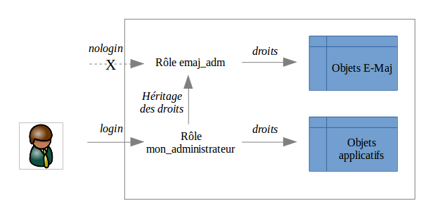

Mise en place de la politique d'accès à E-Maj
=============================================

Une mauvaise utilisation d'E-Maj peut mettre en cause l'intégrité des bases de données. Aussi convient-il de n'autoriser son usage qu'à des utilisateurs qualifiés et clairement identifiés comme tels.

Les rôles E-Maj
---------------

Pour utiliser E-Maj, on peut se connecter en tant que super-utilisateur. Mais pour des raisons de sécurité, il est préférable de tirer profit des deux rôles créés par la procédure d'installation :

* **emaj_adm** sert de rôle d'administration ; il peut exécuter toutes les fonctions  et accéder à toutes les tables d'E-Maj, en lecture comme en mise à jour,
* **emaj_viewer** sert pour des accès limités à de la consultation ; il ne peut exécuter que des fonctions de type statistique et n'accède aux tables d'E-Maj qu'en lecture.

Tous les droits attribués à *emaj_viewer* le sont aussi à *emaj_adm*.

Mais lors de leur création, ces deux rôles ne se sont pas vus attribuer de capacité de connexion (aucun mot de passe et option *NOLOGIN* spécifiés ). Il est recommandé de NE PAS leur attribuer cette capacité de connexion. A la place, il suffit d'attribuer les droits qu'ils possèdent à d'autres rôles par des requêtes SQL de type *GRANT*.

Attribution des droits E-Maj
----------------------------

Pour attribuer à un rôle donné tous les droits associés à l'un des deux rôles *emaj_adm* ou *emaj_viewer*, et une fois connecté en tant que super-utilisateur pour avoir le niveau de droit suffisant, il suffit d'exécuter l'une des commandes suivantes ::

  GRANT emaj_adm TO <mon.rôle.administrateur.emaj>;
  GRANT emaj_viewer TO <mon.rôle.de.consultation.emaj>;

Naturellement, plusieurs rôles peuvent se voir attribuer les droits *emaj_adm* ou *emaj_viewer*.

Attribution des droits sur les tables et objets applicatifs
-----------------------------------------------------------

Pour qu'un administrateur E-Maj puisse également accéder à des tables ou à d'autres objets applicatifs (schémas, séquences, vues, fonctions,...), on peut attribuer aux rôles *emaj_adm* ou *emaj_viewer* des droits d'accès à ces objets. Mais il est préférable d'affecter ces droits directement et uniquement aux rôles qui héritent des droits d'*emaj_adm* ou *emaj_viewer*, en ne laissant à ces derniers que des droits sur les tables et objets E-Maj.

Synthèse
--------

Le schéma ci-dessous symbolise l'attribution recommandée des droits pour un administrateur E-Maj.

Bien évidemment, ce schéma s'applique également au rôle *emaj_viewer*.

Sauf indication contraire, les opérations qui suivent vont pouvoir être exécutées indifféremment avec un rôle super-utilisateur ou un rôle du groupe *emaj_adm*.

