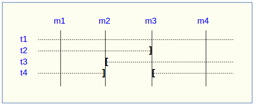
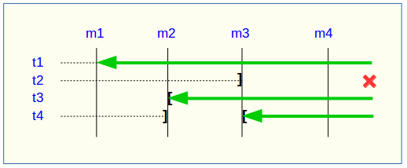
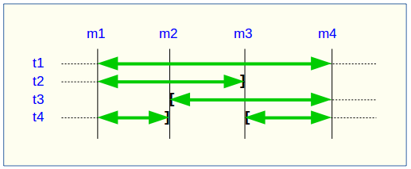
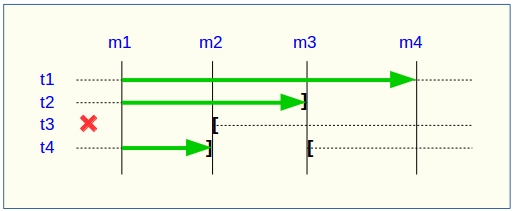

Modification des groupes de tables
==================================

.. _emaj_alter_group:

Plusieurs types d'événements peuvent rendre nécessaire la modification d'un groupe de tables : 

* la composition du groupe de tables change, avec l'ajout ou la suppression de tables ou de séquence dans le groupe,
* un des paramètres liés à une table change dans la configuration E-Maj (priorité, schéma de log, tablespace,…),
* une ou plusieurs tables applicatives appartenant au groupe de tables voient leur structure évoluer (ajout ou suppression de colonnes, changement de type de colonne,...).

Modification de groupes en état *IDLE*
--------------------------------------

Dans tous les cas, la démarche suivante peut être suivie :

* arrêter le groupe s'il est dans un état actif, avec la fonction :ref:`emaj_stop_group() <emaj_stop_group>`,
* adapter le contenu de la table :ref:`emaj_group_def <emaj_group_def>` et/ou modifier la structure des tables applicatives,
* supprimer puis recréer le groupe avec les fonctions :ref:`emaj_drop_group() <emaj_drop_group>` et :ref:`emaj_create_group() <emaj_create_group>`.

Mais l'enchaînement des deux fonctions emaj_drop_group() et emaj_create_group() peut être remplacé par l'exécution de la fonction *emaj_alter_group()*, avec une requête SQL du type ::

   SELECT emaj.emaj_alter_group('<nom.du.groupe>');

La fonction retourne le nombre de tables et de séquences dorénavant contenues dans le groupe de tables.

La fonction *emaj_alter_group()* recrée également les objets E-Maj qui pourraient manquer (table de log, fonction, …).

La fonction supprime et/ou crée les schémas de log, en fonction des besoins.

A l'issue de la modification d'un groupe, celui-ci reste en état « *IDLE* » mais le contenu de ses tables de log est purgé.

Le caractère « *rollbackable* » ou « *audit_only* » du groupe de tables ne peut être modifié par cette commande. Pour changer cette caractéristique, il faut supprimer puis recréer le groupe de tables, en utilisant successivement les fonctions :ref:`emaj_drop_group() <emaj_drop_group>` et :ref:`emaj_create_group() <emaj_create_group>`.

Toutes les actions enchaînées par la fonction *emaj_alter_group()* sont exécutées au sein d'une unique transaction. En conséquence, si une erreur survient durant l'opération, le groupe de tables se retrouve dans son état initial.

Dans la plupart des cas, l'exécution de la fonction *emaj_alter_group()* est nettement plus rapide que  l'enchaînement des deux fonctions :ref:`emaj_drop_group() <emaj_drop_group>` et :ref:`emaj_create_group() <emaj_create_group>`.

Il est possible d'anticiper la mise à jour de la table *emaj_group_def*, alors que le groupe de tables est encore actif. Cette mise à jour ne prendra bien sûr effet qu'à l'issue de l'exécution de la fonction *emaj_alter_group()*. 

Plusieurs groupes de tables peuvent être modifiés en même temps, en utilisant la fonction *emaj_alter_groups()* ::

   SELECT emaj.emaj_alter_groups('<tableau.des.groupes>');

Cette fonction permet notamment de déplacer une table ou une séquence d’un groupe de tables à un autre dans une même opération.

Plus d'information sur les :doc:`fonctions multi-groupes <multiGroupsFunctions>`. 

.. _alter_logging_group:

Modification de groupes en état *LOGGING*
-----------------------------------------

Mais la méthode précédente présente plusieurs inconvénients :

* les logs antérieurs à l’opération sont perdus,
* il n’est plus possible de remettre le groupe de tables dans un état antérieur.

Néanmoins certaines actions sont possibles sur des groupes de tables maintenus en état *LOGGING*. Le tableau suivant liste ces actions possibles et leurs conditions de réalisation. Des détails sur les méthodes à suivre sont présentés plus bas.

+----------------------------------------+----------------+--------------------------------+
| Action                                 | Groupe LOGGING | Méthode                        |
+========================================+================+================================+
| Changer le préfixe des noms emaj       | Oui            | Ajustement emaj_group_def      |
+----------------------------------------+----------------+--------------------------------+
| Changer le tablespace de log data      | Oui            | Ajustement emaj_group_def      |
+----------------------------------------+----------------+--------------------------------+
| Changer le tablespace de log index     | Oui            | Ajustement emaj_group_def      |
+----------------------------------------+----------------+--------------------------------+
| Changer la priorité E-Maj              | Oui            | Ajustement emaj_group_def      |
+----------------------------------------+----------------+--------------------------------+
| Oter une table/séquence d’un groupe    | Oui            | Ajustement emaj_group_def      |
+----------------------------------------+----------------+--------------------------------+
| Ajouter une table/séquence à un groupe | Oui            | Ajustement emaj_group_def      |
+----------------------------------------+----------------+--------------------------------+
| Changer le groupe d'appartenance       | Oui            | Ajustement emaj_group_def      |
+----------------------------------------+----------------+--------------------------------+
| Réparer une table ou une séquence      | Oui            | Enchaînement suppression/ajout |
+----------------------------------------+----------------+--------------------------------+
| Renommer une table                     | Non            |                                |
+----------------------------------------+----------------+--------------------------------+
| Renommer une séquence                  | Non            |                                |
+----------------------------------------+----------------+--------------------------------+
| Changer le schéma d’une table          | Non            |                                |
+----------------------------------------+----------------+--------------------------------+
| Changer le schéma d’une séquence       | Non            |                                |
+----------------------------------------+----------------+--------------------------------+
| Renommer une colonne d’une table       | Non            |                                |
+----------------------------------------+----------------+--------------------------------+
| Changer la structure d’une table       | Non            |                                |
+----------------------------------------+----------------+--------------------------------+
| Autres formes d’ALTER TABLE            | Oui            | Sans impact E-Maj              |
+----------------------------------------+----------------+--------------------------------+
| Autres formes d’ALTER SEQUENCE         | Oui            | Sans impact E-Maj              |
+----------------------------------------+----------------+--------------------------------+

Méthode "Ajustement emaj_group_def"
^^^^^^^^^^^^^^^^^^^^^^^^^^^^^^^^^^^

La plupart des attributs de la table :ref:`emaj_group_def <emaj_group_def>` décrivant les groupes de tables peuvent être modifiés et pris en compte en dynamique, sans que les groupes de tables ne soient arrêtés.

Pour ce faire, il suffit d’enchaîner les opérations :

* modifier la table :ref:`emaj_group_def <emaj_group_def>`,
* appeler l’une des fonctions *emaj_alter_group()* ou *emaj_alter_groups()*.

Pour les groupes de tables en état *LOGGING*, ces fonctions posent un verrou de type *ROW EXCLUSIVE* sur chaque table applicative constituant les groupes de tables concernés. 

Sur ces mêmes groupes, elles posent également une marque dont le nom peut être fourni en paramètre. La syntaxe de ces appels devient ::

   SELECT emaj.emaj_alter_group('<nom.du.groupe>' [,'<marque>']);

ou ::

   SELECT emaj.emaj_alter_groups('<tableau.des.groupes>' [,'<marque>']);

Si le paramètre représentant la marque n'est pas spécifié, ou s'il est vide ou *NULL*, un nom est automatiquement généré : « ALTER_% », où le caractère '%' représente l'heure de début de la transaction courante, au format « hh.mn.ss.mmm ».

Une opération de rollback E-Maj ciblant une marque antérieure à une modification de groupes de tables ne procède **PAS** automatiquement à une annulation de ces changements.

Néanmoins, l’administrateur a la possibilité d’appliquer cette même procédure pour revenir à un état antérieur.

Incidence des ajouts ou suppressions de tables et séquences dans un groupe en état *LOGGING*
^^^^^^^^^^^^^^^^^^^^^^^^^^^^^^^^^^^^^^^^^^^^^^^^^^^^^^^^^^^^^^^^^^^^^^^^^^^^^^^^^^^^^^^^^^^^

.. caution::

	Quand une table ou une séquence est détachée de son groupe de tables, toute opération de rollback ultérieure sur ce groupe sera sans effet sur cet objet. 

Une fois la table ou la séquence applicative décrochée de son groupe de tables, elle peut être modifiée (*ALTER*) ou supprimée (*DROP*). Les historiques liés à l’objet (logs, trace des marques,...) sont conservés pour examen éventuel. Ils restent néanmoins associés à l'ancien groupe d'appartenance de l'objet. Pour éviter toute confusion, les tables de log sont renommées, avec l’ajout dans le nom d’un suffixe numérique. Ces logs et traces des marques ne seront supprimés que par les opérations de :ref:`réinitialisation du groupe de tables <emaj_reset_group>` ou par les :ref:`suppressions des plus anciennes marques <emaj_delete_before_mark_group>` du groupe.

.. caution::

   Quand une table ou une séquence est ajoutée à un groupe de tables actif, celle-ci est ensuite traitée par les éventuelles opérations de rollback. Mais si l’opération de rollback cible une marque posée avant l’ajout de la table ou de la séquence dans le groupe, la table ou la séquence sera remise dans l’état qu’elle avait au moment où elle a été ajoutée au groupe, et un message d’avertissement est généré. En revanche une telle table ou séquence ne sera pas traitée par une fonction de génération de script SQL si la marque de début souhaitée est antérieure à l’ajout de la table dans le groupe.

Quelques graphiques permettent de visualiser plus facilement les conséquences de l’ajout ou la suppression d’une table ou d’une séquence dans un groupe de tables actif.

Prenons 4 tables affectées à un groupe (t1 à t4) et 4 marques posées au fil du temps (m1 à m4). En m2, t3 a été ajoutée au groupe et t4 en a été retirée. En m3, t2 a été retirée du groupe alors que t4 y a été remis.

Un rollback à la marque m1 :

* traiterait la table t1,
* **NE** traiterait **PAS** la table t2, faute de log après m3,
* traiterait la table t3, mais en ne remontant que jusqu’à m2,
* traiterait la table t4, mais en ne remontant que jusqu’à m3, faute de log entre m2 et m3.

Une restitution de statistiques entre les marques m1 et m4 produirait :

* 1 ligne pour t1 (m1,m4),
* 1 ligne pour t2 (m1,m3),
* 1 ligne pour t3 (m2,m4),
* 2 lignes pour t4 (m1,m2) et (m3,m4).

La génération d’un script SQL pour l’intervalle m1 à m4 :

* traiterait la table t1,
* traiterait la table t2, mais en n’allant pas au-delà de m3,
* **NE** traiterait **PAS** la table t3, faute de log avant m2,
* traiterait la table t4, mais en n’allant pas au-delà de m2, faute de log entre m2 et m3.

Si la structure d’une table applicative a été modifiée par mégarde alors qu’elle se trouvait dans un groupe de tables actif, les opérations de pose de marque et de rollback seront bloquées par les contrôles internes d’E-Maj. On peut éviter de devoir arrêter, modifier puis relancer le groupe de tables en retirant la table concernée de son groupe puis en la rajoutant.

Quand une table change de groupe d’affectation, l’incidence sur la capacité de générer un script SQL ou de procéder à un rollback des groupes de tables source et destination est similaire à ce que serait la suppression de la table du groupe source puis son ajout dans le groupe destination.

Méthode "Enchaînement suppression/ajout"
^^^^^^^^^^^^^^^^^^^^^^^^^^^^^^^^^^^^^^^^

Même si les triggers sur événements mis en place avec E-Maj limitent les risques, il peut arriver que des composants E-Maj supportant une table applicative (table, séquence ou fonction de log) soient supprimés. Le groupe de tables contenant cette table ne peut alors plus fonctionner correctement.

Pour résoudre le problème sans arrêter le groupe de tables (et ainsi perdre le bénéfice des logs enregistrés), il est possible de sortir puis réintégrer la table de son groupe de tables en le laissant actif. Pour ce faire, il suffit d’enchaîner les 4 étapes :

* suppression de la ligne correspondant à la table dans la table *emaj_group_def*,
* appel de la fonction *emaj_alter_group()* pour le groupe de tables concerné, afin d’effectivement détacher la table du groupe,
* ajout de la ligne correspondant à la table dans la table *emaj_group_def*,
* appel à nouveau de la fonction *emaj_alter_group()* pour le groupe de tables concerné, afin de réintégrer la table au groupe.

Naturellement, à l’issue de la sortie de la table de son groupe, le contenu des logs associés n’est plus exploitable pour un éventuel rollback ou une éventuelle génération de script.

Il peut arriver également qu’une table ou séquence applicative soit supprimée. Dans ce cas, on pourra sortir la table ou séquence du groupe de table actif, en enchaînant les 2 étapes :

* suppression de la ligne correspondant à la table/séquence dans la table *emaj_group_def*,
* appel de la fonction *emaj_alter_group()* pour le groupe de tables concerné.
