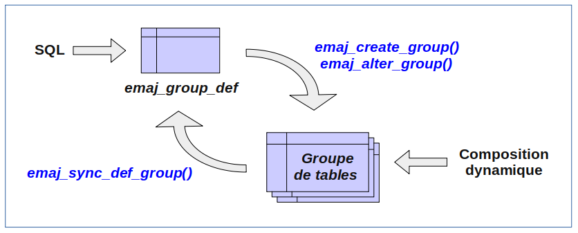

Modification des groupes de tables
==================================

Généralités
-----------

Plusieurs types d'événements peuvent rendre nécessaire la modification d'un groupe de tables : 

* la composition du groupe de tables change, avec l'ajout ou la suppression de tables ou de séquence dans le groupe,
* un des paramètres liés à une table change dans la configuration E-Maj (priorité, tablespace,…),
* une ou plusieurs tables applicatives appartenant au groupe de tables voient leur structure évoluer (ajout ou suppression de colonnes, changement de type de colonne,...),
* une table ou une séquence change de nom ou de schéma.

Lorsque la modification touche un groupe de tables en état *LOGGING*, il peut être nécessaire de sortir temporairement la table ou séquence concernée de son groupe de tables, avec des impacts sur les éventuelles opérations postérieures de rollback E-Maj.

Le plus souvent, en fonction de l’utilisation ou non de la :ref:`table de configuration emaj_group_def<emaj_group_def>`, les modifications peuvent être réalisées :

* soit en dynamique, au travers de fonctions dédiées,
* soit en modifiant le contenu de la table *emaj_group_def* , puis en exécutant une fonction *emaj_alter_group()*,

Le tableau suivant liste les actions possibles, en fonction de la méthode choisie.

+--------------------------------------------------------+------------------------+-------------------------------+
| Actions                                                | Ajustement dynamique   | Ajustement par emaj_group_def |
+========================================================+========================+===============================+
| Ajouter une table/séquence à un groupe                 | Fonctions dédiées      | emaj_alter_group()            |
+--------------------------------------------------------+------------------------+-------------------------------+
| Supprimer une table/séquence d’un groupe               | Fonctions dédiées      | emaj_alter_group()            |
+--------------------------------------------------------+------------------------+-------------------------------+
| Déplacer une table/séquence vers un autre groupe       | Fonctions dédiées      | emaj_alter_group()            |
+--------------------------------------------------------+------------------------+-------------------------------+
| Changer le tablespace de la table ou de l'index de log | Fonctions dédiées      | emaj_alter_group()            |
+--------------------------------------------------------+------------------------+-------------------------------+
| Changer la priorité E-Maj d'une table                  | Fonctions dédiées      | emaj_alter_group()            |
+--------------------------------------------------------+------------------------+-------------------------------+
| Réparer une table                                      | Sortie du groupe +     | emaj_alter_group()            |
|                                                        | Ajout dans le groupe   |                               |
+--------------------------------------------------------+------------------------+-------------------------------+
| Renommer une table                                     | Sortie du groupe +     | Sortie du groupe +            |
|                                                        | ALTER TABLE + Ajout    | ALTER TABLE + Ajout           |
+--------------------------------------------------------+------------------------+-------------------------------+
| Renommer une séquence                                  | Sortie du groupe +     | Sortie du groupe +            |
|                                                        | ALTER SEQUENCE + Ajout | ALTER SEQUENCE + Ajout        |
+--------------------------------------------------------+------------------------+-------------------------------+
| Changer le schéma d’une table                          | Sortie du groupe +     | Sortie du groupe +            |
|                                                        | ALTER TABLE + Ajout    | ALTER TABLE + Ajout           |
+--------------------------------------------------------+------------------------+-------------------------------+
| Changer le schéma d’une séquence                       | Sortie du groupe +     | Sortie du groupe +            |
|                                                        | ALTER SEQUENCE + Ajout | ALTER SEQUENCE + Ajout        |
+--------------------------------------------------------+------------------------+-------------------------------+
| Renommer une colonne d’une table                       | Sortie du groupe +     | Sortie du groupe +            |
|                                                        | ALTER TABLE + Ajout    | ALTER TABLE + Ajout           |
+--------------------------------------------------------+------------------------+-------------------------------+
| Changer la structure d’une table                       | Sortie du groupe +     | Sortie du groupe +            |
|                                                        | ALTER TABLE + Ajout    | ALTER TABLE + Ajout           |
+--------------------------------------------------------+------------------------+-------------------------------+
| Autres formes d’ALTER TABLE                            | Sans impact E-Maj                                      |
+--------------------------------------------------------+------------------------+-------------------------------+
| Autres formes d’ALTER SEQUENCE                         | Sans impact E-Maj                                      |
+--------------------------------------------------------+------------------------+-------------------------------+

Les modifications de composition de groupes de tables en état *LOGGING* peuvent avoir des conséquences sur les opérations de rollback E-Maj ou de génération de scripts SQL (voir plus bas).

D’une manière générale, même si le groupe de tables est en état *LOGGING*, une opération de rollback E-Maj ciblant une marque antérieure à une modification de groupes de tables ne procède PAS automatiquement à une annulation de ces changements. Néanmoins, l’administrateur a la possibilité d’appliquer lui même les changements permettant de  remettre uns structure de groupe de tables à un état antérieur.

.. _dynamic_ajustment:

Méthode « Ajustement dynamique »
--------------------------------

Quelques fonctions permettent d’ajuster dynamiquement le contenu des groupes de tables sans modification de la table *emaj_group_def*.

Ajouter des tables ou des séquences à un groupe
^^^^^^^^^^^^^^^^^^^^^^^^^^^^^^^^^^^^^^^^^^^^^^^

Les fonctions d’:ref:`assignation d’une ou plusieurs tables ou séquences<assign_table_sequence>` à un groupe de tables, utilisées pour la création des groupes, sont utilisables également au cours de la vie du groupe.

Lors de l’exécution des fonctions, les groupes de tables concernés peuvent être en état *IDLE* ou *LOGGING*.

Lorsque le groupe de tables est actif (état *LOGGING*), un verrou exclusif est posé sur chaque table du groupe.

Lorsque le groupe de table est actif, une marque est également posée. Son nom prend la valeur du dernier paramètre fourni lors de l’appel de la fonction. Ce paramètre est optionnel. S’il n’est pas fourni, le nom de la marque posée est généré avec un préfixe *ASSIGN*.

.. _remove_table_sequence:

Retirer des tables de leur groupe de tables
^^^^^^^^^^^^^^^^^^^^^^^^^^^^^^^^^^^^^^^^^^^

Les 3 fonctions suivantes permettent de retirer une ou plusieurs tables de leur groupe de tables ::

	SELECT emaj.emaj_remove_table('<schéma>', '<table>' [,'<marque>'] );

ou ::

	SELECT emaj.emaj_remove_tables('<schéma>', '<tableau.de.tables>' [,'<marque>'] );

ou ::

	SELECT emaj.emaj_remove_tables('<schéma>', '<filtre.de.tables.à.inclure>', '<filtre.de.tables.à.exclure>' [,'<marque>'] );

Leur fonctionnement est identique aux fonctions d’assignation de tables.

Quand plusieurs tables sont sorties, celles-ci ne proviennent pas nécessairement d’un même groupe de tables d’origine.

Lorsque le ou les groupes de tables d’origine sont actifs et que la marque n’est pas fournie en paramètre, le nom de la marque posée est généré avec un préfixe *REMOVE*.

Retirer des séquences de leur groupe de tables
^^^^^^^^^^^^^^^^^^^^^^^^^^^^^^^^^^^^^^^^^^^^^^

Les 3 fonctions suivantes permettent de retirer une ou plusieurs séquences de leur groupe de tables ::

	SELECT emaj.emaj_remove_sequence('<schéma>', '<séquence>' [,'<marque>'] );

ou ::

	SELECT emaj.emaj_remove_sequences('<schéma>', '<tableau.de.séquences>' [,'<marque>'] );

ou ::

	SELECT emaj.emaj_remove_sequences('<schéma>', '<filtre.de.séquences.à.inclure>', '<filtre.de.séquences.à.exclure>' [,'<marque>'] );

Leur fonctionnement est identique aux fonctions d’assignation de séquences.

Quand plusieurs séquences sont sorties, celles-ci ne proviennent pas nécessairement d’un même groupe de tables d’origine.

Lorsque le groupe de tables est actif et que la marque n’est pas fournie en paramètre, le nom de la marque posée est généré avec un préfixe *REMOVE*.

.. _move_table_sequence:

Déplacer des tables vers un autre groupe de tables
^^^^^^^^^^^^^^^^^^^^^^^^^^^^^^^^^^^^^^^^^^^^^^^^^^

3 fonctions permettent de déplacer une ou plusieurs tables vers un autre groupe de tables ::

	SELECT emaj.emaj_move_table('<schéma>', '<table>', 'nouveau.groupe' [,'<marque>'] );

ou ::

	SELECT emaj.emaj_move_tables('<schéma>', '<tableau.de.tables>', 'nouveau.groupe' [,'<marque>'] );

ou ::

	SELECT emaj.emaj_move_tables('<schéma>', '<filtre.de.tables.à.inclure>', '<filtre.de.tables.à.exclure>', 'nouveau.groupe' [,'<marque>'] );

Quand plusieurs tables sont déplacées, celles-ci ne proviennent pas nécessairement d’un même groupe de tables d’origine.

Lorsque le ou les groupes de tables d’origine sont actifs et que la marque n’est pas fournie en paramètre, le nom de la marque posée est généré avec un préfixe *MOVE*.

Déplacer des séquences vers un autre groupe de tables
^^^^^^^^^^^^^^^^^^^^^^^^^^^^^^^^^^^^^^^^^^^^^^^^^^^^^

3 fonctions permettent de déplacer une ou plusieurs séquences vers un autre groupe de tables ::

	SELECT emaj.emaj_move_sequence('<schéma>', '<séquence>', 'nouveau.groupe' [,'<marque>'] );

ou ::

	SELECT emaj.emaj_move_sequences('<schéma>', '<tableau.de.séquences>', 'nouveau.groupe' [,'<marque>'] );

ou ::

	SELECT emaj.emaj_move_sequences('<schéma>', '<filtre.de.séquences.à.inclure>', '<filtre.de.séquences.à.exclure>', 'nouveau.groupe' [,'<marque>'] );

Quand plusieurs séquences sont déplacées, celles-ci ne proviennent pas nécessairement d’un même groupe de tables d’origine.

Lorsque le groupe de tables est actif et que la marque n’est pas fournie en paramètre, le nom de la marque posée est généré avec un préfixe *MOVE*.

.. _modify_table:

Modifier les  propriétés de tables
^^^^^^^^^^^^^^^^^^^^^^^^^^^^^^^^^^

3 fonctions permettent de modifier les propriétés d’une table ou de plusieurs tables d’un même schéma ::

	SELECT emaj.emaj_modify_table('<schéma>', '<table>', '<propriétés.modifiées>' [,'<marque>']]);

ou ::

	SELECT emaj.emaj_modify_tables('<schéma>', '<tableau.de.tables>', '<propriétés.modifiées>' [,'<marque>']]);

ou ::

	SELECT emaj.emaj_modify_tables('<schéma>', '<filtre.de.tables.à.inclure>', '<filtre.de.tables.à.exclure>','<propriétés.modifiées>' [,'<marque>']]);

Le paramètre <propriétés.modifiées> est de type JSONB. Ses champs élémentaires sont les mêmes que pour le paramètre <propriétés> des :ref:`fonctions d'assignation de tables<assign_table_sequence>`. Mais ce paramètre <propriétés.modifiées> ne contient que les propriétés ... à modifier. Les propriétés non valorisées restent inchangées. On peut affecter la valeur par défaut d’une propriété en la valorisant avec un *NULL* (le null *JSON*).

Les fonctions retournent le nombre de tables ayant subi au moins une modification de propriété.

Lorsque le groupe de tables est actif et que la marque n’est pas fournie en paramètre, le nom de la marque posée est généré avec un préfixe *MODIFY*.

.. _emaj_alter_group:

Modification par ajustement de la table emaj_group_def
------------------------------------------------------

Pour éviter de devoir supprimer puis recréer complètement un ou plusieurs groupes de tables après modification de la table *emaj_group_def*, une fonction permet de traiter  uniquement les impacts de ces modifications ::

   SELECT emaj.emaj_alter_group('<nom.du.groupe>' [,'<marque>']);

La fonction retourne le nombre de tables et de séquences dorénavant contenues dans le groupe de tables.

La fonction *emaj_alter_group()* recrée également les objets E-Maj qui pourraient manquer (table de log, fonction, …). Elle supprime et/ou crée les schémas de log, en fonction des besoins.

Si le groupe de table est en état *IDLE*, le contenu de ses tables de log est purgé.

Si le groupe de table est en état *LOGGING*, la fonction :

* pose un verrou de type ROW EXCLUSIVE sur chaque table applicative du groupe de tables,
* pose une marque dont le nom peut être fourni en paramètre.

Si le paramètre représentant la marque n'est pas spécifié, ou s'il est vide ou *NULL*, un nom est automatiquement généré : *ALTER_%*, où le caractère '%' représente l'heure courante, au format "hh.mn.ss.mmmm".

Toutes les actions enchaînées par la fonction *emaj_alter_group()* sont exécutées au sein d'une unique transaction. En conséquence, si une erreur survient durant l'opération, le groupe de tables se retrouve dans son état initial.

Il est possible d'anticiper la mise à jour de la table *emaj_group_def*, alors que le groupe de tables est encore actif. Cette mise à jour ne prendra bien sûr effet qu'à l'issue de l'exécution de la fonction *emaj_alter_group()*. 

Plusieurs groupes de tables peuvent être modifiés en même temps, en utilisant la fonction *emaj_alter_groups()* ::

   SELECT emaj.emaj_alter_groups('<tableau.des.groupes>' [,'<marque>']);

Cette fonction permet notamment de déplacer une table ou une séquence d’un groupe de tables à un autre dans une même opération.

La syntaxe de représentation des tableaux de groupes de tables est présentée :doc:`ici<multiGroupsFunctions>`.

Incidence des ajouts ou suppressions de tables et séquences dans un groupe en état *LOGGING*
--------------------------------------------------------------------------------------------

.. caution::

	Quand une table ou une séquence est détachée de son groupe de tables, toute opération de rollback ultérieure sur ce groupe sera sans effet sur cet objet. 

Une fois la table ou la séquence applicative décrochée de son groupe de tables, elle peut être modifiée (*ALTER*) ou supprimée (*DROP*). Les historiques liés à l’objet (logs, trace des marques,...) sont conservés pour examen éventuel. Ils restent néanmoins associés à l'ancien groupe d'appartenance de l'objet. Pour éviter toute confusion, les tables de log sont renommées, avec l’ajout dans le nom d’un suffixe numérique. Ces logs et traces des marques ne seront supprimés que par les opérations de :ref:`réinitialisation du groupe de tables <emaj_reset_group>` ou par les :ref:`suppressions des plus anciennes marques <emaj_delete_before_mark_group>` du groupe.

.. caution::

   Quand une table ou une séquence est ajoutée à un groupe de tables actif, celle-ci est ensuite traitée par les éventuelles opérations de rollback. Mais si l’opération de rollback cible une marque posée avant l’ajout de la table ou de la séquence dans le groupe, la table ou la séquence sera remise dans l’état qu’elle avait au moment où elle a été ajoutée au groupe, et un message d’avertissement est généré. En revanche une telle table ou séquence ne sera pas traitée par une fonction de génération de script SQL si la marque de début souhaitée est antérieure à l’ajout de la table dans le groupe.

Quelques graphiques permettent de visualiser plus facilement les conséquences de l’ajout ou la suppression d’une table ou d’une séquence dans un groupe de tables actif.

Prenons 4 tables affectées à un groupe (t1 à t4) et 4 marques posées au fil du temps (m1 à m4). En m2, t3 a été ajoutée au groupe et t4 en a été retirée. En m3, t2 a été retirée du groupe alors que t4 y a été remis.

.. image:: images/logging_group_changes.png
   :align: center

Un rollback à la marque m1 :

* traiterait la table t1,
* **NE** traiterait **PAS** la table t2, faute de log après m3,
* traiterait la table t3, mais en ne remontant que jusqu’à m2,
* traiterait la table t4, mais en ne remontant que jusqu’à m3, faute de log entre m2 et m3.

.. image:: images/logging_group_rollback.png
   :align: center

Une restitution de statistiques entre les marques m1 et m4 produirait :

* 1 ligne pour t1 (m1,m4),
* 1 ligne pour t2 (m1,m3),
* 1 ligne pour t3 (m2,m4),
* 2 lignes pour t4 (m1,m2) et (m3,m4).

.. image:: images/logging_group_stat.png
   :align: center

La génération d’un script SQL pour l’intervalle m1 à m4 :

* traiterait la table t1,
* traiterait la table t2, mais en n’allant pas au-delà de m3,
* **NE** traiterait **PAS** la table t3, faute de log avant m2,
* traiterait la table t4, mais en n’allant pas au-delà de m2, faute de log entre m2 et m3.

.. image:: images/logging_group_gen_sql.png
   :align: center

Si la structure d’une table applicative a été modifiée par mégarde alors qu’elle se trouvait dans un groupe de tables actif, les opérations de pose de marque et de rollback seront bloquées par les contrôles internes d’E-Maj. On peut éviter de devoir arrêter, modifier puis relancer le groupe de tables en retirant la table concernée de son groupe puis en la rajoutant.

Quand une table change de groupe d’affectation, l’incidence sur la capacité de générer un script SQL ou de procéder à un rollback des groupes de tables source et destination est similaire à ce que serait la suppression de la table du groupe source puis son ajout dans le groupe destination.

Réparation de groupe de tables
------------------------------

Même si les triggers sur événements mis en place avec E-Maj limitent les risques, il peut arriver que des composants E-Maj supportant une table applicative (table, fonction ou trigger de log) soient supprimés. Le groupe de tables contenant cette table ne peut alors plus fonctionner correctement.

Pour résoudre le problème sans arrêter le groupe de tables (et ainsi perdre le bénéfice des logs enregistrés), il est possible de sortir puis réintégrer la table de son groupe de tables en le laissant actif. Pour ce faire, il suffit d’enchaîner les 2 commandes ::

   SELECT emaj.emaj_remove_table('<schéma>', '<table>' [,'<marque>']);

   SELECT emaj.emaj_assign_table('<schéma>', '<table>', '<groupe>' [,'propriétés' [,'<marque>']] );

Naturellement, une fois la table sortie de son groupe, le contenu des logs associés n’est plus exploitable pour un éventuel rollback ou une éventuelle génération de script.

Néanmoins, si la séquence de log est absente (cas de figure hautement improbable) et que le groupe de tables est en état *LOGGING*, la réparation nécessite de :ref:`forcer l'arrêt du groupe<emaj_force_stop_group>` avant de sortir puis réassigner la table.

Il peut arriver également qu’une table ou séquence applicative soit supprimée accidentellement avant d’avoir été sortie de son groupe de tables. Dans ce cas, on pourra sortir à posteriori cette table ou cette séquence de son groupe de tables, même si celui-ci est actif

* soit en exécutant uniquement la fonction *emaj_remove_table()* ou *emaj_remove_sequence()* appropriée,
* soit en enchaînant les 2 étapes de suppression de la ligne correspondant à la table/séquence dans la table *emaj_group_def*, et d'appel de la fonction *emaj_alter_group()* pour le groupe de tables concerné.

.. _emaj_sync_def_group:

Combiner gestion dynamique des groupes de tables et configuration par emaj_group_def
------------------------------------------------------------------------------------

En principe, il faut choisir une fois pour toute la méthode de gestion du contenu des groupes de tables : gestion dynamique ou par la table de configuration *emaj_group_def*. Il est néanmoins possible de mixer les 2 méthodes.

La difficulté réside alors dans le fait qu’une fois effectuées des modifications en dynamique du contenu des groupes de tables, la table *emaj_group_def* ne reflète plus la configuration courante des groupes.

Pour éviter de reporter manuellement les modifications apportées en dynamique dans la table *emaj_group_def*, sans garantie de fiabilité, l’administrateur E-Maj peut, pour un groupe de tables donné, synchroniser le contenu de la table *emaj_group_def* à partir de la situation courante. Pour cela, il peut exécuter ::

   SELECT emaj.emaj_sync_def_group('<groupe>');

La fonction retourne le nombre de tables et séquences contenues dans le groupe de tables traité.

Le schéma suivant représente les flux de modifications possibles :

