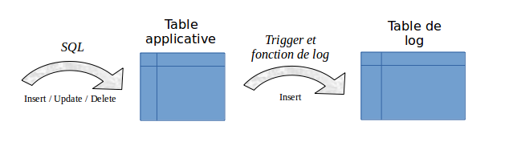

Architecture
============

Pour mener à bien l'opération de rollback sans avoir conservé au préalable une image physique des fichiers de l'instance PostgreSQL, il faut pouvoir enregistrer les mises à jour effectuées sur les tables applicatives de manière à pouvoir les annuler.

Avec E-Maj, cela prend la forme suivante.

Les requêtes SQL tracées
************************
Les opérations de mises à jour enregistrées concernent les verbes SQL suivants :

* insertions de lignes :

  * INSERT élémentaires (INSERT … VALUES) ou ensemblistes (INSERT … SELECT)
  * COPY … FROM 

* mises à jour de lignes :

  * UPDATE 

* suppression de lignes :

  * DELETE

* vidage de table :

  * TRUNCATE

Pour les requêtes qui traitent plusieurs lignes, chaque création, modification ou suppression est enregistrée individuellement. Ainsi par exemple, une requête *DELETE FROM <table>* portant sur une table d'1 million de lignes générera l'enregistrement d'1 million de suppressions de ligne.

Le cas des verbes SQL *TRUNCATE* est spécifique. Comme aucun trigger de niveau ligne (*FOR EACH ROW*) n'est activable pour ce verbe, les conséquences d'un *TRUNCATE* ne peuvent pas être annulées par E-Maj. C'est pourquoi son exécution est interdite pour les groupes de tables de type « *ROLLBACKABLE* » à l'état « *actif* ». Son exécution est en revanche toujours autorisée pour les groupes de tables créés en mode « *AUTID_ONLY* ». Dans ce cas, seule l'exécution du verbe est enregistrée.

Les objects créés
*****************

Pour chaque table applicative sont créés :

* une **table de log** dédiée, qui contient les données correspondant aux mises à jour effectuées,
* un **trigger** et une **fonction** spécifique, permettant, lors de chaque création (*INSERT*, *COPY*), mise à jour (*UPDATE*) ou suppression (*DELETE*) de ligne, d'enregistrer dans la table de log toutes les informations nécessaires à l'annulation ultérieure de l'action élémentaire,
* un autre **trigger** permettant soit de bloquer toute exécution d'un verbe SQL *TRUNCATE* pour les groupes de type « *ROLLBACKABLE* », soit de tracer l'exécution des verbes SQL *TRUNCATE* pour les groupes de tables de type « *AUDIT_ONLY* »,
* une **séquence** qui permet de dénombrer très rapidement le nombre de mises à jour enregistrées dans les tables de log entre 2 marques.

Une **table de log** a la même structure que la table applicative correspondante. Elle comprend néanmoins quelques colonnes techniques supplémentaires :

* un identifiant unique, sous la forme d'un entier associé à une séquence globale,
* la date et l'heure précise de la mise à jour,
* le type d'opération SQL effectuée : *INS* pour *INSERT*, *UPD* pour *UPDATE* et *DEL* pour *DELETE*,
* un attribut '*OLD*' ou '*NEW*' permettant de distinguer les anciennes et nouvelles valeurs des lignes mises à jour,
* le numéro interne de la transaction à l'origine de la mise à jour (*txid* PostgreSQL),
* le rôle de connexion à l'origine de la mise à jour,
* l'adresse ip de l'utilisateur à l'origine de la mise à jour,
* le port ip de l'utilisateur à l'origine de la mise à jour.

Pour le bon fonctionnement d'E-Maj, un certain nombre d'**objets techniques** sont également créés à l'installation de cette extension :

* 13 tables,
* 5 types composites et 2 énumérations,
* 1 vue,
* plus de 90 fonctions, dont environ la moitié directement appelables par les utilisateurs,
* 1 séquence, nommée *emaj_global_seq*, permettant d'associer à chaque mise à jour enregistrée dans une table de log quelconque de la base de données un identifiant unique de valeur croissante au fil du temps,
* 1 schéma spécifique, nommé *emaj*, qui contient tous ces objets,
* 2 rôles de type groupe (sans possibilité de connexion) : *emaj_adm* pour administrer les composants E-Maj, et *emaj_viewer* pour uniquement consulter les composants E-Maj,
* 2 triggers sur événement avec PostgreSQL 9.3 et 9.4 et 3 triggers sur événement à partir de PostgreSQL 9.5.

Quelques tables techniques dont il peut être utile de connaître la structure sont décrites en détail :  :ref:`emaj_group_def <emaj_group_def>`, :ref:`emaj_param <emaj_param>` et :ref:`emaj_hist <emaj_hist>`.

Norme de nommage des objets E-Maj
*********************************

Les objets associés aux tables applicatives portent des noms construits en utilisant, par défaut, le nom de la table et de son schéma d'appartenance. Ainsi :

* le nom de la **table de log** est : 
	<nom.du.schema>_<nom.de.la.table>_log

* le nom de la **fonction de log** est : 
	<nom.du.schema>_<nom.de.la.table>_log_fnct

* le nom de la **séquence** associée à la table de log est :
    <nom.du.schema>_<nom.de.la.table>_log_seq

Mais il est possible de définir, pour chaque table applicative, le **préfixe** constituant le nom des objets E-Maj associés. Ceci permet notamment de gérer des tables avec des noms très longs.

Le nom des autres **fonctions** E-Maj est aussi normalisé :

* les fonctions dont les noms commencent par `emaj_` sont appelables par les utilisateurs,
* les fonctions dont les noms commencent par `_` sont des fonctions internes qui ne doivent pas être appelées directement.

Les **triggers** créés sur les tables applicatives portent tous le même nom :

* *emaj_log_trg* pour les triggers de log,
* *emaj_trunc_trg* pour les triggers de contrôle des verbes *TRUNCATE*.

Le nom des **triggers sur événements** commence par `emaj_` et se termine par `_trg`.

Les schémas créés
*****************

Tous les objets techniques créés lors de l'installation de l'extension sont localisés dans le schéma **emaj**. Seule la fonction associée au trigger sur événement « emaj_protection_trg » appartient au schéma « public »

Par défaut, tous les objets liés aux groupes de tables sont créés dans le schéma principal emaj. Mais, au travers du paramétrage des groupes de tables, il est possible de localiser ces objets dans un ou plusieurs **schémas secondaires**. Le nom des schémas secondaires commencent par « emaj », seul leur suffixe peut être défini dans le :ref:`paramétrage des groupes de tables <emaj_group_def>`.

Les tablespaces utilisés
************************

Lors de l'installation de l'extension, les tables techniques E-Maj sont stockées dans le tablespace par défaut, positionné au niveau de l’instance ou de la database ou explicitement défini pour la session courante.

Il en est de même pour les tables de log et leur index. Mais au travers du :ref:`paramétrage des groupes de tables <emaj_group_def>`, il est aussi possible de créer les tables de log et leur index dans des tablespaces spécifiques.

