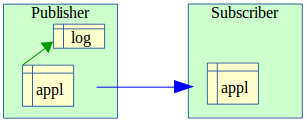
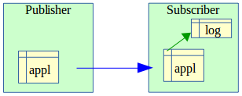
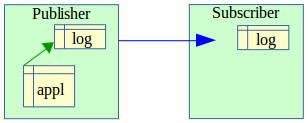
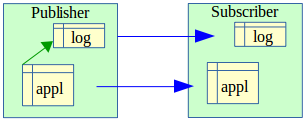

Impacts sur l'administration de l'instance et de la base de données
===================================================================

Arrêt/relance de l'instance
---------------------------

L'utilisation d'E-Maj n'apporte aucune contrainte particulière sur l'arrêt et la relance des instances PostgreSQL.

Règle générale
^^^^^^^^^^^^^^

Au redémarrage de l'instance, tous les objets d'E-Maj se retrouvent dans le même état que lors de l'arrêt de l'instance : les triggers de logs des groupes de tables actifs restent activés et les tables de logs sont alimentées avec les mises à jours annulables déjà enregistrées.

Si une transaction avait des mises à jour en cours non validées lors de l'arrêt de l'instance, celle-ci est annulée lors du redémarrage, les écritures dans les tables de logs se trouvant ainsi annulées en même temps que les modifications de tables.

Cette règle s'applique bien sûr aux transactions effectuant des opérations E-Maj telles que le démarrage ou l'arrêt d'un groupe, un rollback, une suppression de marque, etc.

Rollback des séquences
^^^^^^^^^^^^^^^^^^^^^^

Lié à une contrainte de PostgreSQL, seul le rollback des séquences applicatives n'est pas protégé par les transactions. C'est la raison pour laquelle les séquences sont rollbackées en toute fin d':ref:`opération de rollback <emaj_rollback_group>`. (Pour la même raison, lors de la pose d'une marque, les séquences applicatives sont traitées en début d'opération.)

Au cas où un rollback serait en cours au moment de l'arrêt de l'instance, il est recommandé de procéder à nouveau à ce même rollback juste après le redémarrage de l'instance, afin de s'assurer que les séquences et tables applicatives restent bien en phase.

Sauvegarde et restauration
--------------------------

.. caution::
   E-Maj peut permettre de diminuer la fréquence avec laquelle les sauvegardes sont nécessaires. Mais E-Maj ne peut se substituer totalement aux sauvegardes habituelles, qui restent nécessaires pour conserver sur un support externe des images complètes des bases de données !

Sauvegarde et restauration au niveau fichier
^^^^^^^^^^^^^^^^^^^^^^^^^^^^^^^^^^^^^^^^^^^^

Lors des sauvegardes ou des restauration des instances au niveau fichier, il est essentiel de sauver ou restaurer **TOUS** les fichiers e l'instance, y compris ceux stockés sur des tablespaces dédiés.

Après restauration des fichiers, les groupes de tables se retrouveront dans l'état dans lequel ils se trouvaient lors de la sauvegarde, et l'activité de la base de données peut reprendre sans opération E-Maj particulière.

Sauvegarde et restauration logique de base de données complète
^^^^^^^^^^^^^^^^^^^^^^^^^^^^^^^^^^^^^^^^^^^^^^^^^^^^^^^^^^^^^^

Pour les sauvegardes et restaurations logiques de base de données avec E-Maj, utilisant *pg_dump*, et *psql* ou *pg_restore*, il est essentiel que la base d’origine et la base restaurée utilisent la **même version d’E-Maj**. Dans le cas contraire, le contenu de certaines tables techniques peut ne pas correspondre à leur structure. La lecture de la ligne de clé *'emaj_version'* de la table *emaj.emaj_param* peut permettre de connaître la version d’une extension E-Maj créée dans une base de données.

Pour les groupes de tables arrêtés (en état *IDLE*), comme les triggers de logs sont inactifs et que le contenu des tables de log n'a pas d'importance, il n'y a aucune précaution particulière à prendre pour les retrouver dans le même état après une restauration.

Pour les groupes de tables en état *LOGGING* au moment de la sauvegarde, il faut s'assurer que les triggers de logs ne sont pas activés au moment de la reconstitution (restauration) des tables applicatives. Dans le cas contraire, pendant la reconstruction des tables, toutes les insertions de lignes seraient aussi enregistrées dans les tables de logs !

Lorsqu'on utilise les commandes *pg_dump* pour la sauvegarde et *psql* ou *pg_restore* pour la restauration et que l'on traite des bases complètes (schéma et données), ces outils font en sorte que les triggers, dont les triggers de log E-Maj, ne soient activés qu'en fin de restauration. Il n'y a donc pas de précautions particulières à prendre.

En revanche, dans le cas de sauvegarde et restauration des données seulement (sans schéma, avec les options -a ou *--data-only*), alors il faut spécifier l'option *--disable-triggers* :

* à la commande *pg_dump* (ou *pg_dumpall*) pour les sauvegardes au format plain (*psql* utilisé pour le rechargement),
* à la commande *pg_restore* pour les sauvegardes au format *tar* ou *custom*.

La restauration de la structure de la base de données génère 2 messages d'erreur indiquant que la fonction *_emaj_protection_event_trigger_fnct()* et que le trigger sur événement *emaj_protection_trg* existent déjà ::

    ...
    ERROR:  function "_emaj_protection_event_trigger_fnct" already exists with same argument types
    ...
    ERROR:  event trigger "emaj_protection_trg" already exists
    ...

L'affichage de ces messages est normal et n'est pas le signe d'une restauration défectueuse. En effet, ces 2 objets sont créés avec l'extension mais en sont détachés ensuite, de sorte que le trigger puisse être capable de bloquer la suppression éventuelle de l'extension. L'outil *pg_dump* les sauvegarde donc comme des objets indépendants. Lors de la restauration, ces objets sont donc créés 2 fois, une première fois avec l'extension emaj et une seconde fois en tant qu'objet indépendant. C'est cette seconde tentative de création qui provoque les 2 messages d'erreur.

Sauvegarde et restauration logique de base de données partielle
^^^^^^^^^^^^^^^^^^^^^^^^^^^^^^^^^^^^^^^^^^^^^^^^^^^^^^^^^^^^^^^

Les outils *pg_dump* et *pg_restore* permettent de ne traiter qu'un sous-ensemble des schémas et/ou des tables d'une base de données.

Restaurer un sous-ensemble des tables applicatives et/ou des tables de log comporte un risque très élevé de corruption des données en cas de rollback E-Maj ultérieur sur le groupe de tables concerné. En effet, dans ce cas, il est impossible de garantir la cohérence entre les tables applicatives, les tables de log et les tables internes d'E-Maj, qui contiennent des données essentielles aux opérations de rollback.

S'il s'avère nécessaire de procéder à une restauration partielle de tables applicatives, il faut faire suivre cette restauration de la suppression puis recréation du ou des groupes de tables touchées par l'opération.

De la même manière il est fortement déconseillé de procéder à une restauration partielle des tables du schéma *emaj*.

Le seul cas de restauration partielle sans risque concerne la restauration du contenu complet du schéma *emaj*, ainsi que de toutes les tables et séquences appartenant à tous les groupes de tables créés dans la base de données.

Chargement de données
---------------------

Au delà de l'utilisation de *pg_restore* ou de *psql* avec un fichier issu de *pg_dump* évoquée plus haut, il est possible de procéder à des chargements massifs de tables par la commande SQL *COPY* ou la méta-commande *psql* *\\copy*. Dans les deux cas, le chargement des données provoque le déclenchement des triggers sur *INSERT*, dont bien sûr celui utilisé pour le log d'E-Maj. Il n'y a donc aucune contrainte à l'utilisation de *COPY* et *\\copy* avec E-Maj.

Pour l'utilisation d'autres outils de chargement, il convient de vérifier que les triggers sont bien activés à chaque insertion de ligne.

Réorganisation des tables de la base de données
-----------------------------------------------

Réorganisation des tables applicatives
^^^^^^^^^^^^^^^^^^^^^^^^^^^^^^^^^^^^^^

Les tables applicatives protégées par E-Maj peuvent être réorganisées par une commande SQL *CLUSTER*. Que les triggers de logs soient actifs ou non, le processus de réorganisation n'a pas d'impact pas le contenu des tables de log.

Réorganisation des tables E-Maj
^^^^^^^^^^^^^^^^^^^^^^^^^^^^^^^

L'index correspondant à la clé primaire de chaque table des schémas d'E-Maj est déclaré « *cluster* », que ce soit les tables de log ou les quelques tables internes.

.. caution::
   Aussi, l'installation d'E-Maj peut avoir un impact opérationnel sur l'exécution des commandes SQL *CLUSTER* au niveau de la base de données.

Dans le cas d'une utilisation en mode continu d'E-Maj, c'est à dire sans arrêt et relance réguliers des groupes de tables, mais avec suppression des marques les plus anciennes, il est recommandé de procéder régulièrement à des réorganisations des tables de log E-Maj. Ceci permet ainsi de récupérer de l'espace disque inutilisé suite aux suppressions des marques.

Utilisation d'E-Maj avec de la réplication
------------------------------------------

Réplication physique intégrée
^^^^^^^^^^^^^^^^^^^^^^^^^^^^^

E-Maj est parfaitement compatible avec le fonctionnement des différents modes de réplication physique intégrée de PostgreSQL (archivage des *WAL* et *PITR*, *Streaming Replication* asynchrone ou synchrone). Tous les objets E-Maj des bases hébergées sur l'instance sont en effet répliqués comme tous les autres objets de l'instance.

Néanmoins, compte tenu de la façon dont PostgreSQL gère les séquences, la valeur courante des séquences peut être un peu en avance sur les instances secondaires par rapport à l'instance primaire. Pour E-Maj, ceci induit des statistiques générales indiquant parfois un nombre de lignes de log un peu supérieur à la réalité. Mais il n'y a pas de conséquence sur l'intégrité des données.

Réplication logique intégrée
^^^^^^^^^^^^^^^^^^^^^^^^^^^^

Les versions 10 et suivantes de PostgreSQL intègrent des mécanismes de réplication logique. La granularité de réplication est ici la table. L’objet de publication utilisé dans la réplication logique est assez proche du concept de groupes de tables E-Maj, à ceci près qu’une publication ne peut contenir de séquences.

**Réplication de tables applicatives gérées par E-Maj**

Une table applicative appartenant à un groupe de tables E-Maj peut être mise en réplication. Les éventuels rollbacks E-Maj se répliqueront naturellement côté *subscriber*, à condition qu’aucun filtre ne soit appliqué sur les types de verbes SQL répliqués.

**Réplication de tables applicatives avec gestion par E-Maj côté subscriber**

A partir d’E-Maj 4.0, il est possible d’insérer une table applicative dans un groupe de tables E-Maj avec des mises à jour en provenance d’un flux de réplication. Toutes les opérations E-Maj sont bien sûr exécutées côté *subscriber* (démarrage/arrêt du groupe, pose de marque,...). On peut effectuer un rollback E-Maj de ce groupe de tables, une fois stoppée la réplication (pour éviter des conflits dans les mises à jour). Mais à l’issue du rollback, les tables du *publisher* et du *subscriber* ne seront plus en cohérence.

**Réplication de tables de log E-Maj**

A partir d’E-Maj 4.0, il est techniquement possible de mettre une table de log E-Maj en réplication (en trouvant un moyen de construire le DDL de création – par *pg_dump* par exemple). Ceci peut permettre de dupliquer ou concentrer les données de log sur un autre serveur. Mais la table de log répliquée ne peut être utilisée qu’en **consultation**. En effet, les séquences de log n’étant pas répliquées, ces logs ne peuvent pas être utilisés à d’autres fins.

**Réplication de tables applicatives et de tables de log E-Maj**

Tables applicatives et tables de log peuvent être répliquées simultanément. Mais comme dans le cas précédent, ces logs ne sont utilisables qu’à des fins de **consultation**. Les éventuelles opérations de rollback E-Maj ne peuvent s’effectuer que côté *publisher*.

Autres solutions de réplication
^^^^^^^^^^^^^^^^^^^^^^^^^^^^^^^

L'utilisation d'E-Maj avec des solutions de réplication externe basées sur des triggers, tels que *Slony* ou *Londiste*, nécessite réflexion... On 
évitera probablement de mettre sous réplication les tables de log et les tables techniques d'E-Maj.

