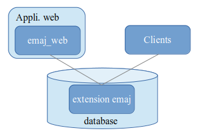

Introduction
============

Licence
*******

Cette extension et toute la documentation qui l'accompagne sont distribuées sous licence GPL (GNU - General Public License).

Objectifs d'E-Maj
*****************

E-Maj est l'acronyme français de « *Enregistrement des Mises A Jour* ».

Il répond à deux objectifs principaux :

* E-Maj peut servir à **tracer les mises à jours** effectuées sur le contenu de tables par des traitements. La consultation de ces mises à jour enregistrées offre ainsi une réponse aux besoins d' « audit des mises à jour ».
* Utilisant ces mises à jour enregistrées, E-Maj est capable de **remettre le contenu d'un ensemble de tables dans un état prédéfini**, sans restauration physique de l'ensemble des fichiers d'une instance (cluster) PostgreSQL, ni rechargement complet de l'ensemble des tables concernées.

En d’autres termes, E-Maj est une extension PostgreSQL qui permet un enregistrement des mises à jour avec une fine granularité et un voyage dans le temps de sous-ensembles de bases de données.

Il constitue ainsi une bonne solution pour :

* positionner à des moments précis des points de sauvegarde sur un ensemble de tables,
* restaurer si nécessaire cet ensemble de tables dans un état stable, sans arrêt de l'instance,
* gérer plusieurs points de sauvegarde, chacun d'eux étant utilisable à tout moment comme point de restauration.

Ainsi, dans un **environnement de production**, E-Maj peut permettre de simplifier l'architecture technique utilisée, en offrant une alternative souple et efficace à des sauvegardes intermédiaires longues (pg_dump) et/ou coûteuses en espace disque (disques miroirs). E-Maj peut également apporter une aide au débogage, en offrant la possibilité d'analyser de façon précise les mises à jour effectuées par un traitement suspect sur les tables applicatives.

Dans un **environnement de test**, E-Maj permet également d'apporter de la souplesse dans les opérations. Il est ainsi possible de repositionner très facilement les bases de données dans des états stables prédéfinis afin de répéter autant de fois que nécessaire des tests de traitement.

Principaux composants
*********************

E-Maj regroupe en fait plusieurs composants :

* un objet PorstgreSQL **extension** créé dans chaque base de données, nommée emaj et contenant quelques tables, fonctions, séquences, ...
* un ensemble de **clients externes** appelables en ligne de commande,
* une **interface graphique web** sous la forme d’un plugin pour l’outil *phpPgAdmin*, ou d’une application indépendante, **Emaj_web**.

Les clients externes et l’interface graphique font appel aux fonctions de l’extension emaj.

Tous ces composants sont décrits dans cette documentation.

