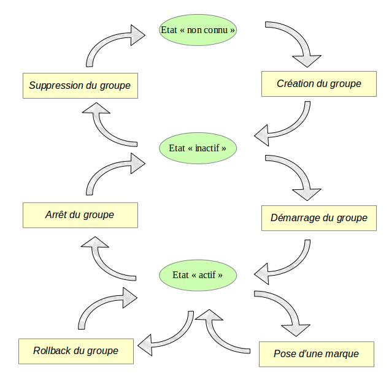

Fonctions principales
=====================

Avant de décrire chacune des principales fonctions d'E-Maj, il est intéressant d'avoir un aperçu global de l'enchaînement typique des opérations. 

Enchaînement des opérations
---------------------------

L'enchaînement des opérations possibles pour un groupe de tables peut se matérialiser par ce synoptique.

Définition des groupes de tables
--------------------------------

.. _emaj_group_def:

La table emaj_group_def
^^^^^^^^^^^^^^^^^^^^^^^

Le contenu du ou des groupes de tables que l'on souhaite gérer se définit en garnissant la table **emaj.emaj_group_def**. Il faut insérer dans cette table une ligne par table ou séquence applicative à intégrer dans un groupe. Cette table *emaj_group_def* a la structure suivante :

+--------------------------+------+------------------------------------------------------------------------------------------------------+
| Colonne                  | Type | Description                                                                                          |
+==========================+======+======================================================================================================+
| grpdef_group             | TEXT | nom du groupe de tables                                                                              |
+--------------------------+------+------------------------------------------------------------------------------------------------------+
| grpdef_schema            | TEXT | nom du schéma contenant la table ou la séquence applicative                                          |
+--------------------------+------+------------------------------------------------------------------------------------------------------+
| grpdef_tblseq            | TEXT | nom de la table ou de la séquence applicative                                                        |
+--------------------------+------+------------------------------------------------------------------------------------------------------+
| grpdef_priority          | INT  | niveau de priorité de la table ou de la séquence dans les traitements E-Maj (optionnel)              |
+--------------------------+------+------------------------------------------------------------------------------------------------------+
| grpdef_log_dat_tsp       | TEXT | nom du tablespace hébergeant la table de log (optionnel)                                             |
+--------------------------+------+------------------------------------------------------------------------------------------------------+
| grpdef_log_idx_tsp       | TEXT | nom du tablespace hébergeant l'index de la table de log (optionnel)                                  |
+--------------------------+------+------------------------------------------------------------------------------------------------------+

L'administrateur peut alimenter cette table par tout moyen usuel : verbe SQL *INSERT*, verbe SQL *COPY*, commande *psql \\copy*, outil graphique, etc.

Le contenu de la table *emaj_group_def* est sensible à la casse. Les noms de schéma, de table, de séquence et de tablespace doivent correspondre à la façon dont PostgreSQL les enregistre dans son catalogue. Ces noms sont le plus souvent en minuscule. Mais si un nom est encadré par des double-guillemets dans les requêtes SQL, car contenant des majuscules ou des espaces, alors il doit être enregistré dans la table *emaj_group_def* avec ces mêmes majuscules et espaces.

.. caution::

   Pour garantir l'intégrité des tables gérées par E-Maj, il est fondamental de porter une attention particulière à cette phase de définition des groupes de tables. Si une table était manquante, son contenu se trouverait bien sûr désynchronisé après une opération de *rollback* sur le groupe de tables auquel elle aurait dû appartenir. En particulier, lors de la création ou de la suppression de tables applicatives, il est important de tenir à jour le contenu de cette table *emaj_group_def*.

Les colonnes principales
^^^^^^^^^^^^^^^^^^^^^^^^

Un nom de groupe de tables (colonne **grpdef_group**) doit contenir au moins un caractère. Il peut contenir des espaces et/ou des caractères de ponctuation. Mais il est recommandé d'éviter les caractères virgule, guillemet simple ou double.

Une table ou une séquence d'un schéma donné (colonnes **grpdef_schema** et **grpdef_tblseq**) ne peut pas être affectée à plusieurs groupes de tables. Toutes les tables d'un schéma n'appartiennent pas nécessairement au même groupe. Certaines peuvent appartenir à des groupes différents. D'autres peuvent n'être affectées à aucun groupe.

Toute table appartenant à un groupe de tables non créé en mode *AUDIT_ONLY* doit posséder une clé primaire explicite (clause *PRIMARY KEY* des *CREATE TABLE* ou *ALTER TABLE*). 

E-Maj gère les partitions élémentaires de tables partitionnées créées avec le DDL déclaratif (à partir de PostgreSQL 10). Elles sont gérées comme n’importe quelle autre table. En revanche, comme les tables mères restent toujours vides, E-Maj refuse qu’elles soient assignées à un groupe de tables. Toutes les partitions d’une même table partitionnée n’ont pas nécessairement besoin d’être couvertes par E-Maj. Des partitions d’une même table partitionnée peuvent être affectées à des groupes de tables différents.

De par leur nature, les tables temporaires (*TEMPORARY TABLE*) ne peuvent être supportées par E-Maj. Et les tables de type *UNLOGGED* ou *WITH OIDS* ne peuvent appartenir qu’à un groupe de tables de type *AUDIT_ONLY*.

Si une séquence est associée à une table applicative, il faut explicitement la déclarer dans le même groupe que sa table. Ainsi, lors d'une opération de rollback, elle sera remise dans l'état où elle se trouvait lors de la pose de la marque servant de référence au rollback.

En revanche, les tables de log et leur séquence NE doivent PAS être référencées dans un groupe de tables !

Les colonnes optionnelles
^^^^^^^^^^^^^^^^^^^^^^^^^

La colonne **grpdef_priority** est de type entier (*INTEGER*) et peut prendre la valeur *NULL*, Elle permet de définir un ordre de priorité dans le traitements des tables par les fonctions d'E-Maj. Ceci peut-être utile pour faciliter la pose des verrous. En effet, en posant les verrous sur les tables dans le même ordre que les accès applicatifs typiques, on peut limiter le risque de deadlock. Les fonctions E-Maj traitent les tables dans l'ordre croissant de *grpdef_priority*, les valeurs *NULL* étant traitées en dernier. Pour un même niveau de priorité, les tables sont traitées dans l'ordre alphabétique de nom de schéma puis de nom de table.

Pour optimiser les performances des installations E-Maj comportant un très grand nombre de tables, il peut s'avérer intéressant de répartir les tables de log et leur index dans plusieurs tablespaces. La colonne **grpdef_log_dat_tsp** sert à spécifier le nom du tablespace à utiliser pour la table de log d'une table applicative. De la même manière, la colonne **grpdef_log_idx_tsp** sert à spécifier le nom du tablespace à utiliser pour l'index de la table de log. 

Si une colonne *grpdef_log_dat_tsp* ou *grpdef_log_idx_tsp* contient une valeur *NULL* (valeur par défaut), le tablespace par défaut de la session courante au moment de la création du groupe est utilisé.

Pour les séquences, les colonnes *grpdef_log_dat_tsp* et *grpdef_log_idx_tsp* doivent rester NULL.

.. _emaj_create_group:

Création d'un groupe de tables
------------------------------

Une fois la constitution d'un groupe de tables définie, E-Maj peut créer ce groupe. Pour ce faire, il suffit d'exécuter la requête SQL suivante ::

   SELECT emaj.emaj_create_group('<nom.du.groupe>', <est.rollbackable>);

ou encore, dans sa forme abrégée ::

   SELECT emaj.emaj_create_group('<nom.du.groupe>');

Le second paramètre, de type booléen, indique si le groupe est de type *ROLLBACKABLE* avec la valeur vrai ou de type *AUDIT_ONLY* avec la valeur fausse. Si le second paramètre n'est pas fourni, le groupe à créer est considéré comme étant de type *ROLLBACKABLE*.

La fonction retourne le nombre de tables et de séquences contenues dans le groupe.

Pour chaque table du groupe, cette fonction crée la table de log associée, la fonction et le trigger de log, ainsi que le trigger bloquant les exécutions de requêtes SQL *TRUNCATE*.

La fonction crée également les schémas de log nécessaires.

En revanche, si des tablespaces spécifiques pour les tables de log ou pour leurs index, sont référencés, ceux-ci doivent déjà exister avant l'exécution de la fonction.

La fonction *emaj_create_group()* contrôle également l'existence de « triggers applicatifs » impliquant les tables du groupe. Si un trigger existe sur une table du groupe, un message d'avertissement est retourné incitant l'utilisateur à vérifier que ce trigger ne fait pas de mises à jour sur des tables n'appartenant pas au groupe.

Si une séquence du groupe est associée à une colonne soit de type *SERIAL* ou *BIGSERIAL* soit définie avec une clause *GENERATED AS IDENTITY*, et que sa table d'appartenance ne fait pas partie du groupe, la fonction génère également un message de type *WARNING*. 

Une forme particulière de la fonction permet de créer un groupe de table vide, c’est à dire ne contenant à sa création aucune table ni séquence ::

   SELECT emaj.emaj_create_group('<nom.du.groupe>', <est.rollbackable>, <est.vide>);

Le troisième paramètre prend la valeur *faux* par défaut. Si le paramètre est valorisé à *vrai*, le groupe ne doit pas être référencé dans la table *emaj_group_def*. Une fois créé, un groupe vide peut ensuite être peuplé, à l’aide de la fonction :doc:`emaj_alter_group() <alterGroups>`.

Toutes les actions enchaînées par la fonction *emaj_create_group()* sont exécutées au sein d'une unique transaction. En conséquence, si une erreur survient durant l'opération, toutes les tables, fonctions et triggers déjà créés par la fonction sont annulées.

En enregistrant la composition du groupe dans la table interne *emaj_relation*, la fonction *emaj_create_group()* en fige sa définition pour les autres fonctions E-Maj, même si le contenu de la table *emaj_group_def* est modifié entre temps.

Un groupe créé peut être modifié par la fonction :doc:`emaj_alter_group() <alterGroups>` ou supprimé par la fonction :ref:`emaj_drop_group() <emaj_drop_group>`.

.. _emaj_start_group:

Démarrage d'un groupe de tables
-------------------------------

Démarrer un groupe de table consiste à activer l'enregistrement des mises à jour des tables du groupe. Pour ce faire, il faut exécuter la commande ::

   SELECT emaj.emaj_start_group('<nom.du.groupe>'[, '<nom.de.marque>' [, <effacer.anciens.logs?>]]);

Le groupe de tables doit être au préalable à l'état inactif.

Le démarrage du groupe de tables créé une première marque.

S'il est spécifié, le nom de la marque initiale peut contenir un caractère générique '%'. Ce caractère est alors remplacé par l'heure de début de la transaction courante, au format « *hh.mn.ss.mmm* »,

Si le paramètre représentant la marque n'est pas spécifié, ou s'il est vide ou *NULL*, un nom est automatiquement généré : "*START_%*", où le caractère '%' représente l'heure de début de la transaction courante, au format « *hh.mn.ss.mmm* ».
 
Le paramètre *<anciens.logs.à.effacer>* est un booléen optionnel. Par défaut sa valeur est égal à vrai (true), ce qui signifie que les tables de log du groupe de tables sont purgées de toutes anciennes données avant l'activation des triggers de log. Si le paramètre est explicitement positionné à « faux » (false), les anciens enregistrements sont conservés dans les tables de log. De la même manière, les anciennes marques sont conservées, même si ces dernières ne sont alors plus utilisables pour un éventuel rollback (des mises à jour ont pu être effectuées sans être tracées alors que le groupe de tables était arrêté).

La fonction retourne le nombre de tables et de séquences contenues dans le groupe.

Pour être certain qu'aucune transaction impliquant les tables du groupe n'est en cours, la fonction *emaj_start_group()* pose explicitement sur chacune des tables du groupe un verrou de type *SHARE ROW EXCLUSIVE*. Si des transactions accédant à ces tables sont en cours, ceci peut se traduire par la survenue d'une étreinte fatale (*deadlock*). Si la résolution de l'étreinte fatale impacte la fonction E-Maj, le deadlock est intercepté et la pose de verrou est automatiquement réitérée, avec un maximum de 5 tentatives.

La fonction procède également à la purge des événements les plus anciens de la table technique :ref:`emaj_hist <emaj_hist>`.

A l'issue du démarrage d'un groupe, celui-ci devient actif ("*LOGGING*").

Plusieurs groupes de tables peuvent être démarrés en même temps, en utilisant la fonction *emaj_start_groups()* ::

   SELECT emaj.emaj_start_groups('<tableau.des.groupes>'[, '<nom.de.marque>' [, <effacer.anciens.logs?>]]);

Plus d'information sur les :doc:`fonctions multi-groupes <multiGroupsFunctions>`.

.. _emaj_set_mark_group:

Pose d'une marque intermédiaire
-------------------------------

Lorsque toutes les tables et séquences d'un groupe sont jugées dans un état stable pouvant servir de référence pour un éventuel *rollback*, une marque peut être posée. Ceci s'effectue par la requête SQL suivante ::

   SELECT emaj.emaj_set_mark_group('<nom.du.groupe>'[, '<nom.de.marque>']);

Le groupe de tables doit être à l'état actif.

Une marque de même nom ne doit pas déjà exister pour le groupe de tables.

Le nom de la marque peut contenir un caractère générique '%'. Ce caractère est alors remplacé par l'heure de début de la transaction courante, au format « *hh.mn.ss.mmm* »,

Si le paramètre représentant la marque n'est pas spécifié ou s'il est vide ou *NULL*, un nom est automatiquement généré : « *MARK_%* », où le caractère '%' représente l'heure de début de la transaction courante, au format « *hh.mn.ss.mmm* ».
 
La fonction retourne le nombre de tables et de séquences contenues dans le groupe.

La fonction *emaj_set_mark_group()* enregistre l'identité de la nouvelle marque, avec l'état des séquences applicatives appartenant au groupe, ainsi que l'état des séquences associées aux tables de log. Les séquences applicatives sont traitées en premier, pour enregistrer leur état au plus près du début de la transaction, ces séquences ne pouvant pas être protégées des mises à jour par des verrous.

Il est possible d'enregistrer deux marques consécutives sans que des mises à jour de tables aient été enregistrées entre ces deux marques.

La fonction *emaj_set_mark_group()* pose des verrous de type « *ROW EXCLUSIVE* » sur chaque table du groupe. Ceci permet de s'assurer qu'aucune transaction ayant déjà fait des mises à jour sur une table du groupe n'est en cours. Néanmoins, ceci ne garantit pas qu'une transaction ayant lu une ou plusieurs tables avant la pose de la marque, fasse des mises à jours après la pose de la marque. Dans ce cas, ces mises à jours effectuées après la pose de la marque seraient candidates à un éventuel rollback sur cette marque.

Une marque peut être posée sur plusieurs groupes de tables même temps, en utilisant la fonction *emaj_set_mark_groups()* ::

   SELECT emaj.emaj_set_mark_groups('<tableau.des.groupes>'[, '<nom.de.marque>']);

Plus d'information sur les :doc:`fonctions multi-groupes <multiGroupsFunctions>`.

.. _emaj_rollback_group:

Rollback simple d'un groupe de tables
-------------------------------------

S'il est nécessaire de remettre les tables et séquences d'un groupe dans l'état dans lequel elles se trouvaient lors de la prise d'une marque, il faut procéder à un rollback. Pour un rollback simple (« *unlogged* » ou « *non tracé* »), il suffit d'exécuter la requête SQL suivante ::

   SELECT * FROM emaj.emaj_rollback_group('<nom.du.groupe>', '<nom.de.marque>', <est_altération_groupe_permise>);

Le groupe de tables doit être à l'état actif et la marque indiquée doit être toujours « active », c'est à dire qu'elle ne doit pas être marquée comme logiquement supprimée.

Le mot clé '*EMAJ_LAST_MARK*' peut être utilisé comme nom de marque pour indiquer la dernière marque posée.

Le 3ème paramètre est un booléen qui indique si l’opération de rollback peut cibler une marque posée antérieurement à une opération de :doc:`modification du groupe de tables <alterGroups>`. Selon leur nature, les modifications de groupe de tables effectuées alors que ce dernier est en état *LOGGING* peuvent être ou non automatiquement annulées. Dans certains cas, cette annulation peut être partielle. Par défaut, ce paramètre prend la valeur *FAUX*.

La fonction retourne un ensemble de lignes comportant un niveau de sévérité pouvant prendre les valeurs « *Notice* » ou « *Warning* », et un texte de message. La fonction retourne une ligne de type « *Notice* » indiquant le nombre de tables et de séquences effectivement modifiées par l'opération de rollback. Des lignes de types « *Warning* » peuvent aussi être émises dans le cas où des opérations de modification du groupe de tables ont du être traitées par le rollback.

Pour être certain qu'aucune transaction concurrente ne mette à jour une table du groupe pendant toute la durée du rollback, la fonction *emaj_rollback_group()* pose explicitement un verrou de type *EXCLUSIVE* sur chacune des tables du groupe. Si des transactions accédant à ces tables en mise à jour sont en cours, ceci peut se traduire par la survenue d'une étreinte fatale (deadlock). Si la résolution de l'étreinte fatale impacte la fonction E-Maj, le deadlock est intercepté et la pose de verrou est automatiquement réitérée, avec un maximum de 5 tentatives. En revanche, les tables du groupe continuent à être accessibles en lecture pendant l'opération.

Si des tables du groupe à « rollbacker » possèdent des triggers, il peut être nécessaire de les désactiver avant le rollback et de les réactiver à l'issue de l'opération (plus de détails :ref:`ici <application_triggers>`).

Si une table impactée par le rollback possède une clé étrangère (*foreign key*) ou est référencée dans une clé étrangère appartenant à une autre table, alors la présence de cette clé étrangère est prise en compte par l'opération de rollback. Si le contrôle des clés créées ou modifiées par le rollback ne peut être différé en fin d'opération (contrainte non déclarée *DEFERRABLE*), alors cette clé étrangère est supprimée en début de rollback puis recréée en fin de rollback.

Lorsque le volume de mises à jour à annuler est important et que l'opération de rollback est longue, il est possible de suivre l'avancement de l'opération à l'aide de la fonction :ref:`emaj_rollback_activity() <emaj_rollback_activity>` ou du client :doc:`emajRollbackMonitor.php <rollbackMonitorClient>`.

A l'issue de l'opération de rollback, se trouvent effacées :

* les données des tables de log qui concernent les mises à jour annulées,
* toutes les marques postérieures à la marque référencée dans la commande de rollback.

Les opérations de rollback sont historisées dans la table *emaj_rlbk*. L'état final des opérations de rollback est accessible dans les colonnes *rlbk_status* et *rlbk_msg* de cette table *emaj_rlbk*.

Il est alors possible de poursuivre les traitements de mises à jour, de poser ensuite d'autres marques et éventuellement de procéder à un nouveau rollback sur une marque quelconque.

.. caution::

   Par nature, le repositionnement des séquences n'est pas « annulable » en cas de rollback de la transaction incluant l'exécution de la fonction *emaj_rollback_group()*. Pour cette raison, le traitement des séquences applicatives est toujours effectué après celui des tables. Néanmoins, même si le temps de traitement des séquences est très court, il n'est pas impossible qu'un problème surgisse lors de cette dernière phase. La relance de la fonction *emaj_rollback_group()* mènera à bien l'opération de manière fiable. Mais si cette fonction n'était pas ré-exécutée immédiatement, il y aurait risque que certaines séquences aient été repositionnées, contrairement aux tables et à d'autres séquences.

Plusieurs groupes de tables peuvent être « rollbackés » en même temps, en utilisant la fonction *emaj_rollback_groups()* ::

   SELECT * FROM emaj.emaj_rollback_groups('<tableau.des.groupes>', '<nom.de.marque>', <est_altération_groupe_permise>);

La marque indiquée doit strictement correspondre à un même moment dans le temps pour chacun des groupes listés. En d'autres termes, cette marque doit avoir été posée par l'appel d'une même fonction :ref:`emaj_set_mark_groups() <emaj_set_mark_group>`.

Plus d'information sur les :doc:`fonctions multi-groupes <multiGroupsFunctions>`.

Une ancienne version de ces fonctions ne comportait pas de troisième paramètre et retournait un simple entier correspondant au nombre de tables et séquences effectivement traitées::

   SELECT emaj.emaj_rollback_group('<nom.du.groupe>', '<nom.de.marque>');

   SELECT emaj.emaj_rollback_groups('<tableau.des.groupes>', '<nom.de.marque>');

Ces 2 fonctions sont dépréciées et sont amenées à être supprimées dans une prochaine version.

.. _emaj_logged_rollback_group:

Rollback annulable d'un groupe de tables
----------------------------------------

Une autre fonction permet d'exécuter un rollback de type « *logged* », Dans ce cas, les triggers de log sur les tables applicatives ne sont pas désactivés durant le rollback, de sorte que durant le rollback les mises à jours de tables appliquées sont elles-mêmes enregistrées dans les tables de log. Ainsi, il est ensuite possible d'annuler le rollback ou, en quelque sorte, de « rollbacker le rollback ». 

Pour exécuter un « *logged rollback* » sur un groupe de tables, il suffit d'exécuter la requête SQL suivante::

   SELECT * FROM emaj.emaj_logged_rollback_group('<nom.du.groupe>', '<nom.de.marque>', <est_altération_groupe_permise>);

Les règles d'utilisation sont les mêmes que pour la fonction *emaj_rollback_group()*, 

Le groupe de tables doit être en état démarré (*LOGGING*) et la marque indiquée doit être toujours « active », c'est à dire qu'elle ne doit pas être marquée comme logiquement supprimée (*DELETED*).

Le mot clé 'EMAJ_LAST_MARK' peut être utilisé comme nom de marque pour indiquer la dernière marque posée.

Le 3ème paramètre est un booléen qui indique si l’opération de rollback peut cibler une marque posée antérieurement à une opération de :doc:`modification du groupe de tables <alterGroups>`. Selon leur nature, les modifications de groupe de tables effectuées alors que ce dernier est en état *LOGGING* peuvent être ou non automatiquement annulées. Dans certains cas, cette annulation peut être partielle. Par défaut, ce paramètre prend la valeur *FAUX*.

La fonction retourne un ensemble de lignes comportant un niveau de sévérité pouvant prendre les valeurs « *Notice* » ou « *Warning* », et un texte de message. La fonction retourne une ligne de type « *Notice* » indiquant le nombre de tables et de séquences effectivement modifiées par l'opération de rollback. Des lignes de types « *Warning* » peuvent aussi être émises dans le cas où des opérations de modification du groupe de tables ont du être traitées par le rollback.

Pour être certain qu'aucune transaction concurrente ne mette à jour une table du groupe pendant toute la durée du rollback, la fonction *emaj_logged_rollback_group()* pose explicitement un verrou de type *EXCLUSIVE* sur chacune des tables du groupe. Si des transactions accédant à ces tables en mise à jour sont en cours, ceci peut se traduire par la survenue d'une étreinte fatale (*deadlock*). Si la résolution de l'étreinte fatale impacte la fonction E-Maj, le *deadlock* est intercepté et la pose de verrou est automatiquement réitérée, avec un maximum de 5 tentatives. En revanche, les tables du groupe continuent à être accessibles en lecture pendant l'opération.

Si des tables du groupe à rollbacker possèdent des triggers, il peut être nécessaire de les désactiver avant le rollback et de les réactiver à l'issue de l'opération (plus de détails :ref:`ici <application_triggers>`).

Si une table impactée par le rollback possède une clé étrangère (*foreign key*) ou est référencée dans une clé étrangère appartenant à une autre table, alors la présence de cette clé étrangère est prise en compte par l'opération de rollback. Si le contrôle des clés créées ou modifiées par le rollback ne peut être différé en fin d'opération (contrainte non déclarée *DEFERRABLE*), alors cette clé étrangère est supprimée en début de rollback puis recréée en fin de rollback.

Contrairement à la fonction *emaj_rollback_group()*, à l'issue de l'opération de rollback, les données des tables de log qui concernent les mises à jour annulées, ainsi que les éventuelles marques postérieures à la marque référencée dans la commande de rollback sont conservées.

De plus, en début et en fin d'opération, la fonction pose automatiquement sur le groupe deux marques, nommées :

* '*RLBK_<marque.du.rollback>_<heure_du_rollback>_START*'
* '*RLBK_<marque.du.rollback>_<heure_du_rollback>_DONE*'

où *<heure_du_rollback>* représente l'heure de début de la transaction effectuant le rollback, exprimée sous la forme « *heures.minutes.secondes.millisecondes* ».

Lorsque le volume de mises à jour à annuler est important et que l'opération de rollback est longue, il est possible de suivre l'avancement de l'opération à l'aide de la fonction :ref:`emaj_rollback_activity() <emaj_rollback_activity>` ou du client :doc:`emajRollbackMonitor.php <rollbackMonitorClient>`.

Les opérations de rollback sont historisées dans la table *emaj_rlbk*. L'état final des opérations de rollback est accessible dans les colonnes *rlbk_status* et *rlbk_msg* de cette table *emaj_rlbk*.

A l'issue du rollback, il est possible de poursuivre les traitements de mises à jour, de poser d'autres marques et éventuellement de procéder à un nouveau rollback sur une marque quelconque, y compris la marque automatiquement posée en début de rollback, pour annuler ce dernier, ou encore une ancienne marque postérieure à la marque utilisée pour le rollback.
oDes rollbacks de différents types (*logged* / *unlogged*) peuvent être exécutés en séquence. on peut ainsi procéder à l'enchaînement suivant::

* Pose de la marque M1
* …
* Pose de la marque M2
* …
* Logged rollback à M1 (générant les marques *RLBK_M1_<heure>_STRT*, puis *RLBK_M1_<heure>_DONE*)
* …
* Rollback à RLBK_M1_<heure>_DONE (pour annuler le traitement d'après rollback)
* …
* Rollback à RLBK_M1_<heure>_STRT (pour finalement annuler le premier rollback)

Une :ref:`fonction de « consolidation »<emaj_consolidate_rollback_group>` de « *rollback tracé* » permet de transformer un rollback annulable en rollback simple.

Plusieurs groupes de tables peuvent être « rollbackés » en même temps, en utilisant la fonction *emaj_logged_rollback_groups()* ::

   SELECT * FROM emaj.emaj_logged_rollback_groups ('<tableau.des.groupes>', '<nom.de.marque>', <est_altération_groupe_permise>);

La marque indiquée doit strictement correspondre à un même moment dans le temps pour chacun des groupes listés. En d'autres termes, cette marque doit avoir été posée par l'appel d'une même fonction :ref:`emaj_set_mark_groups() <emaj_set_mark_group>`.

Plus d'information sur les :doc:`fonctions multi-groupes <multiGroupsFunctions>`. 

Une ancienne version de ces fonctions ne comportait pas de troisième paramètre et retournait un simple entier correspondant au nombre de tables et séquences effectivement traitées::

   SELECT emaj.emaj_logged_rollback_group('<nom.du.groupe>', '<nom.de.marque>');

   SELECT emaj.emaj_logged_rollback_groups('<tableau.des.groupes>', '<nom.de.marque>');

Ces 2 fonctions sont dépréciées et sont amenées à être supprimées dans une prochaine version.

.. _emaj_stop_group:

Arrêt d'un groupe de tables
---------------------------

Lorsqu'on souhaite arrêter l'enregistrement des mises à jour des tables d'un groupe, il est possible de désactiver le log par la commande SQL ::

   SELECT emaj.emaj_stop_group('<nom.du.groupe>'[, '<nom.de.marque'>]);

La fonction retourne le nombre de tables et de séquences contenues dans le groupe.

La fonction pose automatiquement une marque correspondant à la fin de l'enregistrement. 
Si le paramètre représentant cette marque n'est pas spécifié ou s'il est vide ou *NULL*, un nom est automatiquement généré : « *STOP_%* », où le caractère '%' représente l'heure de début de la transaction courante, au format « *hh.mn.ss.mmm* ».

L'arrêt d'un groupe de table désactive simplement les triggers de log des tables applicatives du groupe. La pose de verrous de type *SHARE ROW EXCLUSIVE* qu’entraîne cette opération peut se traduire par la survenue d'une étreinte fatale (*deadlock*).  Si la résolution de l'étreinte fatale impacte la fonction E-Maj, le deadlock est intercepté et la pose de verrou est automatiquement réitérée, avec un maximum de 5 tentatives.

En complément, la fonction *emaj_stop_group()* passe le statut des marques à l'état « supprimé ». Il n'est dès lors plus possible d'exécuter une commande de rollback, même si aucune mise à jour n'est intervenue sur les tables entre l'exécution des deux fonctions *emaj_stop_group()* et *emaj_rollback_group()*.

Pour autant, le contenu des tables de log et des tables internes d'E-Maj peut encore être visualisé.

A l'issue de l'arrêt d'un groupe, celui-ci redevient inactif.

Exécuter la fonction *emaj_stop_group()* sur un groupe de tables déjà arrêté ne génère pas d'erreur. Seul un message d'avertissement est retourné.

Plusieurs groupes de tables peuvent être arrêtés en même temps, en utilisant la fonction *emaj_stop_groups()* ::

   SELECT emaj.emaj_stop_groups('<tableau.des.groupes>'[, '<nom.de.marque'>]);

Plus d'information sur les :doc:`fonctions multi-groupes <multiGroupsFunctions>`. 

.. _emaj_drop_group:

Suppression d'un groupe de tables
---------------------------------

Pour supprimer un groupe de tables créé au préalable par la fonction :ref:`emaj_create_group() <emaj_create_group>`, il faut que le groupe de tables à supprimer soit déjà arrêté. Si ce n'est pas le cas, il faut d’abord utiliser la fonction :ref:`emaj_stop_group() <emaj_stop_group>`.

Ensuite, il suffit d'exécuter la commande SQL ::

   SELECT emaj.emaj_drop_group('<nom.du.groupe>');

La fonction retourne le nombre de tables et de séquences contenues dans le groupe.

Pour ce groupe de tables, la fonction *emaj_drop_group()* supprime tous les objets qui ont été créés par la fonction :ref:`emaj_create_group() <emaj_create_group>` : tables de log, fonctions de log, triggers de log.

Les éventuels schémas de log qui deviennent inutilisés sont également supprimés.

La pose de verrous qu’entraîne cette opération peut se traduire par la survenue d'une étreinte fatale (*deadlock*). Si la résolution de l'étreinte fatale impacte la fonction E-Maj, le *deadlock* est intercepté et la pose de verrou est automatiquement réitérée, avec un maximum de 5 tentatives.

