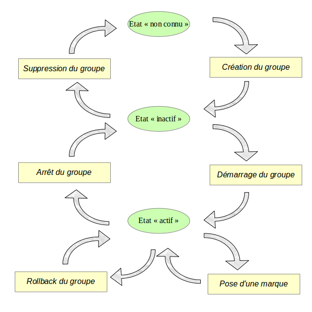

Fonctions principales
=====================

Avant de décrire chacune des principales fonctions d'E-Maj, il est intéressant d'avoir un aperçu global de l'enchaînement typique des opérations. 

Enchaînement des opérations
---------------------------

L'enchaînement des opérations possibles pour un groupe de tables peut se matérialiser par ce synoptique.

----

.. _emaj_start_group:

Démarrer un groupe de tables
----------------------------

"*Démarrer un groupe de tables*" consiste à activer l'enregistrement des mises à jour des tables du groupe. Pour ce faire, il faut exécuter la commande ::

   SELECT emaj.emaj_start_group(p_groupName, p_mark, p_resetLogs, p_loggingGroupAllowed);

**Paramètres en entrée**

- ``p_groupName`` (*TEXT*) : Nom du **groupe** de tables à démarrer.
- ``p_mark`` (*TEXT*, optionnel) : Nom de la **marque** initiale. Il peut contenir un caractère ``%`` représentant l’heure courante au format ``hh.mm.ss.mmmm``. Si le paramètre n'est pas fourni ou a une valeur non *NULL* ou vide, un nom de marque est généré : ``START_%``.
- ``p_resetLogs`` (*BOOLEAN*, optionnel) :

   - *TRUE* (par défaut) : Les tables de log du groupe sont purgées et toutes les marques posées au préalable sont supprimées.
   - *FALSE* : Le contenu des tables de log est conservé en l'état. Les anciennes marques sont également préservées, même si ces dernières ne sont alors plus utilisables pour un éventuel rollback (des mises à jour ont pu être effectuées sans être tracées alors que le groupe de tables était arrêté).
- ``p_loggingGroupAllowed`` (*BOOLEAN*, optionnel) :

   - *FALSE* (par défaut) : Si le groupe de tables est déjà actif, la fonction génère une erreur.
   - *TRUE* : Si le groupe de tables est déjà actif, la fonction ne génère qu'un *Warning*.

**Données retournées**

La fonction retourne le nombre de tables et de séquences contenues dans le groupe, ou 0 si le groupe était déjà *actif*.

**Notes**

Le groupe de tables doit être au préalable à l'état inactif (*IDLE*), sauf si le paramètre ``p_loggingGroupAllowed`` est explicitement positionné à vrai (*TRUE*).

La fonction :

- **Purge les tables de log** du groupe, sauf si ``p_resetLogs`` est positionné à *FALSE*,
- **Supprime toutes les marques** posées au préalable pour le groupe, sauf si ``p_resetLogs`` est positionné à  *FALSE*,
- **Purge** les plus anciens événements de la table technique :ref:`emaj_hist <emaj_hist>` et de quelques autres tables internes,
- Pose une **marque** initiale,
- Active les **triggers** E-Maj pour toutes les tables du groupe.

A l'issue du démarrage d'un groupe :

- celui-ci devient **actif** (*LOGGING*),
- une **nouvelle session de log** est démarrée.

Le paramètre ``p_loggingGroupAllowed`` permet d’écrire des scripts d’administration idempotents.

Pour être certain qu'aucune transaction impliquant les tables du groupe n'est en cours, la fonction *emaj_start_group()* pose explicitement sur chacune des tables du groupe un **verrou** de type *SHARE ROW EXCLUSIVE*. Si des transactions accédant à ces tables sont en cours, ceci peut se traduire par la survenue d'une étreinte fatale (*deadlock*). Si la résolution de l'étreinte fatale impacte la fonction E-Maj, le deadlock est intercepté et la pose de verrou est automatiquement réitérée, avec un maximum de 5 tentatives.

**Opération Multi-groupes**

Grace à la fonction ``emaj_start_groups()``, **plusieurs groupes** de tables peuvent être démarrés en même temps : ::

   SELECT emaj.emaj_start_groups(p_groupNames, p_mark, p_resetLogs, p_loggingGroupsAllowed);

Les différences avec la fonction *emaj_start_group()* sont les suivantes :

- Le premier paramètre est un tableau de *TEXT*. Il contient tous les groupes de tables à traiter. Plus d'information sur les :doc:`fonctions multi-groupes <multiGroupsFunctions>`,
- Si au moins un groupe de table est déjà actif (*LOGGING*), le paramètre ``p_loggingGroupsAllowed`` doit être valorisé à *TRUE*,
- La fonction retourne le nombre total de tables et de séquences des groupes effectivement passés d'inactifs à actifs.

----

.. _emaj_set_mark_group:

Poser une marque intermédiaire
------------------------------

Lorsque toutes les tables et séquences d'un groupe sont jugées dans un **état stable** pouvant servir de référence pour un éventuel *rollback*, une marque peut être posée. Ceci s'effectue par la requête SQL suivante ::

   SELECT emaj.emaj_set_mark_group(p_groupName, p_mark, p_comment);

**Paramètres en entrée**

- ``p_groupName`` (*TEXT*) : Nom du **groupe** de tables.
- ``p_mark`` (*TEXT*, optionnel) : Nom de la **marque**. Il peut contenir un caractère ``%`` représentant l’heure courante au format ``hh.mm.ss.mmmm``. Si le paramètre n'est pas fourni ou a une valeur non *NULL* ou vide, un nom de marque est généré : ``MARK_%``.
- ``p_comment`` (*TEXT*, optionnel) : **Commentaire** décrivant la marque. S’il n’est pas fourni ou s’il est valorisé à *NULL*, aucun commentaire n’est enregistré.

**Données retournées**

La fonction retourne le nombre de tables et de séquences contenues dans le groupe.

**Notes**

Le groupe de tables doit être à l'état actif (*LOGGING*).

Le nom de la marque doit être **unique** au sein du groupe de tables.

Le **commentaire** décrivant sur la marque peut être modifié ou supprimé ultérieurement avec la fonction :ref:`emaj_comment_mark_group()<emaj_comment_mark_group>`.

La fonction *emaj_set_mark_group()* enregistre l'identité de la nouvelle marque, avec l'état des séquences applicatives appartenant au groupe, ainsi que l'état des séquences associées aux tables de log. Les séquences applicatives sont traitées en premier, pour enregistrer leur état au plus près du début de la transaction, ces séquences ne pouvant pas être protégées des mises à jour par des verrous.

Il est possible d'enregistrer deux marques consécutives sans que des mises à jour de tables aient été enregistrées entre ces deux marques.

La fonction *emaj_set_mark_group()* pose des **verrous** de type *ROW EXCLUSIVE* sur chaque table du groupe. Ceci permet de s'assurer qu'aucune transaction ayant déjà fait des mises à jour sur une table du groupe n'est en cours. Néanmoins, ceci ne garantit pas qu'une transaction ayant lu une ou plusieurs tables avant la pose de la marque, fasse des mises à jours après la pose de la marque. Dans ce cas, ces mises à jours effectuées après la pose de la marque seraient candidates à un éventuel rollback sur cette marque.

Pour insérer la pose d’une marque dans un script idempotent, il est possible de conditionner l’opération à sa non existence préalable, en utilisant la fonction :ref:`emaj_does_exist_mark_group()<emaj_exist_state_mark_group>` dans une clause *WHERE*.

**Opération Multi-groupes**

Grace à la fonction ``emaj_set_mark_groups()``, une marque peut être posée sur **plusieurs groupes** de tables même temps : ::

   SELECT emaj.emaj_set_mark_groups(p_groupNames, p_mark, p_comment);

La différence avec la fonction *emaj_set_mark_group()* est la suivante :

- Le premier paramètre est un tableau de *TEXT*. Il contient tous les groupes de tables à traiter. Plus d'information sur les :doc:`fonctions multi-groupes <multiGroupsFunctions>`.

----

.. _emaj_rollback_group:

Exécuter un rollback E-maj simple d'un groupe de tables
-------------------------------------------------------

S'il est nécessaire de remettre les tables et séquences d'un groupe dans l'état dans lequel elles se trouvaient lors de la prise d'une marque, il faut procéder à un **rollback E-Maj**. Pour un rollback simple (« *unlogged* » ou « *non tracé* »), il suffit d'exécuter la requête SQL suivante : ::

   SELECT * FROM emaj.emaj_rollback_group(p_groupName, p_mark, p_isAlterGroupAllowed, p_comment);

**Paramètres en entrée**

- ``p_groupName`` (*TEXT*) : Nom du **groupe** de tables.
- ``p_mark`` (*TEXT*) : Nom de la **marque cible**. Le mot clé ``EMAJ_LAST_MARK`` représente la dernière marque posée.
- ``p_isAlterGroupAllowed`` (*BOOLEAN*, optionnel) :

   - *FALSE* (par défaut) : Une tentative de rollback génère une *exception* si le groupe de tables a été modifié après la marque cible.
   - *TRUE* : L'opération de rollback est autorisée si le :doc:`groupe de tables a été modifié<alterGroups>` après la marque cible.
   
- ``p_comment`` (*TEXT*, optionnel) : **Commentaire** décrivant le rollback. S’il n’est pas fourni ou s’il est valorisé à *NULL*, aucun commentaire n’est enregistré.

**Données retournées**

La fonction retourne un ensemble de lignes comportant les colonnes suivantes :

- ``rlbk_severity`` (*TEXT*) : **Niveau de sévérité** du message (*Notice* ou *Warning*).
- ``rlbk_message`` (*TEXT*) : **Message**.

La fonction retourne 3 lignes de type *Notice* indiquant l'identifiant de rollback généré, le nombre de tables et le nombre de séquences effectivement modifiées par l'opération de rollback. Des lignes de type *Warning* peuvent aussi être émises dans le cas où des opérations de modification du groupe de tables ont du être traitées par le rollback.

**Notes**

Le groupe de tables doit être à l'état démarré (*LOGGING*) et :ref:`non protégé <emaj_protect_group>`.

La marque ciblée ne doit pas être antérieure à une marque :ref:`protégée contre les rollbacks <emaj_protect_mark_group>`.

Si le groupe de tables a été modifié après la marque cible et si le paramètre ``p_isAlterGroupAllowed`` est positionné à *TRUE*, l'opération de rollback :

- **N'annule pas** les changements de structure du groupe, mais les signale pour que l'administrateur exécute les actions requises,
- peut ne pas annuler les changements de contenu ou n'en annuler qu'une partie (:doc:`plus de détails ici<alterGroups>`).

Le **commentaire** associé au rollback permet à l’administrateur d'annoter l’opération en indiquant par exemple la raison de son lancement ou le traitement annulé. Le commentaire peut également être ajouté avec la fonction :ref:`emaj_comment_rollback() <emaj_comment_rollback>`, cette fonction permettant aussi de le modifier ou de le supprimer.

A l'issue de l'opération de rollback, sont effacées :

* les données des tables de log qui concernent les mises à jour annulées,
* toutes les marques postérieures à la marque référencée dans la commande de rollback.

Il est alors possible de poursuivre les traitements de mises à jour, de poser ensuite d'autres marques et éventuellement de procéder à un nouveau rollback sur une marque quelconque.

Pour être certain qu'aucune transaction concurrente ne mette à jour une table du groupe pendant toute la durée du rollback, la fonction *emaj_rollback_group()* pose explicitement un **verrou** de type *EXCLUSIVE* sur chacune des tables du groupe. Si des transactions accédant à ces tables en mise à jour sont en cours, ceci peut se traduire par la survenue d'une étreinte fatale (deadlock). Si la résolution de l'étreinte fatale impacte la fonction E-Maj, le deadlock est intercepté et la pose de verrou est automatiquement réitérée, avec un maximum de 5 tentatives. En revanche, les tables du groupe continuent à être accessibles en lecture pendant l'opération.

Le rollback E-Maj prend en compte la présence éventuelle de triggers et de clés étrangères sur la table concernée. Plus de détails :doc:`ici <rollbackDetails>`.

Lorsque le volume de mises à jour à annuler est important et que l'opération de rollback est longue, il est possible de suivre l'avancement de l'opération à l'aide de la fonction :ref:`emaj_rollback_activity() <emaj_rollback_activity>` ou du client :doc:`emajRollbackMonitor <rollbackMonitorClient>`.

**Opération Multi-groupes**

Grace à la fonction ``emaj_rollback_groups()``, **plusieurs groupes** de tables peuvent être « rollbackés » en même temps : ::

   SELECT * FROM emaj.emaj_rollback_groups(p_groupNames, p_mark, p_isAlterGroupAllowed, p_comment);

Les différences avec la fonction *emaj_rollback_group()* sont les suivantes :

- Le premier paramètre est un tableau de *TEXT*. Il contient tous les groupes de tables à traiter. Plus d'information sur les :doc:`fonctions multi-groupes <multiGroupsFunctions>`,
- La marque indiquée doit strictement correspondre à un même moment dans le temps pour chacun des groupes listés. En d'autres termes, cette marque doit avoir été posée par l'appel d'une même fonction :ref:`emaj_set_mark_groups() <emaj_set_mark_group>`.

----

.. _emaj_logged_rollback_group:

Exécuter un rollback E-Maj annulable ou tracé d'un groupe de tables
-------------------------------------------------------------------

Une autre fonction permet d'exécuter un **rollback tracé** (*logged rollback*), Dans ce cas, les triggers de log sur les tables applicatives ne sont pas désactivés durant le rollback, de sorte que les mises à jours de tables effectuées pour le rollback sont elles-mêmes enregistrées dans les tables de log. Ainsi, il est ensuite possible d'annuler le rollback ou, en quelque sorte, de « rollbacker le rollback ».

Pour exécuter un rollback tracé sur un groupe de tables, il suffit d'exécuter la requête SQL suivante::

   SELECT * FROM emaj.emaj_logged_rollback_group(p_groupName, p_mark, p_isAlterGroupAllowed, p_comment);

Les deux fonctions :ref:`emaj_rollback_group()<emaj_rollback_group>` et *emaj_logged_rollback_group()* partagent :

- les mêmes paramètres en entrée,
- les mêmes données retournées,
- la plupart des rêgles d'utilisation.

Contrairement à :ref:`emaj_rollback_group() <emaj_rollback_group>`, la fonction *emaj_logged_rollback_group()* :

- ne supprime aucune données des tables de log et conserve toutes les marques postérieures à la marque cible,
- pose automatiquement deux marques pour encadrer l'opération :

   - ``*RLBK_<rollback_id>_START*``
   - ``*RLBK_<rollback_id>_DONE*``

Chacune de ces marques a un commentaire indiquant le nom de la marque cible.

Des rollbacks de différents types (*logged* / *unlogged*) peuvent être exécutés en séquence. on peut ainsi procéder à l'enchaînement suivant:

* Pose de la marque M1
* …
* Pose de la marque M2
* …
* Logged rollback à M1 (générant les marques *RLBK_<id.rlbk.1>_STRT*, puis *RLBK_<id.rlbk.1>_DONE*)
* …
* Rollback à RLBK_<id.rlbk.1>_DONE (pour annuler le traitement d'après rollback)
* …
* Rollback à RLBK_<id.rlbk.1>_STRT (pour finalement annuler le premier rollback)

Une :ref:`fonction de « consolidation »<emaj_consolidate_rollback_group>` de « *rollback tracé* » permet de transformer un rollback annulable en rollback simple.

**Opération Multi-groupes**

Grace à la fonction ``emaj_logged_rollback_groups()``, **plusieurs groupes** de tables peuvent être « rollbackés » en même temps : ::

   SELECT * FROM emaj.emaj_logged_rollback_groups (p_groupNames, p_mark, p_isAlterGroupAllowed, p_comment);

Les différences avec la fonction *emaj_logged_rollback_group()* sont les suivantes :

- Le premier paramètre est un tableau de *TEXT*. Il contient tous les groupes de tables à traiter. Plus d'information sur les :doc:`fonctions multi-groupes <multiGroupsFunctions>`,
- La marque indiquée doit strictement correspondre à un même moment dans le temps pour chacun des groupes listés. En d'autres termes, cette marque doit avoir été posée par l'appel d'une même fonction :ref:`emaj_set_mark_groups() <emaj_set_mark_group>`.

----

.. _emaj_stop_group:

Arrêter un groupe de tables
---------------------------

Lorsqu'on souhaite **arrêter l'enregistrement des mises à jour** des tables d'un groupe, il est possible de désactiver le log par la commande SQL : ::

   SELECT emaj.emaj_stop_group(p_groupName, p_mark, p_resetLogs, p_idleGroupAllowed);

**Paramètres en entrée**

- ``p_groupName`` (*TEXT*) : Nom du **groupe** de tables à arrêter.
- ``p_mark`` (*TEXT*, optionnel) : Nom de la **marque** d'arrêt. Il peut contenir un caractère ``%`` représentant l’heure courante au format ``hh.mm.ss.mmmm``. Si le paramètre n'est pas fourni ou a une valeur non *NULL* ou vide, un nom de marque est généré : ``STOP_%``.
- ``p_resetLogs`` (*BOOLEAN*, optionnel) :

   - *FALSE* (par défaut) : Le contenu des tables de log est conservé en l'état. Les anciennes marques sont également préservées.
   - *TRUE* : Une fois les triggers désactivés, les tables de log sont vidées. Les marques existantes sont supprimées et aucune marque d’arrêt n’est posée.
- ``p_idleGroupAllowed`` (*BOOLEAN*, optionnel) :

   - *FALSE* (par défaut) : Si le groupe de tables est déjà arrêté, la fonction génère une erreur.
   - *TRUE* : Si le groupe de tables est déjà arrêté, la fonction ne génère qu'un *Warning*.

**Données retournées**

La fonction retourne le nombre de tables et de séquences contenues dans le groupe, ou 0 si le groupe était déjà arrêté.

**Notes**

Le groupe de tables doit être au préalable à l'état actif (*LOGGING*), sauf si le paramètre ``p_idleGroupAllowed`` est explicitement positionné à vrai (*TRUE*).

La fonction :

- désactive les **triggers** de log des tables applicatives du groupe,
- pose la **marque** d'arrêt,
- **purges les tables de log** si ``p_resetLogs`` est à *TRUE*,
- **supprime toutes les marques** posées précédemment pour le groupe si ``p_resetLogs`` est à *TRUE*.

Une fois le groupe arrêté :

- son état redevient inactif (*IDLE*),
- la **session de log** courante est close, rendant impossible tout rollback E-Maj ciblant l’une des marques posées précédemment, même si aucune mise à jour n'a été effectuée depuis l'arrêt du groupe de tables. Pour autant, les autres usages des tables de log et des marques, si elles n’ont pas été purgées, sont toujours possibles (visualisation, statistiques, vidage des changements, génération SQL).

La pose de **verrous** de type *SHARE ROW EXCLUSIVE* peut se traduire par la survenue d'une étreinte fatale (*deadlock*). Si la résolution de l'étreinte fatale impacte la fonction E-Maj, le deadlock est intercepté et la pose de verrou est automatiquement réitérée, avec un maximum de 5 tentatives.

**Opération Multi-groupes**

Grace à la fonction ``emaj_stop_groups()``, **plusieurs groupes** de tables peuvent être arrêtés en même temps : ::

   SELECT emaj.emaj_stop_groups(p_groupNames, p_mark, p_resetLogs, p_idleGroupsAllowed);

Les différences avec la fonction *emaj_stop_group()* sont les suivantes :

- Le premier paramètre est un tableau de *TEXT*. Il contient tous les groupes de tables à traiter. Plus d'information sur les :doc:`fonctions multi-groupes <multiGroupsFunctions>`,
- Si au moins un groupe de table est déjà inactif (*IDLE*), le paramètre ``p_idleGroupsAllowed`` doit être valorisé à *TRUE*. Dans ce cas, la marque d'arrêt est posées sur tous les groupes cités, afin d'en faire un point dans le temps commun pour d'éventuelles productions de statistiques ou de scripts SQL de rejeu des changements.
- La fonction retourne le nombre total de tables et de séquences des groupes effectivement passés d'actifs à inactifs.
