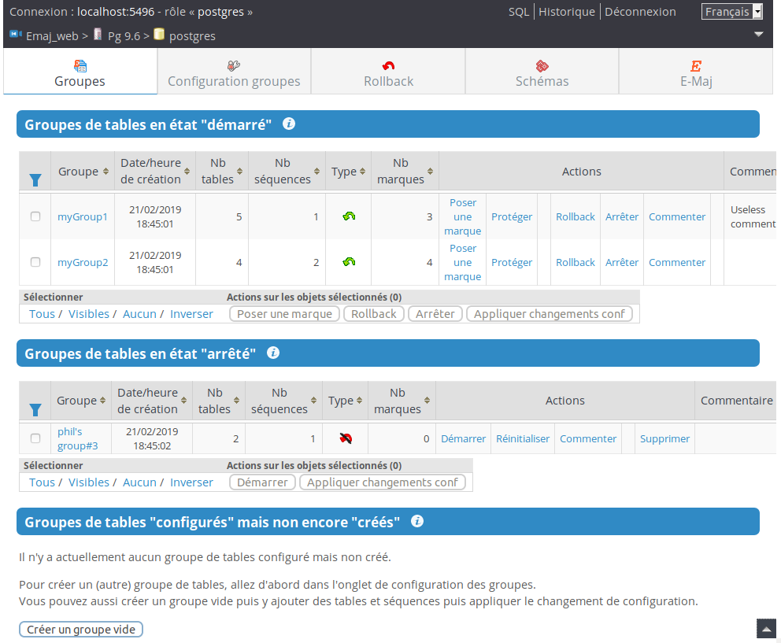
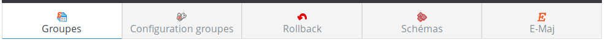
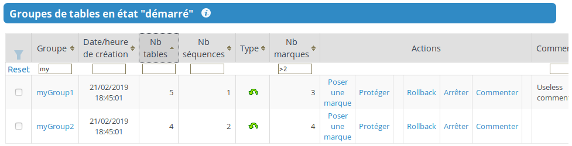
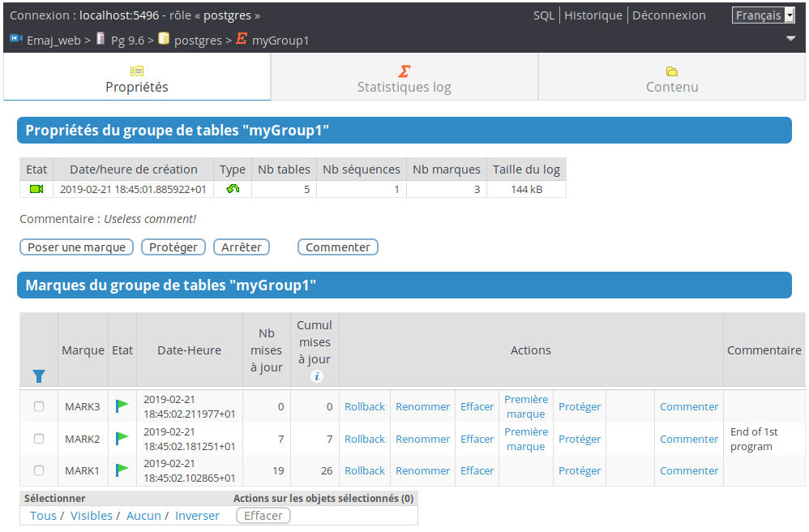
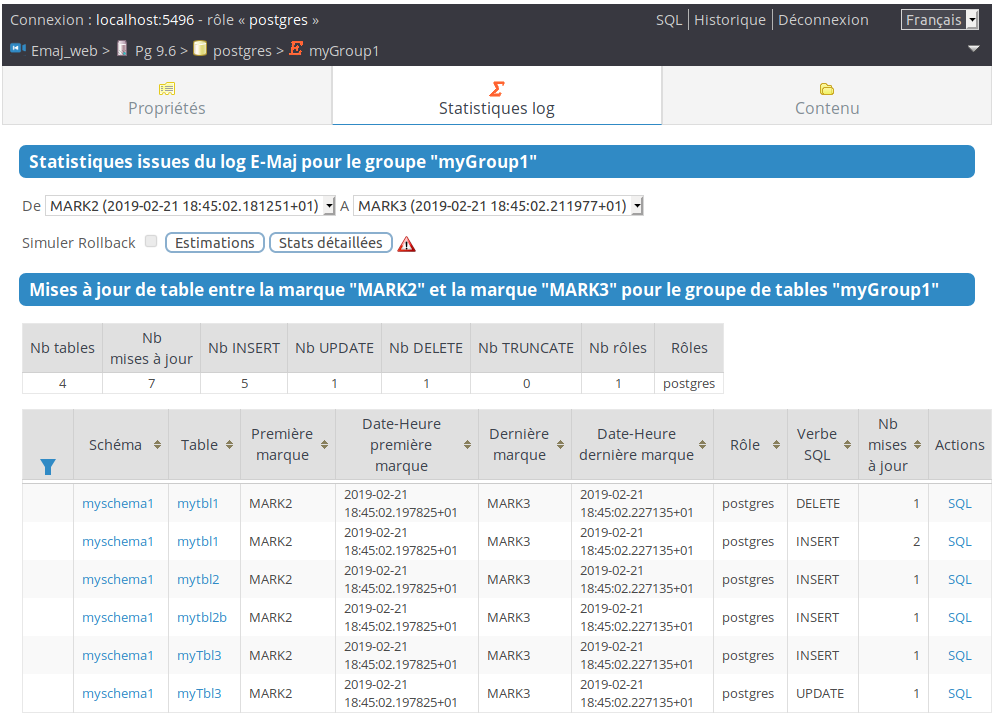
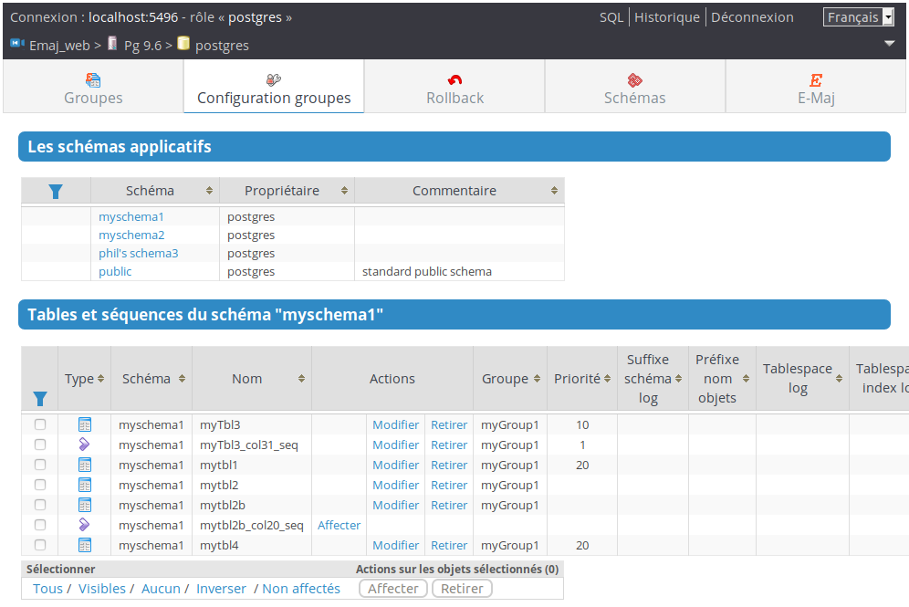
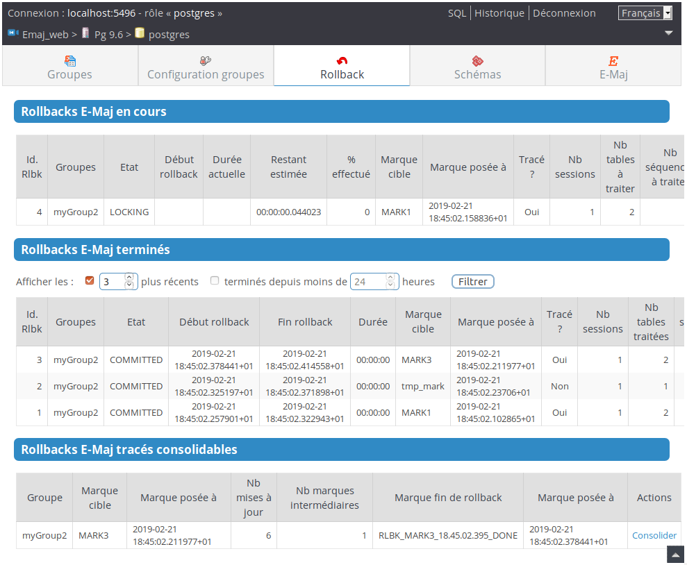
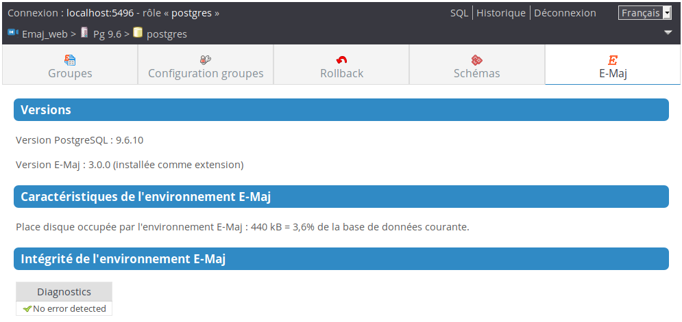

Utilisation d'Emaj_web
======================

Accès à Emaj_web et aux bases de données
----------------------------------------

L’accès à Emaj_web depuis un navigateur affiche la page d’accueil.

Pour se connecter à une base de données, sélectionnez l’instance souhaitée dans l’arborescence de gauche ou dans l’onglet « serveurs », et remplissez les identifiants et mots de passe de connexion. Plusieurs connexions peuvent rester ouvertes simultanément.

Une fois connecté à une base de données dans laquelle l'extension emaj a été installée, l’utilisateur interagit avec l’extension, en fonction des droits dont il dispose (super-utilisateur, *emaj_adm* ou *emaj_viewer*).

Située à gauche, l'arborescence de navigation offre la visibilité de toutes les instances configurées, réparties éventuellement dans des groupes d’instances, et des bases de données qu’elles contiennent. En dépliant l’objet base de données, on accède aux groupes de tables E-Maj et aux schémas existants.

.. figure:: images/web01.png
	:align: center

	Figure 1 – Arborescence de navigation.

Liste des groupes de tables
---------------------------

En sélectionnant une base de données, l'utilisateur accède à une page qui liste les groupes de tables créés dans cette base de données.

   Figure 2 – Liste des groupes de tables.

Trois listes distinctes sont affichées :

* les groupes de tables en état « *démarrés* »,
* les groupes de tables en état « *arrêtés* »,
* les groupes de tables référencés dans la table :ref:`emaj_group_def <emaj_group_def>`, mais qui n’ont pas encore été créés.

Pour chaque groupe de tables créé, sont affichés les attributs suivants :

* sa date et son heure de création,
* le nombre de tables et de séquences applicatives qu'il contient,
* son type (« *ROLLBACKABLE* » ou « *AUDIT-SEUL* », protégé contre les rollbacks ou non),
* le nombre de marques qu'il possède,
* son éventuel commentaire associé.

Pour chaque groupe également, plusieurs boutons sont proposés afin de pouvoir effectuer les actions que son état autorise.

Quelques détails de l'interface utilisateur
-------------------------------------------

Les entêtes de page contiennent :

* des informations sur la connexion courante,
* 3 liens pour accéder à l’éditeur de requête SQL, à l’historique des requêtes exécutées et pour se déconnecter de l’instance courante,
* une liste déroulante pour choisir la langue utilisée dans l’interface utilisateur,
* un fil d’ariane permettant de se repérer dans l’arborescence,
* et un bouton permettant d’aller directement en bas de page.

Deux barres d'icônes permettent de naviguer dans les différentes fonctions d'Emaj_web : l'une regroupe les fonctions globales de l'interface, et l'autre les fonctions associées à un groupe de tables particulier.

   Figure 3 – Barre d'icônes principale.

.. figure:: images/web04.png
   :align: center

   Figure 4 – Barre d'icônes des groupes de tables.

Pour les rôles de type *emaj_viewer*, certaines icônes ne sont pas visibles.

Sur certains tableaux, il est possible de trier en dynamique les lignes affichées à l'aide de petites flèches verticales situées à droite des titres de colonnes. 

Sur certains tableaux également, une icône à gauche de la ligne de titre fait apparaître ou disparaître des champs de saisie permettant le filtrage des lignes affichées.

   Figure 5 – Filtrage des groupes de tables démarrés. Ne sont affichés ici que les groupes de tables dont le nom comprend « *my* » et contenant plus de 2 marques, cette liste étant triée par ordre décroissant du nombre de tables.

Certains tableaux permettent d’exécuter des actions pour plusieurs objets simultanément. Dans ce cas, l’utilisateur sélectionne les objets à l’aide des cases à cocher dans la première colonne du tableau et choisit l’action à exécuter parmi les boutons accessibles sous le tableau.

Détail d'un groupe de tables
----------------------------

Depuis la page listant les groupes de tables, il est possible d'en savoir davantage sur un groupe de tables particulier en cliquant sur son nom. Cette page est aussi accessible par l'icône « *Propriétés* » de la barre des groupes ou par l'arborescence de gauche.

   Figure 6 – Détail d'un groupe de tables

Une première ligne reprend des informations déjà affichées sur le tableau des groupes (nombre de tables et de séquences, type et nombre de marques), complété par l'espace disque utilisé par les tables de log du groupe.

Cette ligne est suivie par l'éventuel commentaire associé au groupe.
 
Puis une série de boutons permet de réaliser les actions que l'état du groupe permet.

L'utilisateur trouve ensuite un tableau des marques positionnées pour le groupe. Pour chacune d'elles, on trouve :

* son nom,
* sa date et son heure de pose,
* son état (actif ou non, protégé contre les rollbacks ou non),
* le nombre de lignes de log enregistrées entre cette marque et la suivante (ou la situation courante s'il s'agit de la dernière marque),
* le nombre total de lignes de log enregistrées depuis que la marque a été posée,
* l'éventuel commentaire associé à la marque.

Pour chaque marque, plusieurs boutons permettent d'exécuter toute action que son état permet.

Statistiques
------------

L'onglet « *Statistiques log* » de la barre des groupes permet d'obtenir des statistiques sur le contenu des mises à jour enregistrées dans les tables de log pour le groupe de tables.

Deux types de statistiques peuvent être obtenues :

* des estimations du nombre de mises à jour par table, enregistrées entre 2 marques ou entre une marque et la situation présente,
* un dénombrement précis du nombre de mises à jour par table, type de requête (*INSERT/UPDATE/DELETE/TRUNCATE*) et rôle.

Si la borne de fin correspond à la situation courante, une case à cocher permet de demander en même temps une simulation de rollback à la première marque sélectionnée afin d'obtenir rapidement une durée approximative d'exécution de cet éventuel rollback.

La figure suivante montre un exemple de statistiques détaillées.

   Figure 7 – Statistiques détaillées des mises à jour enregistrées entre 2 marques

La page restituée contient une première ligne contenant des compteurs globaux.

Sur chacune des lignes du tableau de statistiques, un bouton « *SQL* » permet à l'utilisateur de visualiser facilement le contenu des mises à jour enregistrées dans les tables de log. Un clic sur ce bouton ouvre l'éditeur de requêtes SQL et propose la requête visualisant le contenu de la table de log correspondant à la sélection (table, tranche de temps, rôle, type de requête). L'utilisateur peut la modifier à sa convenance avant de l'exécuter, afin, par exemple, de cibler davantage les lignes qui l'intéressent.

.. figure:: images/web08.png
   :align: center

   Figure 8 – Résultat de la simulation d'un rollback avec estimation du nombre de mises à jour par table.

La page restituée contient une première partie indiquant le nombre de tables et de mises à jour concernées par un éventuel rollback à cette marque et une estimation du temps nécessaire à ce rollback.

Contenu d'un groupe de tables
-----------------------------

L'onglet « *Contenu* » de la barre des groupes permet d'obtenir une vision synthétique du contenu d'un groupe de tables.

Le tableau affiché reprend, pour chaque table et séquence du groupe, les caractéristiques configurées dans la table :ref:`emaj_group_def <emaj_group_def>`, ainsi que la place prise par la table de log et son index.

.. figure:: images/web09.png
   :align: center

   Figure 9 – Contenu d'un groupe de tables.

Configuration des groupes de tables
-----------------------------------

En sélectionnant l’onglet « *Configuration Groupes* » de la barre principale, l'utilisateur atteint la fonction qui gère la définition du contenu des groupes de tables.

La partie supérieure de la page liste les schémas existants dans la base de données (à l'exception des schémas dédiés à E-Maj). En sélectionnant un schéma, la liste de ses tables et séquences apparaît.

   Figure 10 – Configuration des groupes de tables.

Il est alors possible de voir ou de modifier l’affectation des tables et séquences dans les groupes. Les actions effectuées ici modifient le contenu de la table :ref:`emaj_group_def <emaj_group_def>` utilisée pour la création du groupe de tables.

Sont listés pour chaque table ou séquence :

* son type,
* le groupe de table auquel il appartient, s'il y en a un,
* les attributs de la table ou de la séquence dans :ref:`emaj_group_def <emaj_group_def>`, si elle est déjà affectée à un groupe :

  * le niveau de priorité affecté dans le groupe,
  * le suffixe définissant le schéma de log,
  * le préfixe éventuel des noms des objets E-Maj associés à la table,
  * le nom du tablespace éventuel supportant la table de log,
  * le nom du tablespace éventuel supportant l'index de la table de log,

* son propriétaire,
* le tablespace auquel elle est rattachée, s'il y en a un,
* son commentaire enregistré dans la base de données.

Les deux listes de schémas et de tables et séquences affichent également les objets déjà référencés dans la table :ref:`emaj_group_def <emaj_group_def>` mais qui n'existe pas dans la base de données. Ces objets sont identifiés par une icône « ! » dans la première colonne de chaque tableau.

A l'aide de boutons, il est possible :

* d'assigner une table ou une séquence à un groupe de tables nouveau ou existant,
* de modifier les propriétés de la table ou de la séquence dans son groupe de tables,
* de détacher une table ou une séquence de son groupe de tables.

Notons que les modifications apportées au contenu de la table :ref:`emaj_group_def <emaj_group_def>` ne prendront effet que lorsque les groupes de tables concernés seront soit modifiés, soit supprimés puis recréés.

Suivi des opérations de rollback
--------------------------------

Une page, accessible par l'icône « *Rollbacks* » de la barre globale, permet de suivre les opérations de rollback. Trois listes distinctes sont affichées :

* les opérations de rollback en cours, avec le rappel des caractéristiques de l'opération et une estimation de la part de l'opération déjà effectuée et de la durée restante,
* les dernières opérations de rollback terminées,
* les opérations de rollback tracés susceptibles d’être consolidées.

L'utilisateur peut filtrer la liste des rollbacks terminés sur une profondeur d'historique plus ou moins grande.

Pour chaque rollback tracé consolidable listé, un bouton permet d’exécuter la consolidation.

   Figure 11 – Suivi des opérations de rollback.

Contenu des schémas
-------------------

L’onglet *Schémas* permet de sélectionner un schéma, pour :

* lister les tables ou les séquences qu’il contient,
* voir la structure ou le contenu d’une table particulière,
* voir les propriétés d’une séquence particulière.

État de l'environnement E-Maj
-----------------------------

En sélectionnant l’onglet « *Envir. E-Maj* » de la barre principale, l'utilisateur accède à une synthèse de l'état de l'environnement E-Maj.

Sont d'abord restitués :

* les versions de PostgreSQL et d'E-Maj installées,
* la place disque occupée par E-Maj (tables de log, tables techniques et index associés) et la part que cela représente dans la taille globale de la base de données.

Puis l'intégrité de l'environnement est testé ; le résultat de l'exécution de la fonction :ref:`emaj_verify_all() <emaj_verify_all>` est affiché.

   Figure 12 – État de l'environnement E-Maj 

