Utiliser Emaj_web
=================

.. raw:: html

    

Accès à Emaj_web et aux bases de données
----------------------------------------

L’accès à Emaj_web depuis un navigateur affiche la page d’accueil.

Pour se connecter à une base de données, sélectionnez l’instance souhaitée dans l’arborescence de gauche ou dans l’onglet « serveurs », et remplissez les identifiants et mots de passe de connexion. Plusieurs connexions peuvent rester ouvertes simultanément.

Une fois connecté à une base de données dans laquelle l'extension emaj a été installée, l’utilisateur interagit avec l’extension en fonction des droits dont il dispose (super-utilisateur, *emaj_adm* ou *emaj_viewer*).

Située à gauche, l'arborescence de navigation offre la visibilité de toutes les instances configurées, réparties éventuellement dans des groupes d’instances, et des bases de données qu’elles contiennent. En dépliant l’objet base de données, on accède aux groupes de tables E-Maj et aux schémas existants.

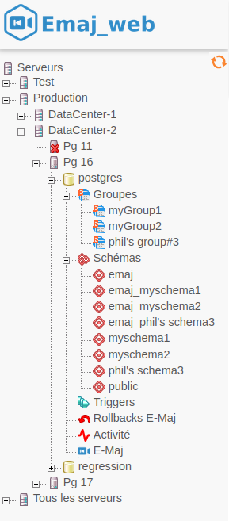

   Figure 1 – Arborescence de navigation.

Les deux icônes en bas et à droite (non visible ici) permettent d’ajuster la largeur de l’arborescence de navigation.

Listes des groupes de tables
----------------------------

En sélectionnant une base de données, l'utilisateur accède à une page qui liste les groupes de tables créés dans cette base de données.

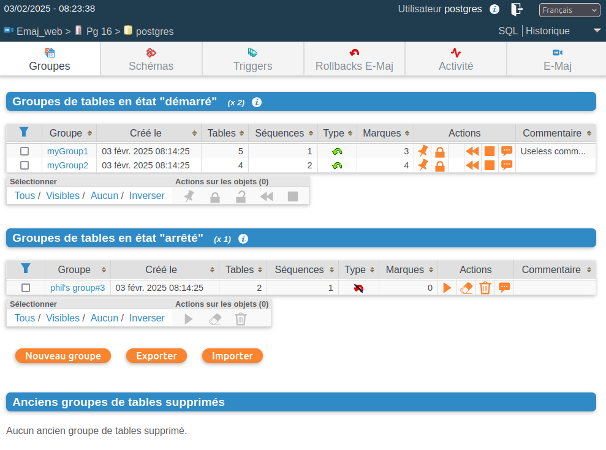

   Figure 2 – Liste des groupes de tables.

Deux listes distinctes sont affichées :

* les groupes de tables en état « *démarrés* »,
* les groupes de tables en état « *arrêtés* ».

Pour chaque groupe de tables créé, sont affichés les attributs suivants :

* sa date et son heure de création,
* le nombre de tables et de séquences applicatives qu'il contient,
* son type (« *ROLLBACKABLE* » ou « *AUDIT-SEUL* », protégé contre les rollbacks ou non),
* le nombre de marques qu'il possède,
* son éventuel commentaire associé.

Pour chaque groupe également, plusieurs boutons sont proposés afin de pouvoir effectuer les actions que son état autorise.

En dessous, trois boutons permettent de créer un nouveau groupe de tables, d’exporter ou d’importer une configuration de groupes de tables vers ou à partir d’un fichier local.

Enfin, est affiché la liste des groupes de tables qui ont été supprimés.

Quelques détails de l'interface utilisateur
-------------------------------------------

Les entêtes de page contiennent :

* des informations sur la connexion courante,
* 3 liens pour accéder à l’éditeur de requête SQL, à l’historique des requêtes exécutées et pour se déconnecter de l’instance courante,
* une liste déroulante pour choisir la langue utilisée dans l’interface utilisateur,
* un fil d’ariane permettant de se repérer dans l’arborescence,
* et un bouton pour aller directement en bas de page.

Deux barres d'icônes permettent de naviguer dans les différentes fonctions d'Emaj_web : l'une regroupe les fonctions globales de l'interface, et l'autre les fonctions associées à un groupe de tables particulier.

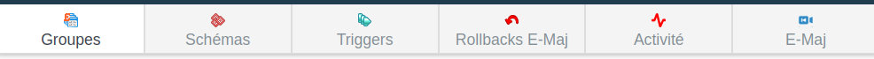

   Figure 3 – Barre d'icônes principale.

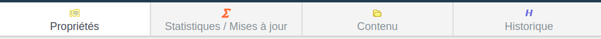

   Figure 4 – Barre d'icônes des groupes de tables.

Pour les rôles de type *emaj_viewer*, certaines icônes ne sont pas visibles.

Sur la plupart des tableaux, il est possible de trier en dynamique les lignes affichées à l'aide de petites flèches verticales situées à droite des titres de colonnes. 

Sur la plupart des tableaux également, une icône à gauche de la ligne de titre fait apparaître ou disparaître des champs de saisie permettant le filtrage des lignes affichées.

.. figure:: images/emajweb_filter.png
   :align: center
   :class: screenshot

   Figure 5 – Filtrage des groupes de tables démarrés. Ne sont affichés ici que les groupes de tables dont le nom comprend « *my* » et contenant plus de 2 marques, cette liste étant triée par ordre décroissant du nombre de tables.

Certains tableaux permettent d’exécuter des actions pour plusieurs objets simultanément. Dans ce cas, l’utilisateur sélectionne les objets à l’aide des cases à cocher dans la première colonne du tableau et choisit l’action à exécuter parmi les boutons accessibles sous le tableau.

Les colonnes contenant des commentaires ont une taille limitée. Mais le contenu complet des commentaires est visible en infobulle lorsque la souris passe au dessus de la cellule.

Les cellules contenant des horodatages d’événement ou des durées affichent en infobulle la valeur complète de la donnée.

Détail d'un groupe de tables
----------------------------

Depuis la page listant les groupes de tables, il est possible d'en savoir davantage sur un groupe de tables particulier en cliquant sur son nom. Cette page est aussi accessible par l'icône « *Propriétés* » de la barre des groupes ou par l'arborescence de gauche.

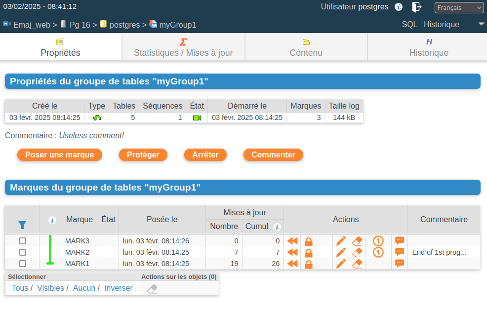

   Figure 6 – Détail d'un groupe de tables

Une première ligne reprend des informations déjà affichées sur le tableau des groupes (nombre de tables et de séquences, type et nombre de marques), complété par l'espace disque utilisé par les tables de log du groupe.

Cette ligne est suivie par l'éventuel commentaire associé au groupe.
 
Puis une série de boutons permet de réaliser les actions que l'état du groupe permet.

L'utilisateur trouve ensuite un tableau des marques positionnées pour le groupe, les plus récentes étant en haut de tableau.  Pour chacune d'elles, on trouve :

* son nom,
* sa date et son heure de pose,
* son état protégé contre les rollbacks ou non,
* le nombre de lignes de log enregistrées entre cette marque et la suivante (ou la situation courante s'il s'agit de la dernière marque),
* le nombre total de lignes de log enregistrées depuis que la marque a été posée,
* l'éventuel commentaire associé à la marque.

Pour chaque marque, plusieurs boutons permettent d'exécuter toute action que son état permet.

Statistiques
------------

L'onglet « *Statistiques / Mises à jour* » de la barre des groupes permet d'obtenir, pour le groupe de tables et sur un intervalle de temps donné, des statistiques sur les mises à jour enregistrées pour les tables et les changements apportés aux séquences. L’intervalle de temps est défini soit par deux marques soit par une marque et la situation courante.

Trois types de statistiques peuvent être obtenues :

* une estimation du nombre de mises à jour pour chaque table,
* une estimation du nombre d’incréments et des changements de structure pour chaque séquence,
* un dénombrement précis du nombre de mises à jour enregistrées, par table, type de requête (*INSERT/UPDATE/DELETE/TRUNCATE*) et rôle.

La figure suivante montre un exemple de statistiques détaillées pour les tables.

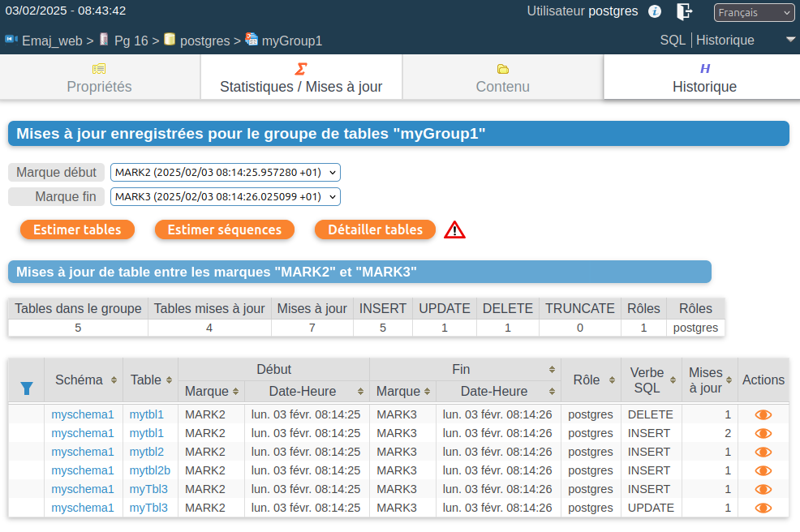

   Figure 7 – Statistiques détaillées des mises à jour enregistrées entre 2 marques

La page restituée contient une première ligne contenant des compteurs globaux.

Sur chacune des lignes du tableau de statistiques, un bouton permet à l'utilisateur de visualiser facilement le contenu des mises à jour enregistrées dans les tables de log. Un clic sur ce bouton ouvre une fenêtre de paramétrage de la requête SQL à générer. Celle-ci est ensuite affichée dans l'éditeur de requêtes SQL pour modification éventuelle avant exécution. Cela peut permettre à l’utilisateur de cibler davantage les lignes qui l'intéressent.

   Figure 8 – Formulaire de génération des requêtes de consultation des changements 

Contenu d'un groupe de tables
-----------------------------

L'onglet « *Contenu* » de la barre des groupes permet d'obtenir une vision synthétique du contenu d'un groupe de tables.

Pour chaque table du groupe, le tableau affiché reprend ses propriétés E-Maj, ainsi que la place prise par ses table et index de log.

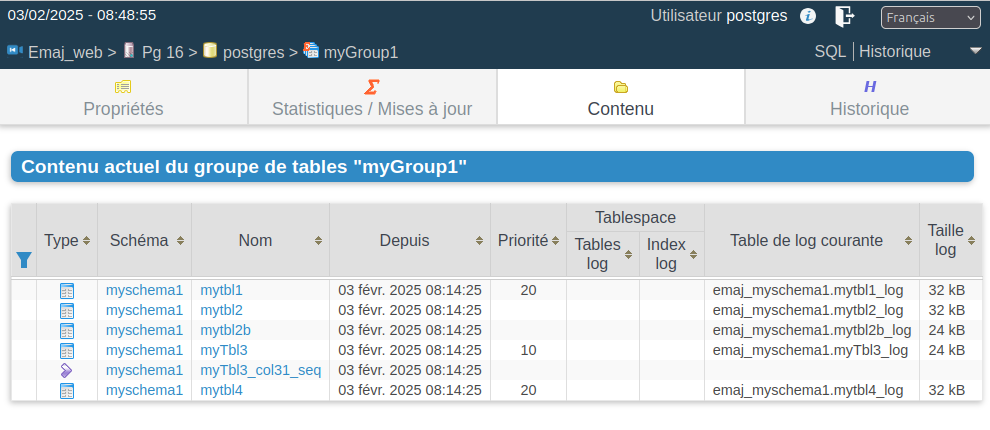

   Figure 9 – Contenu d'un groupe de tables.

Historique des groupes de tables
--------------------------------

L’onglet « *Historique* » permet de visualiser les périodes durant lesquelles un groupe de tables existe, ainsi que celles durant lesquelles le groupe est démarré (les *sessions de log*). La profondeur d’historique conservé dépend du paramètre *history_retention*.

   Figure 10 – Historique d'un groupe de tables.

Schémas et configuration des groupes de tables
----------------------------------------------

L’onglet « *Schémas* » permet de lister les schémas présents dans la base de données. 

En en sélectionnant un, deux listes sont alors affichées : celle des tables puis celle des séquences contenues dans ce schéma.

Pour chaque liste, on trouve les propriétés E-Maj et quelques caractéristiques générales des objets. Des boutons d’action permettent d’accéder à leur structure ou contenu, et de gérer l’assignation des objets dans les groupes de tables.

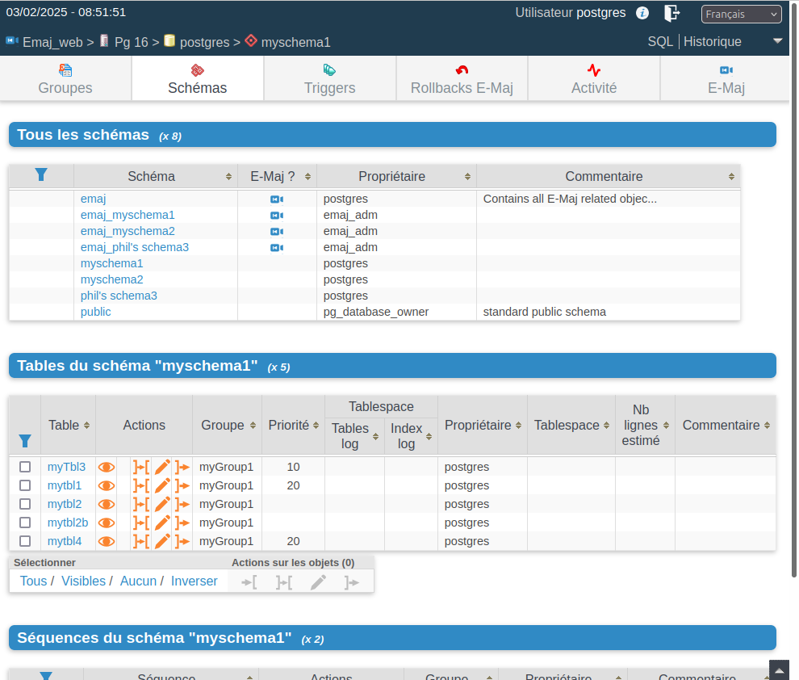

   Figure 11 – Contenu des schémas et configuration des groupes de tables.

Triggers
--------

L’onglet « *Triggers* » liste les triggers applicatifs (ceux qui ne sont pas liés à E-Maj), avec leurs principales caractéristiques.

Un bouton permet de changer le mode de désactivation lors des rollbacks E-Maj.

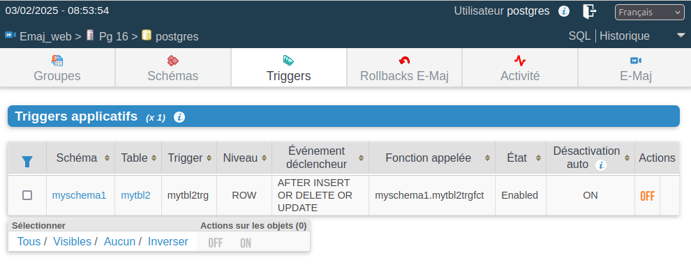

   Figure 12 – Liste des triggers applicatifs

Suivre les opérations de rollback
---------------------------------

Une page, accessible par l'icône « *Rollbacks* » de la barre globale, permet de suivre les opérations de rollback. Trois listes distinctes sont affichées :

* les opérations de rollback en cours, avec le rappel des caractéristiques de l'opération et une estimation de la part de l'opération déjà effectuée et de la durée restante,
* les opérations de rollback terminées,
* les opérations de rollback tracés susceptibles d’être consolidées.

Pour chaque rollback tracé consolidable listé, un bouton permet d’exécuter la consolidation.

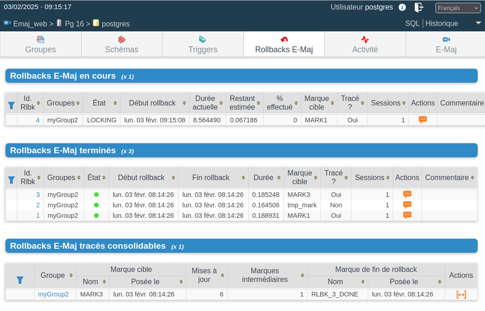

   Figure 13 – Suivi des opérations de rollback.

En cliquant sur un identifiant de rollback dans l’un de ces tableaux, on accède à une page présentant des informations détaillées sur le déroulement en cours ou passé de l’opération sélectionnée.

On y trouve plus précisément des données concernant :

* les propriétés du rollback,
* sa progression,
* le rapport final restitué à l’utilisateur, quand l’opération est terminée,
* le détail de la planification de l’opération, montrant chaque étape élémentaire, avec notamment sa durée, et optionnellement les estimations initiales calculées par E-Maj,
* et les informations relatives à la ou aux sessions de rollback.

   Figure 14 – Détails d’une opération de rollback.

État de l'environnement E-Maj
-----------------------------

En sélectionnant l’onglet « *E-Maj* » de la barre principale, l'utilisateur accède à une synthèse de l'état de l'environnement E-Maj.

Sont d'abord restitués les versions de PostgreSQL et d'E-Maj installées.

Lorsque l’utilisateur est connecté avec un rôle "*superuser*", des boutons permettent, en fonction du contexte, de créer, mettre à jour ou supprimer l’extension *emaj*.

Ensuite sont affichés : la place disque occupée par E-Maj (tables de log, tables techniques et index associés) et la part que cela représente dans la taille globale de la base de données.

Puis l'intégrité de l'environnement est testé ; le résultat de l'exécution de la fonction :ref:`emaj_verify_all() <emaj_verify_all>` est affiché.

Enfin sont listés les paramètres de fonctionnement de l’extension emaj, qu’ils soient présents dans la table *emaj_param* ou valorisés par défaut.

Deux boutons en bas de page permettent d’exporter ou d’importer une configuration de paramètres vers ou à partir d’un fichier local.

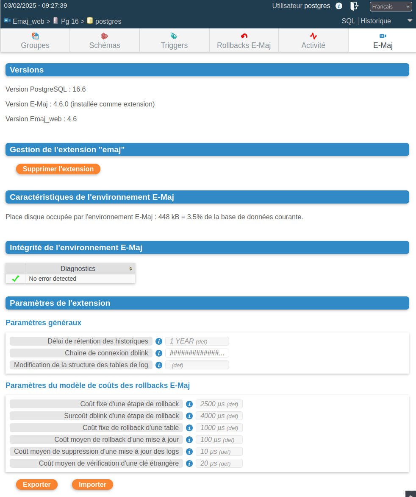

   Figure 15 – État de l'environnement E-Maj 
